# Protos Harvest: The Living Settlement
## A Single-Map Construction, Production, and Survival Overhaul Inspired by *Against the Storm*

**Author:** Manus AI
**Canonical repository:** [junyboi/proto-isometric](https://github.com/junnyboi/proto-isometric)
**Approved source baseline:** `fab0f487d9061f74ac0d3794da9335d3dce53da7`
**Engine contract:** Godot 4.7.2 stable
**Proposal status:** Approved implementation direction (27 August 2026)

## Executive recommendation

**Protos Harvest should become a persistent, single-map settlement game centered on construction, production, logistics, and survival.** The player spawns once in the safe grassland clearing and develops that same world for the duration of the save. There is no overworld, regional route, disposable deployment, secondary settlement simulation, or finale map. Every building, field, resident, warehouse, ruin, resource source, and dangerous biome exists in one continuous playable space.

The design should borrow the strongest local decision patterns from *Against the Storm* while deliberately rejecting its campaign topology. The useful ingredients are flexible production recipes, legible shortages, optional objective offers with meaningful rewards, predictable periods of opportunity and danger, population needs, difficult resource tradeoffs, and events that can be resolved in more than one way.[1] [2] [3] [4] Protos Harvest should express those ideas through its own fiction and existing embodied play: the player directly drives Protos, builds a permanent community, sends workers and supplies into hazardous outer biomes, reclaims or dismantles abandoned infrastructure, and survives increasingly demanding seasons.

The resulting product is **same same, but different**. It should create the strategic tension of a systemic settlement builder without copying a world map, temporary towns, Reputation, Queen’s Impatience, Hostility, glades, or Seals. Progress happens because the one settlement becomes more capable, more connected, and better prepared—not because the player abandons it and selects another node.

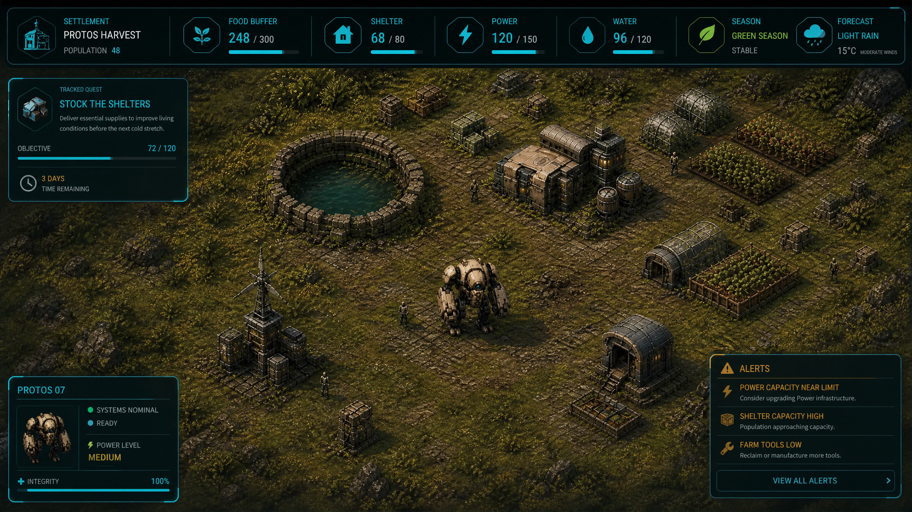

## 1. Product thesis and complexity boundary

> **Design thesis:** One map should contain the entire game loop. The safe grassland gives the player room to build; construction and production make survival possible; quests create changing priorities; ruins create transformative choices; outer biomes provide rare inputs at increasing risk; and every reward returns to the same settlement economy.

The overhaul is intentionally narrower than the previous proposal. It removes the systems most likely to multiply state, interface, save migration, and player cognitive load without improving minute-to-minute play.

| Keep and deepen | Remove entirely | Replace with |
|---|---|---|
| One persistent homestead and surrounding biomes | Overworld or regional node map | Seamless outward exploration on the spawn map |
| Directly controlled Protos | Separate Restoration Deployments | Physical trips from the settlement into outer biomes |
| Construction, farming, orchards, fishing, workforce, logistics, production, and wellbeing | Autonomous relay settlements | Permanent buildings and reclaimed facilities in the same world |
| Predictable weather and seasonal survival | Restoration Window and mission evacuation | Persistent seasons, stockpile pressure, outages, injuries, and recovery |
| Optional objective offers | Route objectives and Convergence finale | Accepted quests with explicit requirements and rewards |
| Existing biome combat and hazards | Blight-clearing or ecological verification as the central goal | Resource access, infrastructure defense, and survival preparation |
| Abandoned ruins | Disposable incident locations | Reclaim, demolish, or leave decisions with permanent map consequences |

This boundary reduces the number of persistence horizons from three to one. There is no campaign graph to generate, no collection of summarized remote sites, no inter-map cargo manifest, no current relay, no Convergence qualification, and no migration of active expeditions into a new topology. The save remains about **one settlement and one world**.

## 2. Why the local *Against the Storm* patterns still matter

*Against the Storm* is effective because production, objectives, weather, population wellbeing, and risk continually modify one another. Its recipe system uses overlapping inputs and outputs so a missing resource changes the plan rather than invalidating it.[1] Its recipe controls expose targets, ingredient choices, enablement, and local overrides so the player can diagnose why a chain is blocked.[2] Its Orders provide optional goals with visible rewards that can redirect priorities.[3] Its seasonal cadence tells the player when to exploit opportunity and when to prepare for stress.[4]

Those principles transfer cleanly to a single persistent map. They do **not** require a roguelite overworld.

| Transferable principle | Single-map Protos Harvest adaptation |
|---|---|
| **Production redundancy** | Important goods have inefficient baseline recipes plus specialized alternatives using biome-specific inputs |
| **Explicit objective offers** | A Quest Ledger offers optional contracts with requirements, risk, progress, and previewed rewards |
| **Predictable stress cadence** | Seasons and weather forecasts determine crop performance, travel safety, power demand, and biome hazards |
| **Expansion creates obligations** | More buildings and residents increase food, shelter, power, repair, hauling, and protection requirements |
| **Population wellbeing affects capacity** | Safe housing, rations, work preferences, injury, concern, and recovery shape sustainable output |
| **Events have multiple approaches** | Abandoned ruins can be reclaimed, demolished, or ignored; each path has different costs and rewards |
| **Information must be causal** | Every blocked job, failed quest step, unsafe assignment, or stalled production order exposes a stable reason |
| **Rewards change future possibilities** | Quests and ruins grant schematics, tools, applicants, rare inputs, building upgrades, and permanent service functions |

The previous proposal emphasized restoration proof, biome strain, route advancement, and a finite operational window. Those systems are no longer recommended. Environmental care can remain one authored concern among many—especially around farming, fishing, and resource renewal—but **clearing blight is not the game’s organizing objective**.

## 3. Current-game audit at the revised baseline

The synchronized repository already contains most of the expensive foundations required for this direction. Through the implemented settlement phases, the game has persistent construction, finite and renewable deposits, authored applicants, protected housing, workforce slots and shifts, staffed extraction, physical local storage, deterministic hauling, reserve floors, recipe policy, nonfatal injury, remedy windows, voluntary departure, seasonal crops, orchards, and deterministic fishing. These systems all operate through one persistent homestead and should be deepened rather than wrapped in a second strategic game.

The principal gaps are now content breadth, quest orchestration, ruin operations, outer-biome economic identity, and a clearer survival arc.

| System | Current foundation | Revision priority |
|---|---|---|
| **Construction** | Seven persistent blueprints, rotation, footprints, bills, upgrades, relocation, demolition, scaffolds, exact-once receipts | Add settlement tiers, utility dependencies, maintenance, specialized biome structures, and reclaimed ruin facilities |
| **Production** | Workbench/furnace stations, two recipes, alternatives, byproducts, targets, priority, enablement | Expand to a compact production web of approximately 18–24 recipes before adding many more buildings |
| **Logistics** | Building-local input/output, warehouse jobs, haulers, self-haul fallback, reserve floors | Add route throughput, travel hazard effects, repair deliveries, quest reservations, and clear bottleneck projections |
| **Population** | Authored applicants, beds, jobs, shifts, morale, concerns, recovery, voluntary departure | Make food, shelter, warmth, safety, and work conditions the central survival constraints |
| **Food systems** | Six seasonal crops, two orchard species, fishing pools and catches | Connect preservation, meals, bait, winter stockpiles, and biome ingredients to resident survival |
| **Resources** | Stable finite/renewable sources, tools, reservations, manual and staffed extraction | Give every outer biome exclusive resource tags and meaningful preparation requirements |
| **Ruins** | Stable ruin IDs, discover/repair/power state, home and outpost classifications | Replace simple repair with explicit Reclaim, Demolish, and Leave operations, resource bills, workers, hazards, and rewards |
| **Biomes** | Grassland, oasis, frozen, lava, desert terrain; fauna, hazards, bosses, weather presentation | Make biome entry an economic decision with unique resources, survival gear, travel costs, and escalating danger |
| **Objectives** | Legacy relay objectives and run terminal outcomes | Replace with a persistent Quest Ledger; no new map or run-reset layer |
| **Information architecture** | Inspectable world, sealed action menus, responsive native panels, production and roster controls | Add Settlement Overview, Quest Ledger, Ruin Operation, and Biome Logistics views without resurrecting tutorial cards |

## 4. Target player experience

### 4.1 One world, one settlement

The player begins in the biome-wide safe grassland clearing. That area contains the original home services, nearby farmland, water, basic salvage, and enough renewable material to recover from mistakes. The redundant `SAFE ZONE` world label and sanctuary ring remain absent because the entire grassland performs that role.

The world extends seamlessly beyond the tree belt into authored outer biomes. The player can physically walk from the settlement into oasis wetlands, frozen tundra, lava fields, and scarred desert. Entering those biomes does not open another screen, load another settlement, or create a parallel save. It simply moves Protos farther from shelter and logistics support.

The settlement is permanent. Buildings do not disappear between chapters. Reclaimed ruins stay reclaimed. Demolished ruins stay cleared. Deposits remember depletion and renewal. Residents retain their history. Roads and hauling distances continue to matter. A bad season is a setback to overcome, not a prompt to throw the town into the campaign-layer recycling bin.

### 4.2 The core play loop

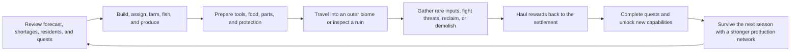

The loop should produce a recurring strategic question: **What must the settlement make today so that it can safely obtain what it cannot make locally tomorrow?** A tundra quest may require insulated panels and preserved meals. Insulated panels may require desert fiber and furnace output. Furnace expansion may require a reclaimed regulator. The regulator may sit in lava territory behind a dangerous route. Every layer feeds the same economy.

### 4.3 Progress without an overworld

Long-term progression is represented by **Settlement Tiers**, not locations on a route. Each tier is a permanent capability threshold based on buildings, survival reserves, population, production breadth, and selected quest or ruin achievements.

| Tier | Settlement identity | Typical unlocks |
|---|---|---|
| **I — Clearing** | Protos and the original home services | Basic shelter, crops, salvage, hand tools, local fishing |
| **II — Workshop** | Stable construction and first staffed production | Warehouse policy, furnace recipes, applicants, basic preservation |
| **III — Settlement** | Sustainable food, housing, power, and logistics | Quest Ledger expansion, specialized tools, ruin reclamation, biome camps |
| **IV — Frontier Hub** | Reliable outer-biome supply chains | Advanced processing, insulated/heat-shielded buildings, rare applicants, complex quests |
| **V — Enduring Community** | A settlement capable of surviving every season and biome pressure | Capstone construction, final production families, optional mastery quests, cosmetic world improvements |

Tier advancement is not a single score bar. Each tier has a short, explicit readiness checklist. The checklist should verify genuine system capacity—such as protected beds, preserved food days, reserve power, staffed production, and a functioning outer-biome supply route—rather than require repetitive resource grinding.

Tier V culminates in one **on-map capstone**, such as a Community Beacon or Horizon Array, constructed in the grassland settlement from advanced products supplied by every major system and outer biome. Completing it provides narrative victory, a permanent visual transformation, and optional mastery quests while leaving the settlement playable indefinitely. It is not a remote finale, a second map, or a reset trigger.

## 5. Construction as the primary expression of progression

Construction should be the player’s most visible answer to survival problems. A building is valuable because it changes what the settlement can safely do, not merely because it raises an abstract number.

### 5.1 Building families

The existing roster should remain the stable base. New content should first extend its upgrade paths and operational roles before creating a large blueprint catalog.

| Family | Core role | Expansion examples |
|---|---|---|
| **Shelter and care** | Protected beds, rest, recovery, morale | Insulation, heating, cooling, clinic beds, communal meals |
| **Storage and logistics** | Buffers, reserve floors, hauling endpoints | Cold storage, hazardous-material storage, biome transfer depots |
| **Extraction** | Staffed access to deposits and renewable sources | Pumps, insulated drills, thermal collectors, wetland harvest rigs |
| **Production** | Transform materials into survival and construction goods | Workbench modules, furnace upgrades, preservation, tool assembly |
| **Food and water** | Farming, orchard, fishing, purification, meals | Greenhouses, smokehouse, canning, bait workshop, water treatment |
| **Power and protection** | Facility operation and hazard resilience | Batteries, wind storage, thermal exchangers, perimeter warning systems |
| **Community** | Recruitment, wellbeing, quest capacity, social recovery | Commons, communications desk, training bay, applicant lodging |

### 5.2 Utilities and maintenance

To deepen construction without producing a wiring simulator from the lower circles of bureaucracy, utilities should remain bounded and readable. Buildings can require one or more of **power**, **water**, **heat protection**, **cold protection**, and **safe access**. These are network capabilities, not manually routed individual pipes for every tile.

Completed buildings also generate predictable maintenance demand. Maintenance consumes small amounts of parts, tools, or filters at day or season boundaries. Insufficient maintenance does not randomly delete a building; it creates a visible degraded state, reduced output, and a repair quest opportunity. The player must be able to forecast the next maintenance bill and reserve goods for it.

### 5.3 Placement and settlement shape

The existing footprint, orientation, entrance, occupancy, corridor, and protected-path rules should remain authoritative. The one-map design makes placement more important because distances persist. The player should develop recognizable districts—housing near safe services, production near warehouses, farms near water, and biome depots near dangerous borders—without formal zoning.

## 6. Production and physical logistics

### 6.1 A compact production web

The first content target should be **18–24 recipes across the existing stations and a small number of upgrades**. This is enough to create adaptation without burying the game beneath a fabricated encyclopedia.

Important functions should have one inefficient baseline method and one or more specialized alternatives. Ingredients should carry functional tags so different biomes can support different versions of the same economy.

| Function | Baseline method | Specialized alternatives |
|---|---|---|
| **Preserved food** | Mixed produce ration | Smoked fish, orchard preserves, fungal protein, mineral-cured meals |
| **Repair parts** | Scrap reconditioning | Iron casting, ceramic components, reclaimed precision modules |
| **Construction panels** | Salvage plate and fiber | Wetland laminate, insulated tundra shell, heat-reflective lava composite |
| **Tools** | Basic salvage tool | Thermal wrench, cryo drill, wetland harvester, precision demolition kit |
| **Water treatment** | Biomass filter | Conductive algae membrane, thermal distillation, cryogenic separation |
| **Power storage** | Reconditioned cells | Wind battery, thermal capacitor, reclaimed regulator bank |
| **Medical supplies** | Clean cloth and food extract | Wetland medicine, cryo stabilizer, ruin-derived diagnostic kits |
| **Protective gear** | Basic work covering | Mire boots, insulated suit, heat shielding, dust seals |

The exact ingredient substitutions must be authored and validated; arbitrary tag matching should not allow reeds to become a transmission gear merely because both are technically “things found outdoors.”

### 6.2 Production policy

The existing production policy is the correct control plane. It should expose global targets, building-local overrides, selected ingredient preference, recipe enablement, priority, reserve floors, current orders, output capacity, and a single stable idle reason.

The UI should answer five questions without opening multiple panels:

1. What item is below target?
2. Which building can produce it?
3. Which ingredient, worker, utility, tool, reserve, or storage condition is blocking it?
4. Where is the nearest valid source or stockpile?
5. Which accepted quest or survival forecast is reserving the available stock?

### 6.3 Physical hauling

Goods remain physical. Sources store output locally, haulers move goods to warehouses or production sites, production consumes local input, and completed goods require delivery. Outer-biome distance and hazard states reduce throughput. A lava route during an eruption warning may pause settler hauling entirely until Protos clears threats or a protected depot is built.

Quest requirements must use the same stock and reservation system. Accepting a delivery quest may reserve a player-selected amount, but it must never silently steal ingredients from active production. The policy view should show both demand sources.

## 7. Survival as sustained settlement pressure

Survival pressure should emerge from understandable resource obligations rather than a second defeat clock. The settlement persists, but poor preparation has lasting consequences.

### 7.1 Core survival dimensions

| Dimension | Pressure | Player responses |
|---|---|---|
| **Food** | Residents consume food; raw goods spoil or fail to cover harsh seasons | Diversify crops, orchard, fishing, meals, preservation, reserves, and quest rewards |
| **Shelter** | Unprotected or poorly insulated residents recover slowly and lose morale | Build beds, insulation, heating/cooling, maintenance, and emergency shelter |
| **Power** | Production, care, and biome protection compete for finite generation and storage | Prioritize loads, expand storage, reclaim generators, schedule production |
| **Water** | Farming, residents, processing, and heat events consume clean water | Purify, store, upgrade pumps, exploit oasis technology, reduce demand |
| **Safety** | Fauna, storms, terrain, and unsafe sites interrupt work and cause nonfatal injury | Escort with Protos, build protection, improve tools, reroute, pause work |
| **Wellbeing** | Rations, work fit, rest, concern, injury, and housing affect retention | Assign humanely, remedy concerns, recover, expand community services |
| **Maintenance** | Buildings and tools degrade predictably through use and seasons | Reserve parts, schedule downtime, complete repair quests, reclaim superior systems |

### 7.2 Seasons and forecast

The existing seasonal crop, orchard, and fishing systems should anchor a known calendar. A compact forecast shows the current season, the next weather event, affected biomes, expected temperature or hazard changes, and settlement consequences.

A season should change opportunity and preparation rather than merely recolor terrain. Green seasons favor crops and wetland gathering; dry periods improve desert access but increase water consumption; cold periods unlock some tundra resources while increasing heating demand; storms disrupt long routes and threaten exposed buildings. The cadence remains deterministic from the save seed and visible several days ahead.

### 7.3 Failure and recovery

The default game should avoid an abrupt global loss screen. Severe shortages create layered setbacks: residents stop unsafe work, morale falls, injuries require recovery, applicants stop arriving, residents may depart after an explainable remedy window, buildings degrade, and production contracts fail. Protos and the home clearing remain available for recovery.

An optional challenge mode may add a hard survival condition later, but it should not be part of the first overhaul slice. The base game’s tension comes from losing time, residents, opportunities, and material—not deleting the settlement.

## 8. Quest Ledger

Quests are the primary source of changing priorities and curated rewards. They adapt the functional role of *Against the Storm* Orders without copying its presentation, hierarchy, terminology, or reward economy.[3]

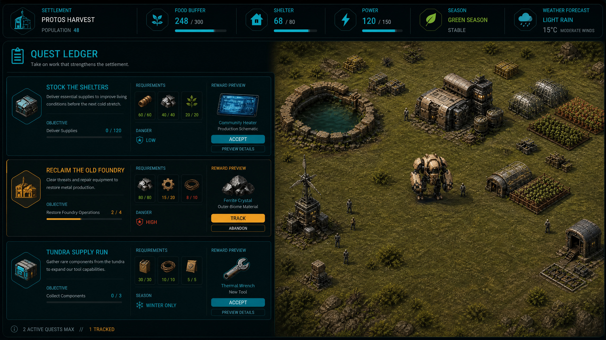

### 8.1 Offer and acceptance rules

The Quest Ledger presents **three offers** at a time. The player may accept up to **two active quests**. Unaccepted offers remain until the next scheduled refresh; accepted quests are never replaced automatically. The player may track one quest on the HUD and may abandon an accepted quest after a confirmation that shows its bounded quest-specific consequence, such as forfeiting a pledged resource deposit and leaving the slot occupied until the next refresh. Declining an unaccepted offer is consequence-free. There is no global reputation currency or victory track.

Offers are deterministic and capability-filtered. A quest cannot require a building, item, tool, biome, resident count, or ruin operation that is neither currently available nor explicitly granted by the quest chain. The generator considers settlement tier, season, known biomes, discovered ruins, production capabilities, residents, unresolved shortages, and recent quest history.

Quest completion is exact-once. Every accepted quest has a stable instance ID, objective state, reward bundle, source revision, expiry policy, and completion receipt. Replaying a completion token grants nothing twice.

### 8.2 Quest archetypes

| Archetype | Example objective | Typical reward |
|---|---|---|
| **Supply** | Deliver preserved meals, repair parts, medicine, or insulated panels | Rare material, applicant, tool, schematic |
| **Construction** | Build and operate a shelter, depot, greenhouse, or power buffer | Blueprint upgrade, settlement tier credit, permanent efficiency option |
| **Production** | Sustain an output target for several days without violating reserve floors | Recipe, station module, warehouse expansion |
| **Survival** | Enter a forecast hazard with specified reserves and finish without a critical safety stop | Protective gear, medicine, morale benefit |
| **Exploration** | Survey a biome landmark, fishing pool, source cluster, or ruin | Map intelligence, resource reveal, specialized tool |
| **Ruin operation** | Reclaim or demolish a named ruin under explicit constraints | Unique facility, recovered component, cleared construction parcel |
| **Community** | Resolve a concern, maintain protected beds, or complete a resident-led project | Applicant quality, community upgrade, wellbeing buffer |
| **Defense** | Protect a work site, defeat an apex threat, or keep a route safe during hauling | Weapon module, hazard protection, rare biome cache |

### 8.3 Objective composition

A quest contains one to three objectives. Objectives may be sequential when causality matters—for example, survey a ruin, deliver a repair bill, then operate the reclaimed facility for one day. They should not be disguised shopping lists of unrelated chores.

Quest progress is reduced **inside the existing `CrossDomainTransaction` candidate before its single validation, save, and publication**. A pure adapter translates the sealed operation payload and canonical result into objective deltas; it never mutates state after persistence. The authoritative operation applies those deltas, any exact-once completion receipt, and the owning inventory, construction, unlock, applicant, or world reward to the same detached candidate. Day advancement reduces quest progress from each subsystem’s canonical closing-day result in the existing deterministic order. A crash can therefore preserve either the complete operation and quest result or neither—never a committed action with missing progress or a reward in a second save.

### 8.4 Rewards

Rewards should create new possibilities rather than mostly return generic currency.

| Reward family | Examples | Guardrail |
|---|---|---|
| **Schematics and recipes** | Preservation, thermal tools, advanced filters | Must be feasible with owned or discoverable inputs |
| **Building capabilities** | Upgrade branch, extra storage, utility efficiency | Sidegrades and specialization before raw percentage inflation |
| **Rare materials** | Cryo crystal, conductive algae, thermal glass, precision modules | Bounded amounts that accelerate but do not replace biome access |
| **Tools and modules** | Demolition kit, insulated drill, Protos hazard module | New interaction or safer access rather than a generic damage ladder |
| **People and knowledge** | Applicant, resident project, source reveal, forecast extension | Must respect housing and authored-person rules |
| **Immediate relief** | Food cache, medicine, spare parts, temporary power cell | Useful recovery, never the only source of a critical item |
| **World improvement** | Repaired service lane, beautification, home visual upgrade | Persistent and visible on the single map |

## 9. Abandoned ruins: reclaim, demolish, or leave

Abandoned ruins are permanent authored opportunities distributed across the one map. Discovering a ruin exposes its identity, hazards, structural condition, salvage profile, possible reclaimed function, and operation requirements.

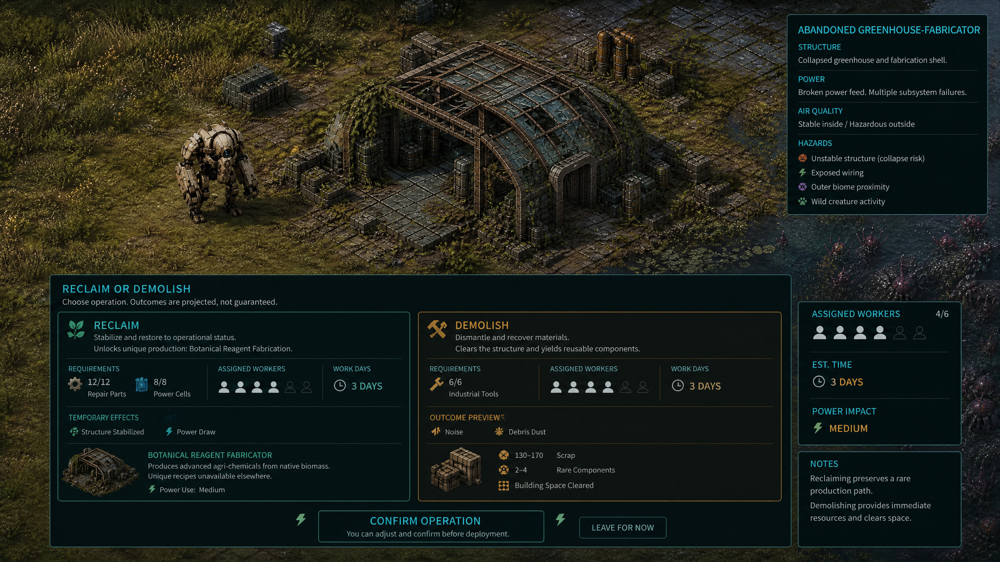

### 9.1 Operation paths

| Choice | Costs | Benefits | Permanent consequence |
|---|---|---|---|
| **Reclaim** | Repair parts, power components, workers, tools, several day commits, hazard protection | Restores a unique or more efficient building function; may unlock recipes, storage, shelter, power, or biome support | Ruin becomes an operational facility with maintenance and staffing needs |
| **Demolish** | Demolition tool, workers, hauling capacity, time, possible threat clearance | Returns scrap, rare components, reusable modules, and building materials; clears valuable footprint | Ruin is removed permanently and the parcel becomes buildable |
| **Leave** | No immediate cost | Preserves the option and avoids current danger | Site remains discoverable; some hazards or quests may persist |

Neither path is morally superior. Reclaiming is a long-term capability investment. Demolishing is an immediate material and space decision. The correct choice depends on settlement needs, route distance, workforce, season, and the uniqueness of the facility.

### 9.2 Ruin operation lifecycle

A ruin progresses through `undiscovered`, `assessed`, `operation_committed`, `in_progress`, and one terminal state: `reclaimed` or `demolished`. Assessment is non-mutating. Committing an operation seals the cost, workers, tools, predicted duration, hazards, and result. Day resolution advances work only when the assigned crew, access, safety, utilities, and reserved inputs remain valid.

Interruption never deletes paid goods silently. Unconsumed reserved inputs remain recoverable, and the UI shows what is needed to resume. Completion creates one exact receipt and applies the world, construction, inventory, and quest effects atomically.

### 9.3 Ruin examples

| Ruin | Reclaimed function | Demolition yield |
|---|---|---|
| **Collapsed greenhouse-fabricator** | Advanced agricultural reagents and off-season crop support | Glass panels, irrigation parts, rare processor |
| **Dormant thermal exchange** | Converts lava heat into stable settlement power | Thermal glass, heat shielding, capacitor core |
| **Flooded membrane works** | High-efficiency water purification using wetland inputs | Conductive membranes, pumps, clean-water cache |
| **Frozen archive shelter** | Cold-safe depot, forecast extension, cryo recipe access | Insulated panels, data core, precision components |
| **Desert relay foundry** | Efficient ceramic and metal-bearing processing | Furnace modules, alloy stock, cleared large footprint |

## 10. Outer biomes: unique value, increasing danger

The grassland is safe and broadly sustainable but intentionally cannot produce every advanced input. The outer biomes supply specialized resources, facilities, fish, plants, energy, and quest opportunities. Access is physical and continuous; the player must prepare Protos, workers, tools, depots, and hauling capacity.

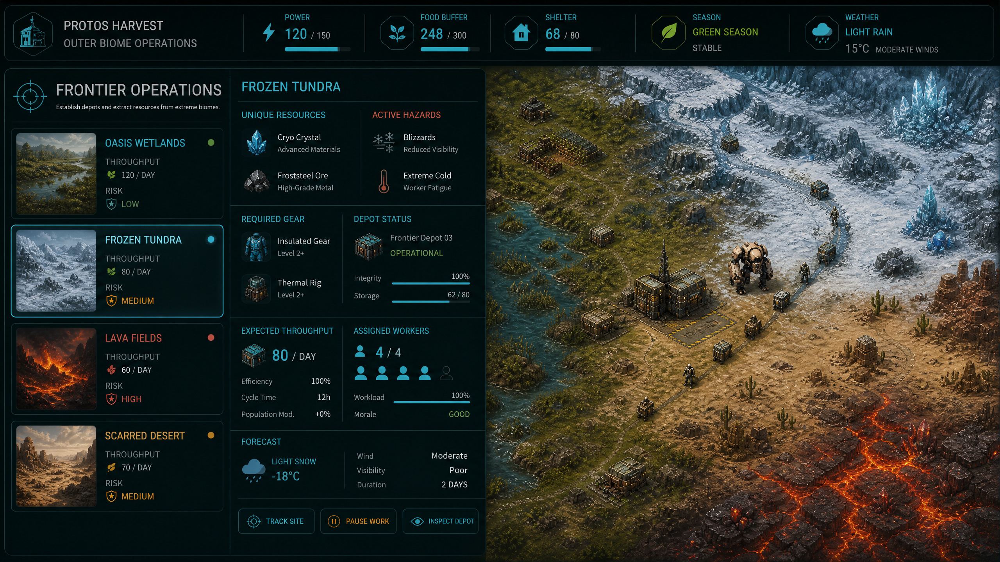

| Biome | Unique rewards and resources | Primary dangers | Preparation and infrastructure |
|---|---|---|---|
| **Grassland clearing** | Staple crops, orchard fruit, pond fish, biomass, common salvage, applicants | Low ambient danger; occasional perimeter threats and seasonal shortages | General storage, farms, housing, baseline power and production |
| **Oasis wetlands** | Medicinal reeds, conductive algae, wetland fiber, membrane materials, rare fish | Mire fauna, flooding, contaminated water, slow movement, disease exposure | Mire boots, elevated paths, pumps, protected wetland depot, medicine |
| **Frozen tundra** | Cryo crystal, insulated fiber, preserved biomass, cold-water catches, archive ruins | Cold exposure, whiteouts, reduced battery output, ice predators | Insulated gear, heated shelter, energy reserve, marked route, cryo drill |
| **Lava fields** | Thermal glass, heat-resistant alloy, geothermal energy, furnace catalysts | Heat exposure, eruptions, unstable ground, aggressive fauna, equipment wear | Heat shielding, coolant, protected power, thermal tools, emergency depot |
| **Scarred desert** | Ceramic mineral, solar components, dry fibers, precision salvage, foundry ruins | Dust storms, water consumption, long sight-line threats, tool abrasion | Water reserve, dust seals, shade shelter, route markers, spare tools |

Outer-biome value should increase with travel and survival cost, but no single biome may contain the only source of a basic survival good. The settlement can always produce inefficient food, repair parts, water treatment, and shelter protection from grassland materials. Outer resources make those functions stronger, cheaper, faster, or capable of supporting higher tiers.

### 10.1 Biome work sites and depots

Workers may be assigned to outer-biome sites only when a safe route and compatible depot exist. A depot is a normal persistent building on the same map, not a miniature settlement. It provides local storage, shelter during forecast hazards, and a hauling endpoint. It does not spawn residents or simulate a second economy.

A route projection shows distance, terrain cost, active hazards, expected daily throughput, required protection, and current threat state. Protos can clear threats, repair infrastructure, deliver emergency supplies, and escort initial operations. Once conditions are safe, assigned workers operate through the normal workforce and day-resolution systems.

## 11. Combat inside the settlement economy

Combat remains embodied and primarily owned by Protos. It should protect access, workers, facilities, and logistics rather than form an independent relay-hunting objective.

Threats can block a deposit, damage an exposed route, interrupt ruin work, threaten a depot, or make a quest unsafe. The player can respond by fighting, improving protection, changing timing, building a safer route, temporarily unassigning workers, or abandoning the opportunity. Every dangerous task should expose at least one preparation or avoidance response in addition to combat.

Settlers retreat from declared critical sites and remain governed by the existing nonfatal injury and recovery rules. The design does not add permanent settler death for dramatic seasoning. Protos damage consumes repair parts, time, and power and can force an outer-biome withdrawal.

## 12. Settlement interface and information architecture

The field remains primary. The HUD should show only settlement-level survival signals: current season and forecast, food buffer, protected beds, power reserve, tracked quest, and one highest-priority warning. Detailed management lives in modal native Godot panels.

The approved interface direction is an **industrial stewardship console**: near-black translucent surfaces, oxidized-teal framing, cyan operational data, amber consequential actions, muted red danger, compact technical typography, and a persistent live-world aperture. Native Godot Controls own layout and text; generated concepts define visual hierarchy rather than becoming flattened interactive screenshots.

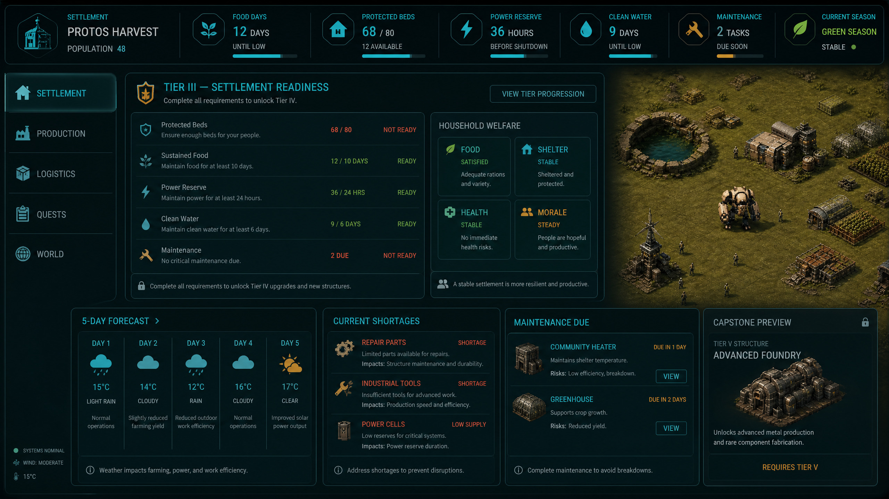

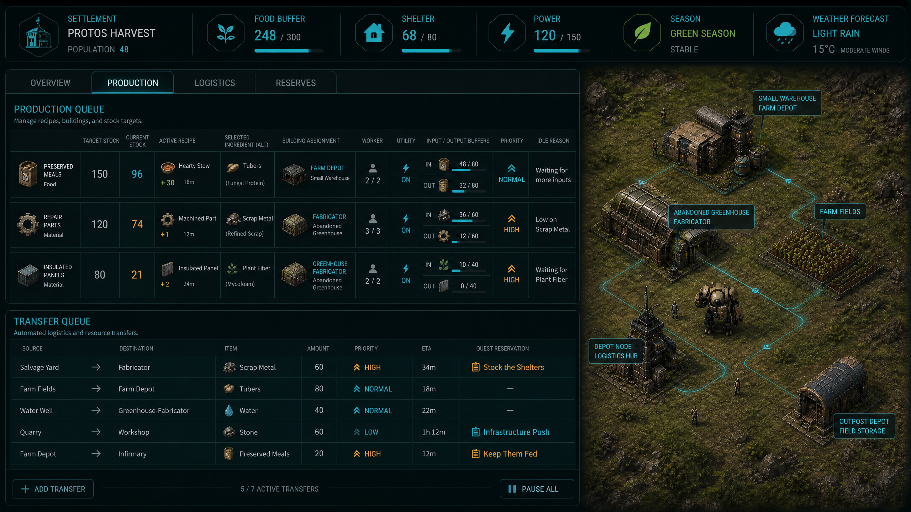

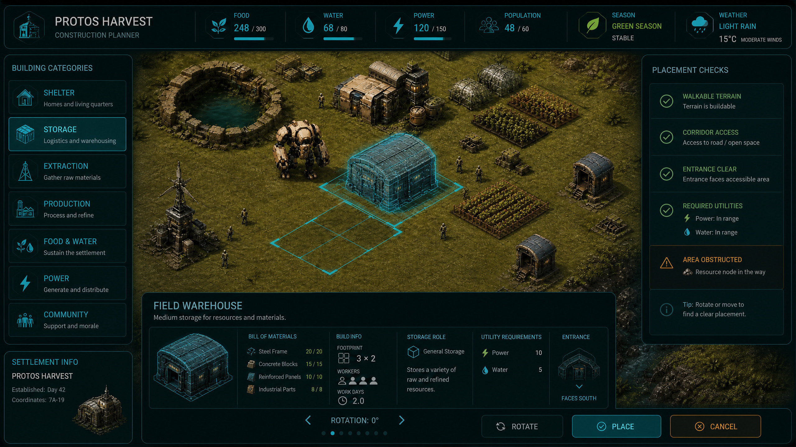

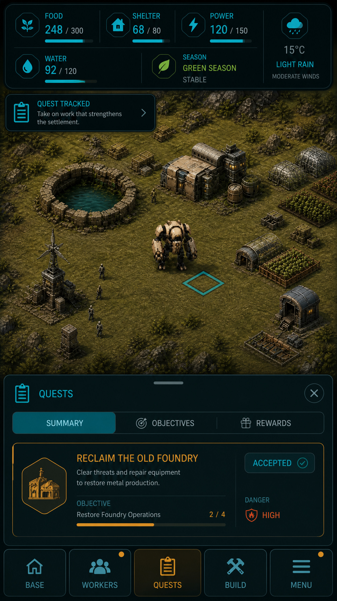

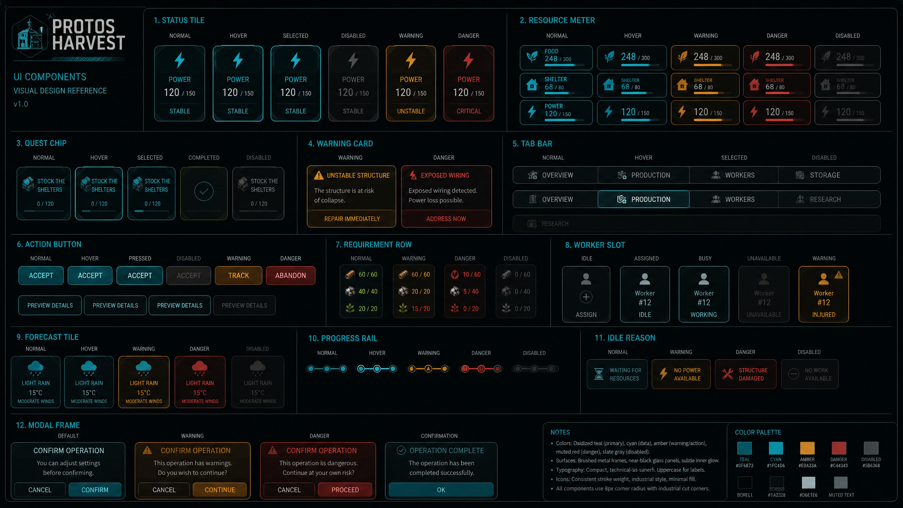

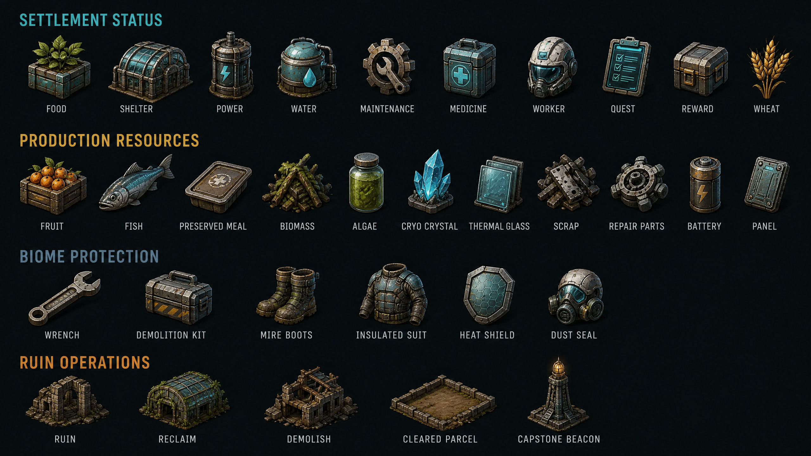

The recommended console has five sections:

| View | Purpose |
|---|---|
| **Settlement** | Food days, shelter, power, water, maintenance, resident status, tier readiness |
| **Production** | Targets, recipes, queues, ingredients, reserves, output, bottlenecks |
| **Logistics** | Warehouses, depots, jobs, routes, throughput, quest reservations, idle reasons |
| **Quests** | Offers, accepted objectives, progress, rewards, tracking, abandonment |
| **World** | Known biomes, hazards, deposits, fishing pools, ruins, work sites, and route readiness on the same map |

The old Region tab is not retained because there is no overworld. The removed tutorial system remains removed. Discovery uses inspectable reasons, glossary links, concise first-use highlights attached to existing controls, and pauseable diagnostics.

Information follows four rules:

1. Every requirement names the current amount, needed amount, source, and reservation owner.
2. Every blocked job exposes one stable reason and one relevant inspection target.
3. Every future season, quest expiry, ruin step, maintenance bill, or recovery event shows its resolving day.
4. Color remains redundant with icon, shape, pattern, and localized text.

## 13. Distinctive identity and anti-copy boundary

The revised proposal borrows systemic principles, not protected expression.

| *Against the Storm* expression | Protos Harvest expression |
|---|---|
| Multiple temporary settlements | One permanent settlement on one continuous map |
| World-map cycle | Persistent seasons and settlement tiers |
| Orders | Capability-filtered Quest Ledger |
| Reputation victory | Permanent construction, production breadth, and tier readiness |
| Queen’s Impatience defeat | Layered food, shelter, power, safety, wellbeing, and maintenance setbacks |
| Forest Hostility | Authored biome hazards and forecast weather |
| Glades | Visible outer-biome territories and persistent abandoned ruins |
| Cornerstones | Tools, engineering modules, recipes, and building upgrade branches |
| Blueprint draft deck | Stable construction roster with quest/ruin-earned specializations |
| Species resolve | Authored human morale, needs, concerns, injury, recovery, and agency |
| Overseer camera | Direct control of Protos remains essential for traversal, repair, gathering, and combat |

Terms from the previous proposal that should be retired are: **Restoration Deployment, Restoration Verification, Restoration Window, Biome Strain, regional expedition, regional route, node graph, relay capacity, autonomous site, Convergence data, Convergence Site, evacuation state, and campaign graph**. “Restoration” may remain in narrative descriptions of repairing a specific facility, but it is not a global score or game mode.

## 14. Technical architecture

### 14.1 New bounded authorities

The simplified architecture adds local authorities only.

| Authority | Responsibility |
|---|---|
| `settlement_progression_catalog.gd` | Tier requirements, unlocks, readiness projections, and stable IDs |
| `settlement_progression_service.gd` | Exact tier advancement and unlock receipts |
| `quest_catalog.gd` | Authored templates, objective definitions, capability predicates, reward bundles |
| `quest_offer_service.gd` | Seeded capability-filtered offers, refresh cadence, recent-history exclusions |
| `quest_state_service.gd` | Accept, track, abandon, progress, expiry, completion, exact-once rewards |
| `quest_event_adapter.gd` | Pure translation of sealed operation/day results into quest deltas inside the owning transaction; never a post-save listener |
| `ruin_operation_catalog.gd` | Reclaim/demolish bills, workers, tools, durations, hazards, and results by ruin kind |
| `ruin_operation_service.gd` | Assessment, sealed commit, day progress, interruption, completion, and atomic effects |
| `biome_access_catalog.gd` | Resource identity, hazard rules, gear requirements, and depot compatibility |
| `biome_route_projection.gd` | Read-only distance, hazard, protection, and throughput calculations on the live map |
| `settlement_survival_projection.gd` | Food days, water, power, shelter, maintenance, and forecast explanations |
| `settlement_capstone_service.gd` | Exact on-map capstone contributions, completion, visual transformation, and endless-continuation flag |
| `quest_ledger_presenter.gd` | Responsive read-only Quest Ledger and intents into transaction boundaries |

The prior `regional_expedition_schema`, `regional_route_generator`, `restoration_mission_schema`, `restoration_verification_service`, `biome_strain_service`, `convergence_service`, and campaign persistence horizon are not recommended and should not be implemented.

### 14.2 Reuse map

The overhaul should reuse `CrossDomainTransaction`, `SaveRepository`, schema validation, canonical hashing, bounded receipts, construction, gathering, orchards, fishing, local storage, logistics, production policy, workforce, housing, wellbeing, day resolution, interaction phases, inspectable-world projections, responsive modal controls, and the current biome/combat authorities.

The **homestead ruin substate remains the sole persisted owner** of ruin lifecycle data. `ruin_operation_service.gd` builds candidate mutations through `CrossDomainTransaction`; `RuinRegistry` remains only the stable-ID lookup and read-only live projection populated from the committed homestead. The three existing fixed facilities retain compatibility adapters and protected-anchor rules while the validator expands to the bounded abandoned-ruin schema.

Compatibility is a one-time pre-game migration, not a playable second topology. A supported old save retains its farm, homestead, residents, inventory, permanent unlocks, and valid banked goods; any active relay expedition is deterministically archived or cancelled under a disclosed bounded compensation rule, then its compatibility `active_run` payload is neutralized. Every migrated and new save enters the same persistent woodland spawn map. New-run launch, relay progression, run extraction/settlement, launch-next flow, alternate gameplay-scene entry, and the old terminal are unreachable after migration.

### 14.3 Persistence

The one-map design preserves envelope schema 5 for the first release and performs an explicit **homestead substate v2 → v3 migration**. Migration verifies the original raw gameplay hash before adding exact bounded `progression`, `quests`, and `ruin_operations` keys, normalizes the three existing facility records into protected compatible states, canonicalizes all collections, and then rebases the normalized hash. `homestead_save_schema.gd`, `farm_save_schema.gd`, and their cross-section validators own the new exact-key and link contracts. A top-level schema 6 is not justified merely to add local quests and ruin operations.

| Section | Added bounded state |
|---|---|
| **Settlement progression** | Current tier, readiness receipts, selected upgrade branches |
| **Quests** | Three offers, at most two accepted quests, one tracked ID, recent-history ring, completion receipts |
| **Ruin operations** | Assessment, selected operation, progress, reservation, terminal reclaimed/demolished state, reward token |
| **Production** | Expanded recipes and policies using existing bounded orders and stacks |

No biome route or cache state is persisted in the first release. Depots remain ordinary construction records, their inventories remain existing building-local stacks, and route readiness, distance, hazard, protection, and throughput are derived on demand from committed construction, world, weather, fauna, workforce, and logistics data. Expanded recipes remain catalog data plus existing per-building policy and order state.

Caps should remain explicit: three offers, two accepted quests, one tracked quest, 32 recent/completed quest summaries, one active operation per ruin, 24 authored ruins, 24 residents, 24 recipes in the first release, and no collection that grows from elapsed time alone.

### 14.4 Determinism and exact-once behavior

Quest offers sort eligible template IDs before seeded selection. The owning transaction invokes the pure quest reducer with its sealed payload and canonical operation result before validation; quest completion and reward mutation share that same candidate and a bounded quest receipt namespace. Receipt compaction may discard old operational detail only after the compact quest state and completion receipt are durable. Ruin operations bind source revision, ruin ID, choice, bill, workers, tools, duration, and projected result in a sealed payload. Day advancement remains the only clock for crops, orchards, fishing renewal, wellbeing, production, hauling, maintenance, quest deadlines, weather, and ruin work.

No gameplay result depends on frame delta, wall-clock time, presentation visibility, or dictionary iteration order. A browser refresh must not duplicate a reward, advance ruin work, reroll offers, or consume another season day.

## 15. Phased implementation plan

The reduced design should be delivered in five independently shippable phases. After every phase: protect local work, integrate upstream, run focused and historical suites, import through Godot 4.7.2, run bounded headless boot, execute landscape/portrait Xvfb checks with representative input, run `verify.sh --release`, boot the exact exported PCK, serve over HTTP, inspect browser/network/runtime logs, update evidence, commit, and fast-forward push to `main`.

| Phase | Scope | Exit gate | Relative effort |
|---|---|---|---:|
| **S0 — Simplified contracts and quest vertical slice** | Freeze single-map terminology; implement one-time active-run migration; disable launch, relay, run settlement, and alternate scene entry; add homestead v3 quest keys; build three offers, one accepted quest, one supply objective, an in-transaction quest reducer, exact reward, and responsive Ledger | Every supported old/new save enters the same spawn map; no old run path is reachable; accept/progress/reward is crash-safe, compaction-safe, cold-reloadable, and exact once | 9–14 engineer-days |
| **S1 — Production survival core** | Expand to 18–24 recipes, preserved food, utilities, maintenance, survival projection, quest reservations, forecast links | Three viable ways to sustain core food/parts; all shortages and maintenance states explain themselves | 15–22 days |
| **S2 — Ruin operations** | Homestead ruin v3 validator/migration, protected adapters for the three existing facilities, Assessment, Reclaim/Demolish/Leave, five ruin archetypes, worker/resource scheduling, atomic world/inventory/building/quest results | Persisted homestead is sole authority; every path cold-reloads and completes exactly once; reclaimed facilities and cleared parcels persist | 12–18 days |
| **S3 — Outer-biome economy** | Unique resource tags, gear, depots, route projection, hazard work stops, biome quests, production alternatives | Each outer biome provides unique optional value; grassland always supports inefficient recovery; no second economy | 15–22 days |
| **S4 — Settlement tiers, capstone, balance, and release** | Tier readiness, reward pacing, quest pool, resident/community quests, on-map capstone construction, exact narrative completion and visual transformation, difficulty options, localization, performance and accessibility | Capstone consumes products from every major production/biome family through existing transactions, cold-reloads, completes once, changes no scene, resets nothing, and allows indefinite play; stable ten-year soak and full release matrix | 16–24 days |

The order-of-magnitude implementation range is **63–94 engineer-days**, substantially below the previous route-based proposal’s 93–139 day estimate. S0 is the greenlight gate. If one accepted quest does not improve construction and production priorities on the current map, adding forty more quests will merely industrialize disappointment.

## 16. Validation and balancing plan

### 16.1 Automated contracts

The test matrix should cover capability-filtered quest offers, acceptance caps, tracking, abandonment, sequential objectives, deadlines, exact-once completion, reward feasibility, recent-history bounds, ruin assessment purity, sealed operation equality, resource reservation, interruption, resumed progress, reclaim/demolish exclusivity, cleared occupancy, unique facility activation, biome gear requirements, depot authority, route throughput, survival projections, maintenance forecasts, additive save normalization, and cold reload.

A deterministic simulation should run at least 10,000 generated quest sets across settlement tiers, seasons, known biomes, available recipes, ruins, and resident counts. Every offer set must contain at least one achievable quest. No quest may require its own reward as a prerequisite. No basic recovery resource may depend exclusively on an outer biome or random offer.

A ten-year settlement soak should advance seasons, production, logistics, residents, concerns, fishing renewal, orchards, maintenance, quests, ruins, and biome sites while proving bounded save size, receipt compaction, stable event history, no orphan reservation, and no second resident or inventory authority.

### 16.2 Player-facing success metrics

| Metric | Healthy signal | Failure signal |
|---|---|---|
| **Construction decisions** | Placement, upgrade, utility, and maintenance change logistics and survival | Buildings are cosmetic unlock gates or obvious linear upgrades |
| **Production diversity** | Different biome inputs and quests produce different viable recipe choices | The same recipe sequence dominates every save |
| **Quest acceptance** | Players decline or delay offers because opportunity cost is real | Every quest is free value or most offers are ignored as chores |
| **Quest rewards** | Rewards unlock capabilities or solve strategic constraints | Rewards are mostly generic scrap or mandatory progression keys |
| **Ruin choices** | Reclaim and demolish both appear in successful settlements | One option is mathematically correct for nearly every ruin |
| **Outer-biome activity** | Players prepare, establish depots, and return for specific value | Biomes are mandatory grind zones or decorative combat arenas |
| **Survival readability** | Most shortages and injuries were forecast and preventable | Failure arrives without causal information or recovery options |
| **Settlement persistence** | Players develop attachment to layout, residents, and repaired landmarks | Progress feels like filling bars while the world remains unchanged |
| **Field-to-console ratio** | Most actions remain embodied; panels diagnose and commit | The optimal game is played entirely in modal spreadsheets |

### 16.3 First public overhaul release

The first release should contain one persistent map, the safe grassland plus four existing outer biomes, five ruin archetypes, 18–24 recipes, six quest archetypes with at least 24 authored templates, two accepted quest slots, five settlement tiers, utility and maintenance projections, four biome depot variants or upgrades, one on-map capstone assembled from every major production and biome family, and full keyboard/controller/touch parity.

It must preserve the borderless fullscreen Web host, current construction and settlement content, exact Godot 4.7.2 compatibility, existing humane resident rules, current combat, title presentation, tutorial removal, and biome-wide grassland safety presentation. Every supported old save must migrate before gameplay into the same woodland spawn map, with no launch or alternate run topology left reachable.

## 17. Recommended first decision

Approve **S0 only**. Build one complete Quest Ledger slice on the existing map:

- three deterministic capability-filtered offers;
- one accepted supply or construction quest;
- visible progress from existing authoritative events;
- one exact-once reward that unlocks a useful production option;
- responsive landscape and portrait presentation;
- additive schema-5 compatibility and cold reload.

That slice answers the most important design question cheaply: **does an accepted objective make the persistent settlement’s construction and production decisions more interesting?** If yes, S1–S4 deepen one coherent game. If no, the repository retains a reusable objective service without inheriting an overworld-shaped mausoleum.

## 18. Delivery companion

The approved concept is implemented through [Protos Harvest: Living Settlement Implementation Plan](PROTOS_HARVEST_LIVING_SETTLEMENT_IMPLEMENTATION_PLAN.md). That plan is authoritative for work-package order, ownership, schema migration, asset production, verification, phase evidence, commit/push cadence, and WebDev deployment.

## References

[1]: https://eremitegames.com/devlog-7-blueprint-drafting-system-and-more/ "Eremite Games — Blueprint Drafting System and More"
[2]: https://eremitegames.com/recipes-cookbook-update/ "Eremite Games — Recipes Cookbook Update"
[3]: https://wiki.hoodedhorse.com/Against_the_Storm/Beginner%27s_Guide "Against the Storm Official Wiki — Beginner’s Guide"
[4]: https://wiki.hoodedhorse.com/Against_the_Storm/Seasons "Against the Storm Official Wiki — Seasons"
