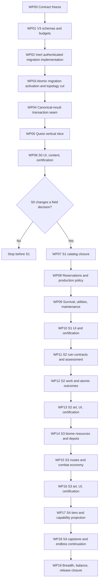

# Protos Harvest: Living Settlement Implementation Plan
## One Persistent Map, One Economy, One Deterministic Settlement

**Author:** Manus AI
**Plan status:** Approved implementation plan
**Canonical repository:** [junnyboi/proto-isometric](https://github.com/junnyboi/proto-isometric)
**Planning baseline:** `fab0f487d9061f74ac0d3794da9335d3dce53da7`
**Engine contract:** Godot `4.7.2.stable.official.ed1daf0bf`, GL Compatibility, no-threads Web
**Product authority:** [Protos Harvest: The Living Settlement](PROTOS_HARVEST_LIVING_SETTLEMENT_CONCEPT_PROPOSAL.md)
**Concept asset authority:** [Living Settlement Concept Asset Manifest](concept/living-settlement/ASSET_MANIFEST.md)

## 1. Purpose and release decision

This plan converts the approved Living Settlement proposal into an executable program for the canonical repository.[1] The finished game remains **one continuous isometric map** containing the grassland settlement and four physically reachable outer biomes. Construction, production, logistics, residents, quests, ruins, combat outcomes, settlement progression, and the capstone all operate through one farm/homestead save horizon and one deterministic day clock.

The implementation deliberately excludes an overworld, regional route graph, deployment selector, remote settlement, second inventory, autonomous depot economy, alternate gameplay scene, and finale reset. The title scene may remain an entry shell. Every supported save must enter `scenes/isometric_map.tscn`, and narrative completion must leave that same settlement running indefinitely.

> **Program rule:** Do not preserve a hidden version of the retired run topology merely to make migration easier. If a system cannot be expressed as bounded state or a projection of the one settlement, it does not belong in this release.

The work is divided into **twenty strictly ordered work packages, WP00–WP19**. Each work package is independently reviewable, regression-tested, committed, and pushed to `main`. S0 is a mandatory stop/go product gate. S1–S4 do not begin unless the completed Quest Ledger slice changes a real construction or production decision without displacing embodied field play.

## 2. Non-negotiable product and engineering constraints

| Constraint | Implementation rule |
|---|---|
| **Topology** | One reachable gameplay scene, one settlement, one economy, one clock. `active_run` is canonical `null` after migration. |
| **Persistence** | Keep envelope schema `5`. Migrate only `farm.homestead` from v2 to exact v3 after untouched raw-hash verification. |
| **Authority** | Every durable datum has one owner. UI, audio, streamed Nodes, registries, and projections never become mutation authorities. |
| **Transactions** | Every gameplay mutation, quest delta, completion, and reward is assembled in one detached `CrossDomainTransaction` candidate before one validation/save/publication. |
| **Time** | Only `DayAdvanceService` advances simulation. Frame time, wall time, browser refresh, modal visibility, and offline elapsed time have no authority. |
| **Population** | Preserve protected beds, optional compatible work, humane safety stops, nonfatal injury, explicit remedies, and voluntary departure. Add no permanent resident death or coercive quest incentives. |
| **World** | Grassland remains biome-wide safe. Outer biomes are valuable and dangerous but never the sole source of basic recovery goods. |
| **UI** | Native Godot Controls own text, focus, hit geometry, progress, accessibility, and localization. Concept images are visual references, not flattened interfaces. |
| **Assets** | Generate new visual assets with GPT Image 2 after IDs and silhouettes freeze. Record provenance and verify runtime/PCK closure. |
| **Release** | Exact Godot 4.7.2 import, tests, bounded boots, dual-aspect visual checks, release export, exact PCK boot, HTTP browser validation, and clean diagnostics are required for every pushed work package. |

## 3. Phase map and dependency graph



| Phase | Primary result | Hard exit gate |
|---|---|---|
| **S0 — One map and quests** | Canonical null-run topology, homestead v3, atomic canonical results, one useful Quest Ledger slice, new HUD/shell | Every supported save enters one map; one quest action/progress/reward is atomic, exact-once, responsive, and materially useful. |
| **S1 — Production survival** | 18–24 recipes, owner-attributed reservations, utilities, maintenance, survival projections, Production/Logistics/Settlement views | Three viable grassland recovery strategies; shortages expose current, needed, source, owner, reason, and resolving day. |
| **S2 — Ruin operations** | Five ruin archetypes with Assess, Reclaim, Demolish, Leave, multi-day work, atomic world outcomes | Both terminal choices are viable and exact-once; no duplicate facility, blocker, salvage, worker, or reservation remains. |
| **S3 — Outer-biome economy** | Four unique resource loops, four ordinary depots, derived routes, humane work stops, atomic combat economy | Each biome is optional but valuable; routes are deterministic and unpersisted; no second economy appears. |
| **S4 — Progression and capstone** | Five settlement tiers, branches, unified capabilities, one on-map capstone, indefinite continuation | Capstone completes once with no scene change/reset; all settlement systems continue indefinitely. |

## 4. Canonical ownership model

| Concern | Persisted owner | Mutation authority | Projection/presentation |
|---|---|---|---|
| Save, recovery, revision, hash | Schema-5 envelope | `SaveRepository`, migration and hash services | Repository status only |
| Whole operation | Detached envelope candidate | `CrossDomainTransaction` | Published canonical result |
| Calendar and weather | `farm.calendar_weather`, day tokens | `DayAdvanceService`, `CalendarState` | Forecast and survival projections |
| World and occupancy | Existing world, construction, mutation ledger | Existing construction/world transaction services | `InfiniteWorld`, occupancy, batched render catalogs |
| Protos state | Not persisted in this release | Field session runtime | HUD/session feedback |
| Physical goods | Robot/home inventories and building-local stacks | `InventoryService`, `BuildingLocalStorageService` | Inventory-location projection |
| Logistics and reservations | Existing versioned `farm.logistics` | `LogisticsService`, `LogisticsReservationService` | Stock, jobs, routes, bottleneck projections |
| Construction and occupancy | `homestead.construction` plus existing world ledger | Existing construction transaction services | Construction and occupancy projections |
| Utility and maintenance policy | Maintenance and utility subrecords on canonical construction records | `SettlementSurvivalService` plus explicit policy transactions | Utility and maintenance projections |
| Production | Building policies, orders, local buffers | `ProductionPolicyService` | Production projection and presenter |
| Residents | Existing resident, applicant, workforce, housing, wellbeing state | Existing humane population services | Roster, housing, work, care projections |
| Quests | `homestead.quests` | `QuestStateService`; rewards delegate to existing domain owners | Quest Ledger and tracked HUD chip |
| Progression | `homestead.progression` | `SettlementProgressionService` | Capability/readiness/tier projection |
| Ruin lifecycle | Homestead `ruins` plus `ruin_operations` continuation | `RuinOperationService` | Read-only `RuinRegistry` and batched lifecycle art |
| Biome routes | Not persisted | Existing operations consume catalog/projection facts | `BiomeRouteProjection` |
| Combat consequences | Existing ecology, world, inventory, receipts | Sealed combat-outcome operations | Transient pooled enemy and hazard Nodes |
| Capstone | Progression record plus one construction/world link | `SettlementCapstoneService` and construction transaction | Progression and world presentation |
| UI and settings | Gameplay UI state is ephemeral; bounded local preferences remain in `user://` | Presenters and `PlayerPreferences` | Native Controls and accessibility names |
| Assets and audio | Catalogs, locale JSON, integrity ledger | Build-time tooling; `AudioService` for playback | Specialized visual/audio catalogs |

`RuinRegistry`, presenters, audio cues, UI signals, scene Nodes, and browser events are prohibited from mutating gameplay state. They may request semantic intents or animate an acknowledged result, nothing more.

## 5. Persistence and migration contract

### 5.1 Canonical post-S0 envelope

Every supported source converges before field input is enabled:

```text
save_format_version = 5
farm.mode = gameplay_mode.fresh_farm
farm.homestead.state_version = 3
farm.migration_tokens contains migration.topology.single_map_v1
active_run = null
profile.pending_modifier_offer = []
profile.selected_next_modifier = modifier.neutral
main gameplay scene = scenes/isometric_map.tscn
spawn = authored woodland clearing spawn
```

The v3 homestead root adds exactly `progression`, `quests`, and `ruin_operations`. WP01 defines, WP02 implements and fixture-tests, and WP03 first emits the **complete public v3 persisted shape**: neutral progression including standard `difficulty_id` and capstone state; quest and ruin-operation sections; exact ruin lifecycle records; construction branch, maintenance, and utility-policy subrecords; versioned logistics reservations; and every receipt namespace in §5.5. Survival does not receive a fourth root. Physical survival goods remain in canonical inventories/local stacks; maintenance and utility policy extend construction records; owner-attributed reservations extend logistics; food days, water days, utility allocation, route status, warnings, readiness, and forecast summaries remain derived.

### 5.2 Legacy-run compensation

| Legacy state | Frozen treatment |
|---|---|
| Farm, homestead, residents, relationships, inventory, construction, world, valid ecology, banked totals, permanent unlocks | Preserve semantically through canonical normalization. |
| Unbanked Scrap and Worm Cores | Partial inventory credit unless the last profile summary proves the same run was already returned. |
| Uncollected run drops | Scrap/Core values are eligible because they were never banked. |
| Credit order | Worm Cores, then Scrap; existing robot stack, existing home stack, new robot stack, new home stack. Never exceed slots or stack caps. |
| Overflow | Credit only what fits. Record explicit forfeited counts; do not invoke all-or-nothing overflow credit. |
| Run phase | Bootstrap, hunt, extraction-ready, succeeded, and failed use the same returned/not-returned rule. |
| Modules, modifier, relays, objectives, events, chassis, shutdown, field position/facing, refit and first-worm flags | Retire with no mapping. Disclose bounded counts and legacy phase. Session Protos begins healthy at woodland spawn. |
| Profile offer | Clear; set selected modifier to neutral. |
| Last run summary | Replace with inert bounded migration disclosure. Shipping gameplay and UI must have zero reads after WP03. |
| Idempotence | Migration token, credits, profile cleanup, v3 state, fresh mode, and null run share one hash revision. Token plus non-null run is invalid. |

A valid legacy save that exceeds the approved 24-resident or 24-authored-ruin product cap is rejected with an explicit compatibility status pending a separately approved archival policy. It is never silently truncated, merged, evicted, injured, or deleted.

### 5.3 Migration sequence

1. Parse bounded JSON and classify raw schemas 1/2, envelopes 3/4, pre-S0 schema 5, current schema 5, malformed, or future.
2. For hashed schema 5, verify the untouched raw gameplay hash before injecting keys or changing topology.
3. Validate the source against its exact historical shape and cross-links.
4. In WP02 fixture harnesses, then in the WP03 production activation, run `single_map_topology_migration.gd` on a detached envelope to calculate partial credit, profile cleanup, fresh mode, migration disclosure, and null run.
5. Run `homestead_v3_migration.gd` to add exact v3 state and normalize the protected home, greenhouse, workshop, and clinic; production first reaches this step only in WP03's atomic topology cut.
6. Canonically sort every collection and validate IDs, links, caps, receipt quotas, section budgets, and total bytes.
7. Rebase the gameplay hash once over the complete result.
8. Commit through validated temporary write and primary/backup rotation before enabling input.
9. On restart, recover either the complete old source or complete new candidate. Hybrid state fails validation.

### 5.4 Bounded v3 state

| Collection | Hard cap |
|---|---:|
| Quest offers / accepted / tracked | 3 / 2 / 1 |
| Objectives per accepted quest | 3 |
| Quest summaries / completion receipts | 32 / 32 |
| Authored ruins / active operation per ruin | 24 / 1 |
| Residents / housing / work assignments | 24 / 24 / 24 |
| Buildings / footprint cells | 64 / 16 |
| Logistics jobs / active reservations | 128 / 64 |
| Recipe policies and orders per building | 8 / 8 |
| First-release recipes | 18–24, maximum 24 |
| Maintenance stacks / selected branches per building | 4 / 2 |
| Sparse source deltas / day tokens / receipts | 256 / 64 / 128 |
| Canonical envelope / ordinary target / raw read ceiling | 1,572,864 / 262,144 / 2,097,152 bytes |

### 5.5 Exact receipt quota

The shared receipt cap remains 128. The implementation must use this exact total:

| Namespace | Quota | Namespace | Quota |
|---|---:|---|---:|
| quick | 4 | construction | 6 |
| deposit | 6 | applicant | 4 |
| assignment | 6 | shift | 24 |
| transfer | 12 | production | 12 |
| wellbeing | 4 | tree | 4 |
| fish | 4 | day | 4 |
| machine | 6 | ecology | 4 |
| quest | 8 | ruin | 6 |
| maintenance | 4 | progression | 4 |
| capstone | 6 | **Total** | **128** |

Naturally idempotent policy replacements use expected revision rather than receipts. Operational detail may compact only after durable domain terminal state makes replay harmless.

### 5.6 Public-shape activation rule

WP02 is the sole implementation of the homestead v2→v3 transformer, but it remains unreachable from the production load path and cannot persist a real save in that package. WP03 activates that already-tested transformer in the same commit that removes runtime dependence on the retired run topology. Packages WP05–WP18 activate behavior and populate records that already exist in the exact v3 schema; they do not add root keys, retroactively reserve receipt namespaces, or perform an unnamed v3→v3 migration. A later subrecord change is permitted only if its owning record already carries an explicit local version and the package names the old shape, new shape, pure compatibility transformer, canonicalization order, hash impact, cap tests, and recovery matrix. Otherwise the change is rejected as a schema-contract breach.

Construction services exclusively mutate construction identity, footprint, lifecycle, and occupancy fields. `SettlementSurvivalService` exclusively mutates maintenance and utility-policy subrecords. Neither authority directly edits the other's fields; coordinated effects occur only through explicit delegated calls on the same detached cross-domain candidate.

### 5.7 Objective S0 stop/go protocol

WP06 must produce `docs/verification/living-settlement/S0_GREENLIGHT.md` and machine-readable decision logs for six fixed saves and quest seeds: food shortage, repair-parts shortage, protected-bed expansion, power reserve, production upgrade, and seasonal preparation. Each fixture is run twice from identical canonical bytes: a baseline with the candidate quest declined and a treatment with it accepted.

S0 passes only when all of the following are true:

| Measure | Pass rule |
|---|---|
| Feasibility | All six treatment quests are achievable, safe, capability-valid, and exact-once. |
| Decision effect | In at least four of six fixtures, acceptance changes one of the next three committed construction choices, production targets, ingredient policies, or reservation allocations relative to baseline. |
| Reward utility | In at least four of six fixtures, the enforced reward is used in a committed construction or production decision within three subsequent day advances. |
| Embodied play | During each 20-minute moderated task, settlement modals occupy no more than 35% of active task time and at least one field action occurs between required modal visits. |
| Comprehension | All six evaluators can identify objective, consequence, reward, owner, and next actionable source without debug tooling. |
| Technical integrity | No unreachable offer, duplicated effect, post-save mutation, alternate topology, second inventory, or console-only completion occurs. |

The evidence records source revision, fixture hashes, offer/decision traces, active field/modal time, screenshots, participant notes, and failures. Poseidon, as product owner, signs the S0 result. A failed or unsigned gate blocks WP07; remediation remains within S0 and the evaluation is repeated from the same fixed fixtures.

## 6. Transaction and deterministic day model

### 6.1 Canonical operation seam

Each mutating request follows this order:

```text
semantic intent + stable IDs + expected source revision
→ owning domain validates and mutates detached candidate
→ owning domain returns sealed canonical result
→ quest_event_adapter translates result into bounded objective deltas
→ quest_state_service applies progress/completion
→ reward service delegates to canonical inventory/progression/applicant/construction/world owner
→ whole-envelope schemas, links, budgets and receipts validate
→ one gameplay hash revision
→ atomic repository save
→ committed publication
→ presentation-only acknowledgement
```

A failed domain mutation emits no quest progress. A failed quest/reward mutation rejects the entire candidate. A post-save listener never grants progress, stock, unlocks, residents, world changes, or completion.

### 6.2 S0 order

S0 preserves the existing order: token validation; rain; crops; orchard; recovery; construction; extraction; logistics; production; wellbeing; machines; economy; calendar; fishing renewal; deposit renewal; applicants; tool recovery; resident arrivals; quest reduction/deadline/refresh; day token; commit. Stages gain bounded canonical typed results but do not change behavior.

### 6.3 Final S1–S4 order

| # | Stage | Contract |
|---:|---|---|
| 0 | Token and context | Freeze closing day D, weather/forecast, seed, catalog revisions, and source revision. |
| 1–3 | Weather, crops, orchard | Apply current-day facts and emit typed results; tomorrow's forecast never changes today's work. |
| 4 | Recovery reconciliation | Advertised recovery on D makes residents eligible before work. |
| 5 | Construction | Advance stable building IDs; ordinary completions may serve later D stages; capstone has explicit staged rules. |
| 6 | Opening access projection | Derive carried condition, safe access, route, threat, protection, and crew eligibility; save no cache. |
| 7 | Ruin operations | Advance stable operation IDs with exclusive crews and reserved inputs; terminal facilities begin production no earlier than D+1. |
| 8 | Extraction | Resolve ordinary and outer-site work; unsafe stops consume/output nothing and impose no morale penalty. |
| 9 | Logistics | Regenerate/process jobs by priority, age, source, destination, item; deliver physical reservations. |
| 10 | Survival allocation | Allocate post-haul power, clean water, and food with explicit priorities and equitable resident facts. |
| 11 | Maintenance | Consume due goods in building/item order; new condition becomes effective D+1. |
| 12 | Production | Complete/start orders using post-haul stock, current-day condition, utilities, workers, station compatibility, and output capacity. |
| 13 | Wellbeing | Consume sealed food/water/shelter/work/safety facts; do not debit food a second time. |
| 14–15 | Legacy machines and economy | Preserve compatibility under utility gates and emit canonical results. |
| 16–21 | Calendar, renewals, applicants, tools, arrivals | Advance to D+1 and resolve dawn in deterministic order. |
| 22 | Quests and dawn rules | Reduce D events, complete/reward, then expire incomplete D deadlines and refresh D+1 offers. |
| 23–24 | Token and commit | Append bounded token only after success; validate, hash, save, publish, or restore source. |

Tier advancement and capstone contribution are explicit between-day transactions. Narrative completion does not stop this pipeline.

## 7. HUD, console, and visual implementation

### 7.1 Field HUD

The default HUD consumes one immutable `SettlementHudProjection` with exactly six semantic slots:

1. current season and next meaningful forecast;
2. food buffer;
3. protected beds;
4. power reserve;
5. one tracked quest;
6. one total-ordered highest-priority warning.

The HUD removes relay count, Alert, run Scrap, Worm Cores, extraction status, modifier, outpost, Refit, terminal, and Region affordances. Water and maintenance can become the selected warning but do not create permanent seventh and eighth tiles. The field remains visible and primary.

### 7.2 Shared console

`JOURNAL_MAP` opens one shared modal with exactly five top-level sections. Context interactions may deep-link to a stable target and section; they do not create competing management CanvasLayers.

| Section | Required content |
|---|---|
| **Settlement** | Survival projection, water, maintenance, residents/applicants/roster, humane status, tier readiness, capstone. |
| **Production** | Targets, station compatibility, recipe alternatives, ingredient choice, orders, utility/maintenance, capacity, one idle reason. |
| **Logistics** | Stock by location, warehouses, depots, jobs, owner reservations, routes, throughput, bottlenecks. |
| **Quests** | Three offers, two accepted slots, one tracked, sequential objectives, sources, owners, deadlines, consequence, rewards. |
| **World** | Same-map biomes, hazards, deposits, pools, ruins, sites, depots, route readiness, inspect deep links. |

There is no Region tab. World is a read-only index of the continuous map, not travel topology.

### 7.3 Component architecture

| Layer | Responsibility |
|---|---|
| Domain catalogs/services | Rules, caps, canonical results, stable reason keys. |
| Pure projections | Bounded detached HUD and five-section read models from one committed snapshot. |
| Pure layout | Wide, compact-landscape, portrait-sheet, narrow-portrait, and notch-safe geometry. |
| Presenters | Native Controls, localization, ephemeral stable-ID selection/filter/scroll/focus, semantic intent emission. |
| Modal controller/coordinators | Input capture, confirmation, expected revision, transaction call, committed refresh, focus restoration. |
| Preferences | UI scale, locale, handedness, audio, haptics, flash, shake, effects, reduced motion in bounded `user://` state. |

### 7.4 Theme and state language

| Token | Initial value | Purpose |
|---|---|---|
| `surface.scrim` | `rgba(3,9,11,0.72)` | Dim the field without erasing world context. |
| `surface.panel` | `#061014` at 98.5% | Primary console and dossier. |
| `surface.raised` | `#0B2328` | Cards, selected rows, detail panes. |
| `stroke.teal` | `#4EB6AA` | Structure and route-ready state. |
| `stroke.cyan` | `#68C5B7` | Neutral active borders and secondary focus structure. |
| `status.cyan` | `#75EAD2` | Served, safe, complete, available. |
| `action.amber` | `#F5A62D` | Primary action, tracking, deadlines, contributions. |
| `text.primary` | `#FFF2CC` | Headings and primary values. |
| `text.secondary` | `#C2D9D3` | Explanation, source, owner, resolving day. |
| `text.warm` | `#F3D39A` | Forecasts and noncritical caution. |
| `status.danger` | `#FF8F87` | Critical block and destructive confirmation only. |
| `state.disabled` | `#596866` | Unavailable controls and values. |

Every state also uses localized text, icon, shape/pattern, and accessible name. Focus uses a cyan outer ring and amber inner keyline; destructive focus adds coral and a broken border. Reduced effects removes pulses/transitions, not information. A visual package passes only when evidence shows the concept hierarchy, consistent spacing, restrained semantic color, persistent live-world aperture or visible field context, and an immediate distinction among information, warning, consequence, and danger. A dark cyan screenshot alone is not acceptance evidence.

### 7.5 Responsive and input matrix

`platform_safe_area.gd` is the sole safe-area authority. Use Containers and internal scrolling; never shrink the entire canvas below legibility.

| Matrix | Required values |
|---|---|
| Viewports | `1920×1080`, `1280×720`, `1024×576`, `844×390`, `720×1280`, `430×860`, `390×844`, `320×568` |
| Insets | Zero plus injected top/side/bottom notch cases |
| UI scale | 0.85, 1.0, 1.25; retain existing 1.5 accessibility certification where supported |
| Locale | English and Simplified Chinese, including live switching while views are open |
| Handedness | Left and right |
| Input | Keyboard, controller, mouse, touch, and cancellation parity |

All actions remain at least 44×44 logical pixels. Modal open cancels joystick, movement, Tool, Quick, Smash, pinch, and buffered commands. Stable selected IDs, not row indices, survive refresh and reflow. Narrow portrait may scroll vertically but never horizontally or hide consequences.

## 8. GPT Image 2 asset program

The ten approved concept masters under `docs/concept/living-settlement/` define the visual target. They remain out of the Web PCK. Runtime assets are generated **only after the owning catalog, IDs, states, and silhouette requirements freeze** so visual production cannot precede the authoritative mechanic contract.

| Phase | Runtime generation batch | Cumulative visual budget |
|---|---|---:|
| **S0** | Six settlement signal icons, five console tab icons, quest archetype/state/reward icons, optional preservation recipe icon | ≤1.0 MB |
| **S1** | Production items, recipe/action icons, survival/utility/maintenance states, restrained building upgrade/condition overlays | ≤3.5 MB |
| **S2** | Five ruin archetypes with abandoned/assessed/in-progress/reclaimed/demolished states, operation/hazard/tool/scaffold/debris icons | ≤6.5 MB |
| **S3** | Four biome depot sprites, four biome source-state families, protection gear/items, route/readiness icons | ≤9.0 MB |
| **S4** | Five tier emblems, progression icons, capstone foundation/accepting/complete/transformation, optional completion illustration | ≤11.0 MB |

Generate standalone assets or small semantically coherent families with GPT Image 2. World sprites use locked isometric projection, zero camera movement, a uniform chroma background when alpha extraction is required, and lower-center anchors. Deterministic tooling may crop, chroma-remove, resize, pack, and compress pixels; it may not create semantic visual content. Dense one-shot icon atlases are not accepted as masters.

Every accepted runtime asset requires a local `SOURCES.md`, machine-readable provenance under `provenance/runtime-assets/`, model and prompt revision, generation timestamp, source and runtime hashes, deterministic processing parameters/tool revision, dimensions/mode, derivative relation, human review, redistribution approval, restrictions, decoded-memory estimate, and export status. Regenerate `assets/RUNTIME_ASSET_INTEGRITY.tsv`; verify alpha, atlas regions, small-scale and grayscale readability, imports, catalog references, and exact PCK presence. A negative export scan must also prove that concept masters, source masters, prompts, source layers, chroma intermediates, rejected generations, processing scratch files, and documentation do not enter the shipping PCK.

The final PCK must remain at or below **85,000,000 bytes**. Initial uncompressed HTML, JavaScript, WASM, PCK, and loaders must remain at or below **126,000,000 bytes**. Net new audio is capped at 3 MB and should reuse existing cues first.

## 9. Content targets

| Domain | First-release content target |
|---|---|
| Recipes | 18–24 authored recipes, exact alternatives, station/unlock gating, inefficient grassland recovery paths |
| Quests | Three S0 templates, expanding to at least 24 public templates across six selected archetypes |
| Ruins | Five authored archetypes, maximum 24 sites, one active operation per site |
| Outer biomes | Wetland, tundra, lava, desert: unique resources, hazards, gear, ordinary depot blueprint, route facts |
| Progression | Five ordered tiers, bounded branches, one unified capability projection |
| Capstone | One grassland site, maximum eight requirement slots, exact completion, same-scene transformation |
| Residents | Existing authored people and humane lifecycle, maximum 24 active settlers |

Basic food, water treatment, repair, and shelter recovery must always have an inefficient grassland path. Random quests, ruins, or outer biomes may improve these functions but may not be their exclusive source.

## 10. Work-package execution protocol

At the beginning of every work package:

```bash
git status --short --branch
git fetch --prune origin
git pull --ff-only origin main
```

After synchronization, the implementing agent must read this implementation plan, the approved concept proposal, the concept asset manifest, and the package's most recent evidence before editing code. Protect any uncommitted work before synchronization. Never rewrite shared `main`. New hot-file edits require one named owner at a time. The schema/migration owner is exclusive for `homestead_save_schema.gd`, `farm_save_schema.gd`, migration helpers, receipt quotas, and budget maxima until WP04 closes. The transaction/day owner is exclusive for `cross_domain_transaction.gd` and `day_advance_service.gd` during packages that change canonical result or day order. The UI integration owner is exclusive for `field_hud.gd`, `settlement_presenter.gd`, modal controller, bridge, locales, and smoke wiring.

At the end of every work package, re-fetch upstream, integrate without rewriting, run the complete gate, update this implementation plan's progress ledger and package notes with actual scope/revision/evidence/deviations, commit one coherent package, and push to `main`. Then deploy the certified Web export through the existing single `proto-isometric-web` project, save a new Manus WebDev checkpoint, verify the production-shaped host, and record its version ID. If the exported bytes are intentionally unchanged, create and verify the checkpoint against the unchanged certified hash and record that fact. Do not accumulate several green packages into one oversized commit, proceed with a dirty plan ledger, or begin the next package before the prior source push and WebDev checkpoint are complete.

### 10.1 Work-package progress ledger

This table is updated in the same commit that closes each package. `Pending` is the only valid initial state; later values are `In progress`, `Blocked`, or `Complete`.

| WP | Initial status | Source revision | WebDev checkpoint | Evidence |
|---:|---|---|---|---|
| 00 | Pending | — | — | — |
| 01 | Pending | — | — | — |
| 02 | Pending | — | — | — |
| 03 | Pending | — | — | — |
| 04 | Pending | — | — | — |
| 05 | Pending | — | — | — |
| 06 | Pending | — | — | `docs/verification/living-settlement/S0_GREENLIGHT.md` required |
| 07 | Pending | — | — | — |
| 08 | Pending | — | — | — |
| 09 | Pending | — | — | — |
| 10 | Pending | — | — | — |
| 11 | Pending | — | — | — |
| 12 | Pending | — | — | — |
| 13 | Pending | — | — | — |
| 14 | Pending | — | — | — |
| 15 | Pending | — | — | — |
| 16 | Pending | — | — | — |
| 17 | Pending | — | — | — |
| 18 | Pending | — | — | — |
| 19 | Pending | — | — | — |

### 10.2 Canonical file map

These names are authoritative. Aliases, parallel managers, and semantically overlapping replacements are rejected during review.

| Path | Phase | Sole responsibility |
|---|---|---|
| `scripts/single_map_topology_migration.gd` | S0 | Envelope convergence, compensation, profile cleanup, fresh mode, token, null run |
| `scripts/homestead_v3_migration.gd` | S0 | Pure exact homestead v2→v3 transformation and protected facilities |
| `scripts/living_settlement_persistence_sections.gd` | S0 | Progression, quest, ruin, construction-extension, and logistics-extension validation delegated by homestead |
| `scripts/quest_definition.gd` | S0 | Strict authored quest Resource contract |
| `scripts/quest_catalog.gd` | S0 | Template IDs, revisions, predicates, objectives, rewards, feasibility |
| `scripts/quest_offer_service.gd` | S0 | Sorted seeded offers, refresh, recent-history exclusion |
| `scripts/quest_save_schema.gd` | S0 | Exact quest keys, bounds, ordering, links |
| `scripts/quest_state_service.gd` | S0 | Accept, decline, track, abandon, progress, expiry, completion |
| `scripts/quest_event_adapter.gd` | S0 | Pure sealed canonical result to objective deltas |
| `scripts/quest_reward_service.gd` | S0 | In-candidate reward delegation to existing owners |
| `scripts/quest_runtime_coordinator.gd` | S0 | Thin expected-revision snapshot and semantic-intent façade |
| `scripts/settlement_progression_catalog.gd` | S0–S4 | Earned unlock IDs, then tiers, branches, readiness, capstone eligibility |
| `scripts/settlement_progression_service.gd` | S0–S4 | Unlock grant, unified capability, then readiness/advance/branch mutations |
| `scripts/settlement_console_layout.gd` | S0 | Pure safe-area responsive layout |
| `scripts/settlement_console_projection.gd` | S0 | Five bounded section read models from one snapshot |
| `scripts/settlement_hud_projection.gd` | S0 | Six HUD signals and total-ordered warning |
| `scripts/settlement_ui_asset_catalog.gd` | S0 | Runtime atlas regions, dimensions, semantic IDs, native fallbacks |
| `scripts/quest_ledger_presenter.gd` | S0 | Read-only Quests section inside shared shell |
| `scripts/content_catalog_validator.gd` | S0 | Cross-catalog IDs, locale, visual, bill, reward, cycle closure |
| `scripts/audio_cue_catalog.gd` | S0 | Presentation-only cue metadata for existing `AudioService` |
| `scripts/inventory_location_projection.gd` | S1 | Physical, reserved, available, and capacity stock by location |
| `scripts/logistics_reservation_service.gd` | S1 | Bounded owner-attributed claims; owns no goods |
| `scripts/production_catalog_audit.gd` | S1 | Recipe, station, unlock, alternative, and recovery closure |
| `scripts/production_projection.gd` | S1 | Targets, orders, ingredients, capacity, utility, condition, one idle reason |
| `scripts/settlement_survival_catalog.gd` | S1 | Weather, food, water, utility, maintenance, stable reason definitions |
| `scripts/settlement_survival_service.gd` | S1 | Candidate allocation, maintenance, policies, canonical result |
| `scripts/settlement_survival_projection.gd` | S1 | Read-only survival, maintenance, and forecast explanation |
| `scripts/production_presenter.gd` | S1 | Read-only Production section |
| `scripts/logistics_presenter.gd` | S1 | Read-only Logistics section |
| `scripts/ruin_operation_catalog.gd` | S2 | Five archetypes, bills, crews, tools, hazards, durations, outcomes |
| `scripts/ruin_operation_service.gd` | S2 | Assessment, commit, daily work, interruption, atomic terminal effects |
| `scripts/ruin_operation_presenter.gd` | S2 | Shared-shell ruin operation view and semantic intents |
| `scripts/ruin_presentation_catalog.gd` | S2 | Read-only batched ruin lifecycle visual projection |
| `scripts/biome_access_catalog.gd` | S3 | Four-biome resources, hazards, gear, depot, access policy |
| `scripts/biome_route_projection.gd` | S3 | Pure bounded distance, terrain, hazard, threat, protection, throughput |
| `scripts/settlement_progression_presenter.gd` | S4 | Readiness, branch, difficulty, capstone, enduring-community view |
| `scripts/settlement_balance_profile.gd` | S4 | Deterministic difficulty/readiness/capstone tuning Resource |
| `scripts/settlement_capstone_service.gd` | S4 | One linked site, contributions, exact completion, narrative/endless state |

Existing files retain their current repository paths. Changes to save repository/migrators, homestead/farm schemas, receipts/budgets/runtime IDs, cross-domain transaction, farm runtime, day/map/bridge/interaction/title, HUD/theme/modal controller, construction, production/logistics, population, ruin/world presentation, biome/ecology/combat, locales, export, verification, or README must extract bounded helpers before any file exceeds the repository's line and complexity guardrails.

| Required path | Contents |
|---|---|
| `data/quests/*.tres` | Three S0 templates, expanding to at least 24 selected public templates through deterministic preload |
| `data/recipes/*.tres` | 16–22 additions for an exact 18–24 recipe first-release web |
| `data/balance/settlement_default.tres` | Standard deterministic thresholds and capstone tuning |
| `data/balance/settlement_*.tres` | Only approved nonstandard S4 difficulty profiles with stable IDs |
| `test/fixtures/living_settlement/*` | Genuine-hash schemas 1–5, all run phases, returned/capacity cases, v2/v3, malformed/future/cap+1 |
| `test/test_living_settlement_*.gd` and runners | Topology, persistence, quest, survival, ruin, biome, progression, UI, accessibility, content, soak, Web/PCK suites |
| `tools/export_budget.json` | Baseline, per-phase deltas, 85 MB PCK and 126 MB payload ceilings |
| `tools/verify_export_budgets.py` | Numeric export ceilings and largest-file report |
| `tools/verify_asset_provenance.py` | Machine provenance and derivative-chain validation |
| `tools/verify_exported_catalog.gd` | Exact catalog dependency closure inside the exported PCK |
| `provenance/runtime-assets/*.json` | Machine records referenced by each runtime family's local `SOURCES.md` |
| `docs/verification/living-settlement/*` | Package evidence, S0 greenlight, trace changes, screenshots, browser/network results, hashes |

## 11. Detailed sequential work packages

### WP00 — Contract freeze

| Field | Plan |
|---|---|
| **Objective** | Freeze every durable owner, stable ID family, cap, receipt quota, migration token, compensation rule, day boundary, depot representation, UI section, palette token, and release budget before code changes. |
| **Build steps** | Add the canonical proposal and this plan under `docs/`; record `migration.topology.single_map_v1`; freeze transient Protos state; freeze v3 exact roots and all nested record versions; freeze the §5.5 receipt table; freeze S0 and final day traces; select four authored depot blueprint IDs; define stable reason-key conventions. |
| **Primary files** | This plan, proposal, `README.md`, architecture decision records if present, existing implementation plans that need supersession notes. |
| **Tests/evidence** | Documentation link check, ID/name collision audit, ownership matrix review, no unresolved alternate topology, clean Markdown/image links, `git diff --check`. |
| **Exit and push** | Written approval that every field has one owner and every removed topology term is compatibility-only. Commit: `docs: approve Living Settlement implementation contract`. |

### WP01 — Homestead v3 schemas, caps, receipts, and budgets

| Field | Plan |
|---|---|
| **Objective** | Add exact neutral and active v3 shapes without changing runtime behavior. |
| **Build steps** | Add `scripts/living_settlement_persistence_sections.gd` and `scripts/quest_save_schema.gd`; delegate from existing near-limit schema files; define neutral and active progression, quest, ruin-operation, ruin-lifecycle, capstone, construction branch/maintenance/utility, logistics reservation, policy, and order records; initialize standard `difficulty_id`; enforce 3/2/1/32 quest caps, 24 residents/ruins, exact cross-links, the complete 128 receipt table, section budgets, and simultaneous maxima. |
| **Primary files** | The canonical files in §10.2; existing `scripts/homestead_save_schema.gd`, `scripts/farm_save_schema.gd`, `scripts/settlement_persistence_sections.gd`, `scripts/exact_once_receipt_ledger.gd`, `scripts/persistence_budget_catalog.gd`, runtime ID/ownership files, `test/fixtures/living_settlement/*`, schema tests, and maximum generator. |
| **Tests/evidence** | Exact keys/types/ranges, canonical ordering, cap/cap+1, duplicate/orphan/unknown/future/nonfinite/fractional rejection, neutral/current shapes, 128 receipt saturation, maximum and ordinary byte budgets. |
| **Exit and push** | No writer emits v3 yet; validators and fixtures are green. Commit: `feat(persistence): define bounded homestead v3 contracts`. |

### WP02 — Inert authenticated convergence implementation

| Field | Plan |
|---|---|
| **Objective** | Implement and exhaustively verify conversion to schema 5 + homestead v3 + fresh mode + null run without activating it in the production save-load path. |
| **Build steps** | Add the sole `single_map_topology_migration.gd` and pure `homestead_v3_migration.gd`; route schemas 1–5 inside fixture/compatibility harnesses; verify untouched schema-5 hashes; apply partial Worm Core/Scrap credit; clear profile offer/modifier; write inert disclosure; normalize protected facilities; model atomic pre-input persistence and recovery under injected repositories. Production `SaveRepository` routing and field startup remain byte-for-byte unchanged and cannot call either transformer in WP02. |
| **Primary files** | `scripts/single_map_topology_migration.gd`, `scripts/homestead_v3_migration.gd`, existing save repository/migrators/compatibility helpers, inventory partial-credit helper, `test/fixtures/living_settlement/*`, migration and fault tests. Extract helpers rather than exceeding source-file limits. |
| **Tests/evidence** | Input immutability, deterministic/idempotent bytes, tamper rejection, all phases, full/partial capacity, already-returned exclusion, overflow disclosure, token contradiction, primary/backup/temp and fault matrix, no people/site loss. |
| **Exit and push** | Every fixture converges or produces an explicit compatibility status; the production load path has zero references to the new transformer and no real save can migrate yet. Commit: `feat(migration): implement inert single-map convergence`. |

### WP03 — Atomic migration activation and runtime/Web topology cut

| Field | Plan |
|---|---|
| **Objective** | In one commit, activate pre-input migration and make its null-run result the only playable topology. |
| **Build steps** | Wire the WP02 transformer into raw-hash-first `SaveRepository` classification and validated temporary-write/backup rotation; block input until migration commit succeeds; in the same package extract startup from the 1,000-line map and remove reachable `RunCoordinator`, relay contest, run terminal, expedition return, launch-next, modifier draft, relay HUD, run pickups, alternate-mode generation, and profile launch reads; initialize session-transient Protos at healthy woodland spawn; remove shipping resources after compatibility fixtures prove coverage. No intermediate commit or checkpoint may activate migration without the complete runtime cut. |
| **Primary files** | `isometric_map.gd`, `harvest_map_bridge.gd`, interaction providers/gates, title flow, world generation, HUD state, transaction operation list, `export_presets.cfg`, smoke/topology tests. |
| **Tests/evidence** | Source scan, runtime-tree scan, export/PCK scan, supported old/new save boot, null-run serialization, one scene entry, no legacy action or resource, representative movement/combat, existing title presentation, borderless zero-margin fullscreen Web host, retired tutorial absence, and exact PCK boot. |
| **Exit and push** | The single atomic commit proves old/new saves either remain recoverable or enter the field with `active_run = null`; no production revision exists where migration is active while run-dependent runtime remains reachable. Commit: `refactor(runtime): activate one-map migration and topology`. |

### WP04 — Canonical operation results and in-candidate reducer seam

| Field | Plan |
|---|---|
| **Objective** | Preserve operation identity and canonical results through the one transaction boundary. |
| **Build steps** | Stop discarding specialized build results; restrict generic `farm_candidate` to controlled compatibility/tests; add bounded canonical result and reducer chain; expose typed existing operation/day results; preserve S0 day order; make failed stages produce no events; carry canonical published result to presentation acknowledgement. |
| **Primary files** | `cross_domain_transaction.gd`, `harvest_farm_runtime.gd`, `day_advance_service.gd`, relevant construction/gathering/logistics/production operation results, transaction fault tests. |
| **Tests/evidence** | Sealed payload identity, stale revision, replay/conflict, rejected operation, validation/write/publish rollback, insertion-order determinism, bounded result sizes, unchanged historical behavior. |
| **Exit and push** | One existing action can feed a pure objective reducer atomically without a post-save signal. Commit: `refactor(transaction): preserve sealed canonical operation results`. |

### WP05 — Quest Ledger vertical slice

| Field | Plan |
|---|---|
| **Objective** | Ship the complete authoritative quest path before broadening content. |
| **Build steps** | Add strict quest Resource/catalog, deterministic offer selection, exact state reducer, pure event adapter, reward dispatcher, unified earned unlock authority, and revision-bound coordinator. Ship three feasible offers, two accepted slots, one tracked slot, accept/decline/track/abandon, one delivery or construction objective, and one enforced preservation recipe unlock. |
| **Primary files** | `scripts/quest_definition.gd`, `scripts/quest_catalog.gd`, `scripts/quest_offer_service.gd`, `scripts/quest_save_schema.gd`, `scripts/quest_state_service.gd`, `scripts/quest_event_adapter.gd`, `scripts/quest_reward_service.gd`, `scripts/quest_runtime_coordinator.gd`, `scripts/settlement_progression_catalog.gd`, `scripts/settlement_progression_service.gd`, three `data/quests/*.tres`, one `data/recipes/*.tres` reward recipe, transaction integration, locales, and quest tests. |
| **Tests/evidence** | 10,000 deterministic offer sets, at least one achievable offer, no self-prerequisite, sequential objective rules, exact reward once, cold reload, compaction, stale/conflict/fault matrix, direct execution rejects locked recipe. |
| **Exit and push** | One accepted quest changes a real production or construction option and survives hard reload exactly. Commit: `feat(quests): add transactional Quest Ledger vertical slice`. |

### WP06 — S0 shared shell, HUD, assets, and product greenlight

| Field | Plan |
|---|---|
| **Objective** | Present the S0 loop in the approved HUD/console language and certify the product direction. |
| **Build steps** | Add pure console layout/projection/HUD projection, UI asset catalog, content validator, shared five-section shell with only Quests populated and other sections honest/available as existing views, six-slot HUD, total-ordered warning, modal input ownership, locale reactivity, stable-ID selection, and safe-area reflow. Generate text-free S0 runtime icons with GPT Image 2 after IDs freeze. |
| **Primary files** | `scripts/settlement_console_layout.gd`, `scripts/settlement_console_projection.gd`, `scripts/settlement_hud_projection.gd`, `scripts/settlement_ui_asset_catalog.gd`, `scripts/quest_ledger_presenter.gd`, `scripts/content_catalog_validator.gd`, `scripts/audio_cue_catalog.gd`; split the existing settlement presenter; update HUD, modal controller, bridge, theme, locales, mobile controls, integrity catalogs, export preset, and S0 tests. |
| **Tests/evidence** | Eight viewports, notches, scales, locales, handedness, all input modes, 44 px targets, focus/cancel, no hard-coded/ID-derived copy, no color-only state, concept hierarchy/live-world aperture/spacing/semantic-state evidence, icon provenance/integrity/PCK checks, HTTP browser path, and the complete §5.7 evaluation. |
| **Exit and push** | Publish signed `docs/verification/living-settlement/S0_GREENLIGHT.md`. Only a pass under every §5.7 rule unlocks WP07; otherwise stop and remediate S0. Commit: `feat(ui): ship Living Settlement S0 console and HUD`. |

### WP07 — S1 item, station, storage, and recipe closure

| Field | Plan |
|---|---|
| **Objective** | Build a compact, validated production web with viable recovery paths. |
| **Build steps** | Expand to 18–24 recipes for preserved food, parts, panels, tools, water treatment, power storage, medicine, and protection; add authored alternatives; enforce station/module/unlock compatibility in projection and execution; bind in-flight orders to catalog revision and chosen inputs; add bounded storage profiles. |
| **Primary files** | Item/recipe catalogs, 16–22 recipe Resources, blueprint/module definitions, production catalog audit, capability projection, catalog/content tests. |
| **Tests/evidence** | Exact catalog closure, stable IDs, acyclic dependencies, no nonsensical tag conversion, three viable food/parts strategies, grassland fallback, old in-flight semantics, source-order invariance. |
| **Exit and push** | Every visible recipe is executable only at a compatible unlocked station and all basic recovery functions remain locally possible. Commit: `feat(production): close the Living Settlement recipe web`. |

### WP08 — Physical reservations and production policy

| Field | Plan |
|---|---|
| **Objective** | Make stock ownership, demand, and bottlenecks explicit without creating shadow inventory. |
| **Build steps** | Add inventory-location projection and owner-attributed reservation service; version logistics, policy, and order records; implement global targets, local inherit/override, selected ingredient preference, reserve floors, quest/maintenance/survival ownership, output capacity, and one stable idle reason. Explain queue overflow instead of silently truncating demand. |
| **Primary files** | `scripts/inventory_location_projection.gd`, `scripts/logistics_reservation_service.gd`, `scripts/production_projection.gd`, existing logistics/local-storage/inventory/production-policy services, pre-versioned v3 persistence sections, transaction operations, and tests. No new root or v3 migration is permitted. |
| **Tests/evidence** | Conservation, no teleportation, no double counting across physical/reserved/available/in-flight, owner isolation, explicit fulfillment, stale/replay/fault behavior, bounded reservations/jobs, cold reload. |
| **Exit and push** | Accepting a quest cannot silently steal active production stock; every claim names its owner. Commit: `feat(logistics): add bounded owner-attributed reservations`. |

### WP09 — Survival, utilities, maintenance, and final day order

| Field | Plan |
|---|---|
| **Objective** | Turn food, water, power, shelter, condition, weather, and recovery into one deterministic survival layer. |
| **Build steps** | Add one survival catalog/service/projection; model closed capabilities rather than tile wires; allocate power/water/food from physical stock; add predictable maintenance bills, operational/degraded condition, next-day effect, critical priorities, climate-safe beds, forecast consequences, and one ration debit; adopt and freeze the final day order in §6.3. |
| **Primary files** | `scripts/settlement_survival_catalog.gd`, `scripts/settlement_survival_service.gd`, `scripts/settlement_survival_projection.gd`, existing calendar/day, construction, logistics, production, housing, wellbeing, workforce, recipe and item files, plus tests. WP01/WP02 already define and emit all persisted subrecords. |
| **Tests/evidence** | Golden trace, same-day haul usability, no mid-shift condition change, unpowered production consumes nothing, one food debit, equitable allocation, humane safety/recovery, no utility graph/cache/history, ten-year bounded simulation. |
| **Exit and push** | The settlement explains present and forecast survival pressure causally and can recover using grassland production. Commit: `feat(survival): add deterministic utilities and maintenance`. |

### WP10 — S1 Settlement, Production, and Logistics views

| Field | Plan |
|---|---|
| **Objective** | Make the expanded economy diagnosable in the approved console while preserving field play as the primary interaction surface. |
| **Build steps** | Populate Settlement, Production, and Logistics sections; expose food/water/power/bed/maintenance forecasts, targets, ingredient choice, station compatibility, orders, local stock, reservations, jobs, routes placeholder, and one stable blocker. Generate S1 item/status/overlay assets with GPT Image 2. |
| **Primary files** | Production/logistics presenters, settlement projection/presenter, HUD warning projection, theme/locales, asset/provenance/integrity/export tooling, UI and soak tests. |
| **Tests/evidence** | All layout/input/localization matrices; every shortage answers current, needed, source, reservation owner, reason, target, and resolving day; cumulative art ≤3.5 MB; PCK/payload budgets. |
| **Exit and push** | A player can diagnose and change a blocked chain from one console flow, then return to embodied play. Commit: `feat(ui): ship production survival management views`. |

### WP11 — S2 ruin catalog, schema, and pure assessment

| Field | Plan |
|---|---|
| **Objective** | Define five permanent authored opportunities with sealed outcomes and no mutation from inspection. |
| **Build steps** | Activate the exact ruin lifecycle and operation records emitted by WP02; add ruin operation catalog/service skeleton; normalize protected home/facility adapters; make registry read-only; expose pure assessment for Reclaim, Demolish, and Leave; seal bills, tools, workers, duration, hazards, reservations, outcome, and source revision; consume the preallocated ruin receipt quota. |
| **Primary files** | `scripts/ruin_operation_catalog.gd`, `scripts/ruin_operation_service.gd`, existing homestead/service/registry and validators, interaction provider/catalog, construction/occupancy links, and ruin tests/fixtures. No new v3 migration or receipt namespace is permitted. |
| **Tests/evidence** | Five exact archetypes, maximum 24, protected-site rejection, assessment purity and repeat equality, Leave no-op, stale/forged payload rejection, one operation per ruin, cold-reloadable commitment. |
| **Exit and push** | Opening/closing assessment writes nothing; committing a valid operation persists one sealed continuation. Commit: `feat(ruins): add authored assessment and operation contracts`. |

### WP12 — S2 multi-day work and atomic world outcomes

| Field | Plan |
|---|---|
| **Objective** | Resolve ruin work safely and atomically into one permanent world consequence. |
| **Build steps** | Insert ruin stage after construction/before extraction; reserve crew and physical goods; enforce worker exclusivity and humane safety stops; support interruption/resume; Reclaim creates one linked persistent facility/building/world record; Demolish suppresses one authored ruin, credits sealed salvage once, and clears only its footprint; reduce quest effects in the same candidate. |
| **Primary files** | Ruin service, day service, workforce/wellbeing, inventory/local storage/logistics, construction/world ledger/occupancy/infinite world, transaction and fault tests. |
| **Tests/evidence** | Exact days, no frame/wall time, safety stop no output/injury/morale penalty, reservation recovery, no orphan crew/goods, mutual terminal states, facility uniqueness, cleared parcel placeability, loot/quest atomicity under faults/replay. |
| **Exit and push** | Both terminal paths survive cold reload with no duplicate visual, blocker, stock, facility, receipt, or reward. Commit: `feat(ruins): resolve reclaim and demolition atomically`. |

### WP13 — S2 ruin visuals, operation view, and certification

| Field | Plan |
|---|---|
| **Objective** | Deliver the approved consequence-comparison interface and readable permanent world states. |
| **Build steps** | Add Ruin Operation section/deep link; show identity, hazards, exact bill, reservation owner, crew eligibility, duration, progress, interruption, maintenance/staffing consequence, salvage/function, and permanent outcome; require explicit confirmation for both terminal choices. Generate five archetype state families and operation icons with GPT Image 2 using locked isometric projection. |
| **Primary files** | Ruin presenter/controller/presentation catalog, interaction dossier links, locales/theme, ruin asset manifests, visual catalogs, export and responsive tests. |
| **Tests/evidence** | Five viewports plus full matrix, wrapped bilingual consequences, focus/cancel/input parity, batched no-authority rendering, alpha/anchor/hash/provenance, 24-ruin max and ten-year soak, cumulative art ≤6.5 MB. |
| **Exit and push** | Across each of five ruin archetypes × three settlement shortages × two seasonal risk states, both Reclaim and Demolish produce at least one Pareto-valid successful outcome; neither choice exceeds 75% of successful outcomes for any archetype. Commit: `feat(ui): ship ruin operation console and lifecycle art`. |

### WP14 — S3 biome resources, protection, and four depots

| Field | Plan |
|---|---|
| **Objective** | Give each outer biome unique economic value and explicit preparation while preserving baseline recovery. |
| **Build steps** | Add exact biome access catalog; define wetland/tundra/lava/desert source identities, gear, hazards, forecast effects, worker protection, and compatible depot blueprint; add four ordinary depot blueprints with local storage; extend source projection/deltas and content closure. |
| **Primary files** | Biome access catalog, item/source catalogs, infinite world, construction/placement/occupancy, local storage, gathering, workforce, schema/capability/content tests. |
| **Tests/evidence** | Stable source IDs/digests, compatible resources only, wrong-biome/depot/gear rejection, grassland fallback for every basic function, ordinary building/link semantics, no depot resident/money/clock/inventory authority. |
| **Exit and push** | Four distinct optional supply loops exist on the same map and basic recovery remains possible without them. Commit: `feat(biomes): add unique resources and ordinary depots`. |

### WP15 — S3 routes, hazard stops, and combat economy

| Field | Plan |
|---|---|
| **Objective** | Make outer-biome distance and danger affect work and hauling without persisting a route graph. |
| **Build steps** | Add pure bounded route projection using canonical map facts and fixed neighbor/tie-break order; derive distance, terrain, forecast, protection, threat, throughput, and one blocker; apply route throughput to extraction/logistics; seal combat/hazard outcomes that atomically update ecology, access, loot, and quests. Keep enemies transient and pooled. |
| **Primary files** | Route projection, logistics/extraction, world safety, ecology, wilderness/enemy adapters, transaction/day service, biome/combat route tests. |
| **Tests/evidence** | Reorder/native-Web deterministic routes, no serialized route/cache keys, visit cap, unsafe stop zero output/debit/injury/morale penalty, durable threat outcome exact-once, no saved enemies, ten-year route soak. |
| **Exit and push** | Distance and risk matter economically; no frame/streaming/UI state can change an authoritative route result. Commit: `feat(biomes): integrate derived routes and combat outcomes`. |

### WP16 — S3 World/Logistics UI, biome assets, and certification

| Field | Plan |
|---|---|
| **Objective** | Make four biome loops readable from the same-map World and Logistics sections. |
| **Build steps** | Add route/site cards with source, depot, distance, terrain, forecast, hazard, threat, protection, throughput, reservation, reason, day, and inspect target; generate four depot sprites, source-state families, protection gear/items, and route/readiness icons with GPT Image 2. |
| **Primary files** | World and logistics projections/presenters, HUD warning selector, interaction deep links, locales/theme, asset manifests/integrity, export/budget/UI tests. |
| **Tests/evidence** | Full responsive/input/localization matrix, grayscale/color-redundant states, no Region/travel commands, locked anchors and alpha, exact PCK assets, biome soak, cumulative art ≤9 MB. |
| **Exit and push** | All four loops are actionable and diagnosable without introducing travel topology or a second economy. Commit: `feat(ui): ship outer-biome operations console`. |

### WP17 — S4 tiers, branches, and unified capabilities

| Field | Plan |
|---|---|
| **Objective** | Express persistent progression as real settlement capacity rather than an abstract reputation bar. |
| **Build steps** | Complete exactly five ordered tiers; add readiness projection, exact tier advance, bounded branch selection, unified capability projection, and one source of truth for recipe/blueprint/utility access. Ship three bounded new-save difficulty IDs—`difficulty.steward`, `difficulty.standard`, and `difficulty.frontier`—backed by balance Resources. Migrated and default new saves use Standard. Difficulty is selected before the first field save, then immutable for that settlement; it may tune deterministic demand, forecast, maintenance, and hazard thresholds but may not remove content, alter exact-once rules, or create exclusive rewards. Populate the Settlement readiness view and title new-settlement selector. Generate five distinct tier emblems after IDs freeze. |
| **Primary files** | `scripts/settlement_progression_catalog.gd`, `scripts/settlement_progression_service.gd`, `scripts/settlement_progression_presenter.gd`, `scripts/settlement_balance_profile.gd`, `data/balance/settlement_default.tres`, two additional approved `data/balance/settlement_*.tres` profiles, capability adapters, title selector, production/construction gates, transaction/receipt/pre-versioned schema files, tier/difficulty tests, and simulation. |
| **Tests/evidence** | Unbroken I→V chain, exact readiness sources/reasons/days, stale/skipped/unmet/duplicate rejection, branch uniqueness, Standard migration/defaulting, pre-save selection and post-save immutability, UI/direct-call parity, catalog-equivalent content/rewards across profiles, 10,000 capability profiles, four fixed strategy families across ten seeds, and humane constraints. |
| **Exit and push** | Under Standard, at least 85% of the 40 fixed strategy/seed simulations reach Tier V between days 90 and 180, none before day 75, every strategy family succeeds on at least six seeds, and no hidden legacy capability bypass exists. Commit: `feat(progression): add settlement tiers and capability gates`. |

### WP18 — S4 capstone and endless continuation

| Field | Plan |
|---|---|
| **Objective** | Complete the game’s narrative on the existing map without ending its simulation. |
| **Build steps** | Add one grassland-compatible capstone blueprint/lifecycle; enforce unique site and protected placement; consume real bounded contributions through inventory; prevent ordinary one-day auto-completion; exact completion sets durable narrative truth, transforms the linked world record, unlocks mastery projection, and leaves all day systems active. Generate foundation, accepting, complete, and transformation assets with GPT Image 2. |
| **Primary files** | Capstone service, progression/construction/world links, transaction/receipt/schema/budget files, Settlement view, world presentation, assets and capstone tests. |
| **Tests/evidence** | No early completion, one site, exact contributions, reserve visibility, fault/replay/cold reload, completed site cannot be moved/demolished to erase victory, no terminal/launch/reset/scene change, 1,000 post-completion days. |
| **Exit and push** | Completion happens once; seasons, residents, applicants, quests, ruins, production, logistics, combat, and day advance continue. Commit: `feat(capstone): complete the settlement without resetting it`. |

### WP19 — Content breadth, balance, accessibility, and release closure

| Field | Plan |
|---|---|
| **Objective** | Close the full approved concept with bounded content, strategic variety, production-grade assets, and complete release evidence. |
| **Build steps** | Expand to at least 24 quest templates across six selected archetypes; complete community quests with humane review; tune recipes/ruins/biomes/tiers/capstone across strategies and seasons; finish runtime art and restrained audio; enforce machine provenance, catalog-to-PCK closure, numeric budgets, localization/accessibility, ten-year and post-capstone schedules. |
| **Primary files** | Content Resources/catalogs, balance profiles, locales, audio/visual catalogs, integrity/provenance/export tools, all focused and historical tests, README and final evidence docs. |
| **Tests/evidence** | Complete §12 matrix, 10,000 offers/profiles, simultaneous maximum, 1,000-day native/Web equality, 3,650-day soak, all humane negatives, eight viewport matrix, title presentation, borderless zero-margin fullscreen Web host, retired tutorial absence, PCK ≤85 MB, payload ≤126 MB, cumulative visuals ≤11 MB, audio ≤3 MB, and clean HTTP/browser logs. |
| **Exit and push** | In the 40 fixed Standard strategy/seed simulations, every strategy family succeeds on at least six seeds, no optional quest template, outer biome, or ruin outcome appears in more than 80% of successful paths, and all topology, authority, accessibility, and release budgets pass. Commit: `release: complete Living Settlement overhaul`. |

## 12. Test, verification, and evidence matrix

| Layer | Required proof |
|---|---|
| Topology | No reachable launch, relay, run settlement, modifier draft, alternate gameplay scene, Region/campaign/remote economy, persisted route/cache, or per-entity authority Node. |
| Schema | Exact keys/types/ranges, canonical reorder, cap/cap+1, unknown/missing/fractional/nonfinite/duplicate/orphan/future rejection. |
| Migration | Schemas 1–5, every run phase, returned/capacity cases, raw-hash tamper, idempotence, byte stability, no resident/site loss, recovery matrix. |
| Compensation | Exact eligible, credited, and forfeited Scrap/Core; drop inclusion; returned exclusion; durable disclosure; contradiction/fault behavior. |
| Atomicity | Validation/open/write/flush/temp/backup/rename/publish/rollback faults preserve complete source or complete candidate. |
| Exact-once | Same-token replay, conflicting payload, stale revision, cold reload, receipt saturation and compaction do not duplicate any effect. |
| Quest/day | Deterministic 3/2/1/32 behavior, sequential objectives, closing-day success, next-dawn refresh, useful enforced reward, S0/final golden traces. |
| Production/survival | Station/alternative/recovery closure, stock conservation, owned reservations, single food debit, utility/maintenance behavior, protected housing and humane recovery. |
| Ruins/biomes | Assessment purity, exclusive crews, atomic terminal outcomes, cleared occupancy, four depots/resources, deterministic route facts, humane stops, combat outcome atomicity. |
| Progression/capstone | Five-tier chain, causal readiness, no self-prerequisite, bounded branches, one capstone, exact completion, same scene, endless continuation. |
| UI/accessibility | Eight viewports, notches, scales, locales, handedness, 44 px targets, deterministic focus/input, live reflow, redundant non-color semantics, humane copy. |
| Assets/content | Every ID/locale/icon/audio reference resolves; exact alpha/dimensions/hash/provenance; no cycles, generated text, orphan or missing PCK resource. |
| Bounds/release | Ordinary <256 KiB, canonical maximum <1.5 MiB, 1,000-day native/Web equality, 3,650-day soak, PCK/payload ceilings, exact PCK catalog boot, clean HTTP logs. |

Historical settlement P6–P11, save/fault/recovery, interaction A/B/C and dossier, responsive/localization, performance, field UI, biome/combat, smoke, and exported-PCK suites remain hard regressions.

### 12.1 Mandatory package-close commands

Every work package must execute the repository-specific equivalents of:

```bash
set -euo pipefail
cd /home/ubuntu/workspace/proto-isometric

git diff --check
gdlint scripts test
GODOT=/home/ubuntu/.local/bin/godot ./verify.sh --release
```

The release gate is supplemented by:

1. direct import with exact Godot 4.7.2;
2. focused work-package runner and full smoke suite;
3. bounded 120-frame headless boot with exact diagnostic scan;
4. Xvfb landscape and portrait checks with dummy audio and representative input;
5. Web preset export with nonempty HTML, JavaScript, WASM, and PCK using the pinned Godot Web contract;[2]
6. exact exported-PCK boot;
7. HTTP serving rather than opening HTML from disk;
8. browser title/field readiness, network/resource verification, and console scan;
9. asset/catalog/PCK closure and byte-budget reports;
10. re-fetch, integrate concurrent upstream, repeat affected tests, commit, and push.

Golden changes require a named semantic reason, prior/new trace, prior/new bytes, and explicit review. An unexplained replacement of an expected hash is prohibited.

## 13. Rollback and compatibility strategy

The program uses forward-only source commits and schema-compatible recovery rather than a long-lived feature flag that preserves two gameplay topologies. Before S0 migration becomes public, fixture and recovery coverage must prove old sources remain recoverable from backup. After migration, rollback means reverting source code to a checkpoint that still understands v3 or deploying a forward repair; it does not mean reviving `active_run` gameplay.

Each work package must document:

| Record | Requirement |
|---|---|
| Schema impact | Exact changed keys, defaults, migration route, validation, hash impact |
| Runtime impact | New/removed authorities and reachability evidence |
| Day impact | Unchanged trace or explicit reviewed schedule version/golden update |
| Asset impact | Added runtime bytes, decoded estimate, provenance, PCK inclusion |
| Compatibility | Supported old/new fixtures, rejection behavior, recovery behavior |
| Rollback | Last compatible commit/checkpoint and forward-repair constraints |
| Evidence | Test logs, screenshots, browser/network scan, artifact hashes |

## 14. Program risk controls

| Risk | Severity | Required control |
|---|---|---|
| Null run breaks boot or is silently recreated | Critical | Land migration/map/bridge/interaction/HUD/save/export cut together; assert null in save and runtime tree. |
| Compensation duplicates or overflows | Critical | Frozen partial-credit order, durable token, returned test, capacity fixtures, pre-input atomic commit. |
| Raw-hash migration launders tampering | Critical | Verify untouched source first, accept exact historical shapes, rebase once. |
| Quest mutation occurs after save | Critical | Canonical-result seam and in-candidate reducer; post-save signals are presentation-only. |
| Cap tightening harms people/sites | Critical | Reject over-cap sources pending explicit policy; never truncate, merge, evict, injure, or delete. |
| Ruin/construction/world divergence | Critical | Homestead owner, read-only registry, atomic handoff/suppression, exact cross-links. |
| Depot/routes become a second economy | Critical | Ordinary buildings/local stacks/workforce/jobs; no route/cache/resident/money persistence. |
| Humane rules regress | Critical | Preserve P9 gates and positive community incentives; no death, coercion, or unsafe-work punishment. |
| Receipt starvation or replay | High | Exact 128 quota, durable terminal state, pressure/compaction/soak tests. |
| Catalog update reinterprets accepted work | High | Seal source revisions, objectives, rewards, recipes, and ingredient choices. |
| UI displaces embodied play | High | One shell, six HUD slots, S0 field-decision greenlight, progressive disclosure. |
| Monolithic hotspot growth | High | Extract startup, validators, projections, and presenters before adding breadth. |
| Art or export closure fails | High | Text-free runtime assets, machine provenance, budget gates, exact catalog-to-PCK verification. |
| Shared branch contamination | High | Protect work, fast-forward only, one hot-file owner, re-fetch/retest before every push. |

## 15. Final definition of done

The Living Settlement overhaul is complete only when every supported old and new save reaches the same woodland field before input; every mutation crosses one candidate/save/publication boundary; each durable record has one bounded owner; the documented day order is deterministic; construction and physical production support understandable survival; quests create useful exact-once priorities; ruins offer permanent Reclaim/Demolish/Leave choices; outer biomes provide unique optional value through ordinary depots and derived routes; residents retain humane agency and recovery; the five-section native console explains causes without replacing field play; GPT Image 2 runtime derivatives are provenance- and export-closed; five tiers and bounded difficulty profiles culminate in one on-map capstone; completion changes no scene and resets nothing; the existing title presentation and borderless zero-margin fullscreen Web host remain intact; the retired tutorial system remains absent; and the settlement continues indefinitely under native and Web builds.

## References

[1]: https://github.com/junnyboi/proto-isometric "Protos Harvest canonical source repository"
[2]: https://docs.godotengine.org/en/stable/tutorials/export/exporting_for_web.html "Godot Engine documentation: Exporting for the Web"
