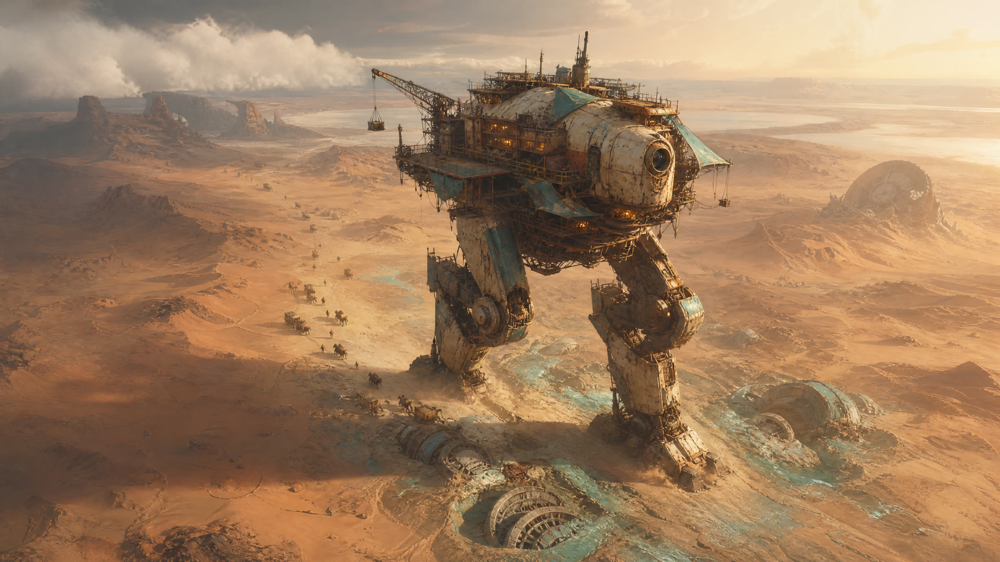
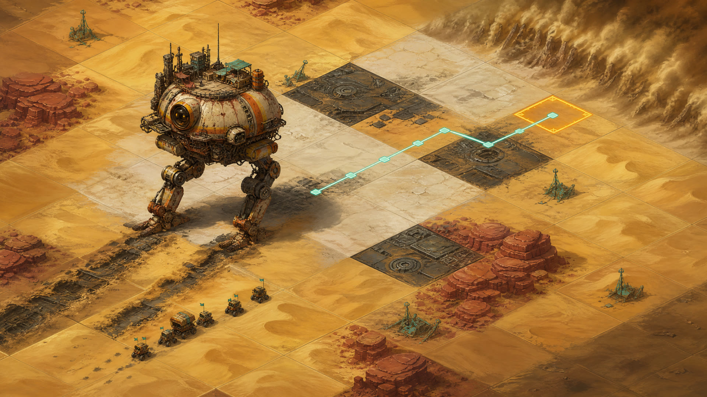

# WALKER’S WAKE

**Game concept and 2:1 isometric prototype proposal**
Author: Manus AI

## Proposal

**WALKER’S WAKE** is a direct-control desert exploration game about **Cardinal**, a hulking salvage robot that leads a fragile caravan through a machine graveyard. Cardinal is not a city-sized walking platform. It is a 6–8 meter industrial colossus: large enough to change the terrain with its fists and feet, but personal enough to become a character the player recognizes in every animation.

The recommended design combines three compatible fantasies: **crossing a hostile landscape**, **maintaining one ancient machine**, and **excavating a buried civilization**. The caravan treats Cardinal as pathfinder, shelter, heavy equipment, and perhaps protector. Combat can exist, especially given the attack animation family, but it should create route pressure rather than reduce Cardinal to a conventional weapons platform. The desert has enough generic military mechs buried in it already.

## Character Authority: Cardinal

The evolving sprite sheet is the primary visual authority. Concept art may extrapolate scale, environment, and narrative context, but it should preserve Cardinal’s defining identity.

| Identity anchor | Concept requirement |
|---|---|
| Silhouette | Compact, broad, hunchbacked, and gorilla-like with a very low center of gravity |
| Torso | Rounded segmented shell with no conventional head or visible neck |
| Arms | Enormous long forearms and blocky fists hanging close to the ground |
| Legs | Short, sturdy mechanical legs that support weight rather than heroic height |
| Materials | Scarred bone-tan and faded peach armor over charcoal-black mechanisms |
| Detail | Dark seams, worn edges, small dorsal fixtures, and dense industrial joints |
| Scale | Giant beside humans and crawlers, but not a skyscraper or mobile settlement |
| Prohibited drift | Tall humanoid proportions, long legs, small arms, mounted city, sleek armor, dominant guns |

The attack frames suggest that Cardinal’s fists are tools as much as weapons. They can brace against storms, smash crusted terrain, expose machine layers, shift rocks, and create temporary shelter. This lets the final attack animations remain useful even if direct combat is rare.

## Player Fantasy

The player directly drives Cardinal with eight-direction WASD movement from a fixed 2:1 isometric view. There is no click-to-move route solver between intention and motion. The player reads terrain while moving, steers around hazards, and controls the distance between Cardinal and the caravan. Every stride consumes power, every heavy hand placement changes the ground, and every stop creates a temporary camp in Cardinal’s lee.

Decisions happen at three readable scales: control Cardinal moment to moment, configure a handful of machine systems, and respond to discoveries or crises through compact events. The player should care about Cardinal as a singular physical character with momentum and temperament, not as a cursor waiting for an A* committee meeting.

## Recommended Core Loop

| Phase | Player decision | Resulting tension |
|---|---|---|
| Survey | Read dunes, salt, rock, ruins, storms, and resource signals while moving | Looking ahead matters because Cardinal cannot cross every surface |
| Drive | Use eight-direction movement to steer, dodge, reposition, and control pace | Immediate control makes terrain and enemy spacing physical |
| Traverse | Advance while Cardinal consumes resources and the caravan follows | Speed protects against storms but can strand slower followers |
| Leave a wake | Knuckle and foot impacts expose machinery, create paths, or damage fragile sites | Progress changes the desert permanently |
| Brace and camp | Stop Cardinal as a windbreak while crews repair, trade, condense water, and excavate | Remaining stationary improves recovery but lets threats converge |
| Decide | Integrate discoveries, help settlements, or abandon opportunities | Cardinal’s identity and the region’s future diverge over time |

## Why This Could Be Fun

Cardinal gives the map a persistent moving center. The core question is not where to build a permanent home, but **how this powerful machine should move through danger while leading vulnerable people**. Direct control makes the weight, facing, acceleration, and spacing of every encounter tangible, while the wake system turns traversal into world modification rather than empty travel time.

The new shape language improves feedback. Cardinal’s low stance and massive forearms naturally communicate weight. A planted fist can crack a tile, a braced pose can signal defense against a dust wall, and the raised attack pose can become a readable preparation state before impact. Its silhouette should remain identifiable even when the final runtime sprite occupies only a small portion of the screen.

## Concept Options Considered

| Direction | Strength | Risk | Recommendation |
|---|---|---|---|
| Direct traversal action | Immediate embodiment, strong terrain use, and natural sprite payoff | Could become frictionless wandering | Use hazards, weight, and wake interactions as the mechanical spine |
| Caravan logistics | Makes Cardinal’s scale and protection meaningful | Can become escort frustration | Model the caravan as one resilient system, not dozens of units |
| Archaeological mystery | Gives every route discovery value | Requires sustained narrative production | Use modular ruins and event chains |
| Mech combat tactics | Gives the attack sheet immediate purpose | Could make the project generic and animation-expensive | Keep encounters rare, positional, and avoidable |

The recommended hybrid is **direct isometric exploration + compact caravan systems + archaeological discovery**, with occasional heavy-impact encounters. A run should be remembered by how Cardinal moved, what its fists uncovered, and which communities survived in its wake.

## Visual Direction

The visual language uses ochre sand, rust-red shelves, pale salt, charcoal ruins, oxidized teal signals, and amber hazard or impact states. The concept image’s cyan line should be read as Cardinal’s recent wake and drive vector, not a computed route. Terrain must remain readable before it becomes beautiful. The fixed orthographic 2:1 projection keeps tile diamonds exact, while atmospheric dust stays near the horizon and map edges so it never obscures movement decisions.

Cardinal carries the sprite sheet’s bone-tan shell, dark mechanics, huge forearms, and short legs into the broader world. At gameplay scale, the broad torso, low stance, pale armor mass, black joints, and near-ground fists should remain the dominant recognition cues. Concept art should not add scaffolding cities, cranes, weapon racks, or other structures that distort the sprite identity.

## Implemented Technical Foundation

The current Godot increment establishes the map as a procedural system rather than committing prematurely to a finished tileset.

| Capability | Current implementation |
|---|---|
| Projection | Exact 2:1 diamond transform using 90×45 logical tiles |
| Grid | Deterministic 18×18 desert field |
| Terrain | Sand, salt, machine ruins, destructible rocks, and collectible scrap |
| Controls | WASD and arrow-key eight-direction drive, Shift run, Space/J/K impact, Escape return |
| Navigation | Accelerated screen-space movement converted into eight isometric grid vectors with terrain blocking and deceleration |
| Actor | Eight-facing Cardinal animation adapter with approved-atlas auto-binding and a procedural proxy fallback |
| Interaction | Contact-frame rock destruction, deterministic debris bursts, and automatic scrap collection |
| Camera | Eased follow, velocity look-ahead, and bounded contact-frame impact shake |
| Persistence | Atomic JSON save of remaining rocks, world scrap, scrap inventory, Cardinal cell, and facing |
| Feedback | Live facing vector, normalized drive speed, grid coordinate, scrap total, impact state, and status panel |
| Rendering | Procedural CanvasItem drawing with no final-art dependency |

The procedural proxy remains deliberately disposable, but its animation state machine is not. Approved horizontal square-cell atlases named `cardinal_walk_<direction>.png` and `cardinal_attack_<direction>.png` replace the proxy automatically without changing movement, facing, impact, grid, or camera APIs. The adapter derives a shared cell size and normalizes it to the current runtime presentation height. The final visual footprint should be validated against the accepted sprite scale before collision expands beyond one navigation anchor.

Camera follow uses a fixed orthographic orientation, exponential easing, and a short velocity-based look-ahead capped to prevent Cardinal from drifting toward the screen edge. Telemetry remains in a `CanvasLayer`, so it does not slide with the world. The attack state emits exactly one contact signal: terrain mutation, deterministic rock and dust fragments, and a decaying camera offset all begin on that frame. The timing constant can be ratcheted to the accepted attack sheet's exact contact index without changing gameplay code.

The desert is mutable across scene and browser-session boundaries. The save is validated before application and replaced through a temporary file plus rollback backup. A malformed or incompatible save is ignored in full, preventing a half-loaded terrain state or corrupted scrap economy.

## Smallest Playable Roadmap

### Increment 1 — Direct Drive, Impact, and Wake

The player drives Cardinal in all eight directions with acceleration and deceleration, uses impact strikes to clear rock, and walks over exposed scrap to collect it. The eased camera follows with directional lead. Every completed stride can later mark a footprint or knuckle-print tile. This is the fastest test of whether controlling Cardinal and interacting with the desert are satisfying.

### Increment 2 — Heat Versus Water

Walking raises reactor heat; bracing allows the caravan to deploy condensers but permits the dust front to approach. The player chooses between continuous movement and profitable stops. Two resources are enough to create tension without converting Cardinal into a mobile tax return.

### Increment 3 — Brace and Camp

At selected safe tiles, Cardinal plants its fists and becomes a windbreak. The player allocates limited crew capacity among repair, salvage, water, and helping nearby travelers. The map remains active while stopping changes the risk profile.

### Increment 4 — Buried Signal

Ruins form a small linked mystery. Excavated fragments alter Cardinal: improved cooling, stronger excavation strikes, safer rock traversal, or a controversial autonomous behavior. This gives progression and a narrative reason to deviate from efficient routes.

## Success Test for the Concept

The concept is promising if a short session creates three emotions without requiring constant combat: satisfaction from moving a heavy machine well, attachment to Cardinal as a singular character, and curiosity about something uncovered by its passage. If traversal feels trivial, add terrain pressure before adding more systems. If Cardinal feels weightless, tune acceleration, animation timing, and impacts before inventing new mechanics. If resource management dominates, delete numbers before inventing new ones.

## Immediate Recommendation

Complete and approve the Cardinal sprite family, then drop its eight walk and attack atlases into the existing runtime contract. The next mechanical slice is persistent wake tiles plus energy and heat costs. That will build on the now-playable weighted drive, impact-strike, rock destruction, scrap collection, and camera foundation while giving the accepted animation contact frames real gameplay jobs.
