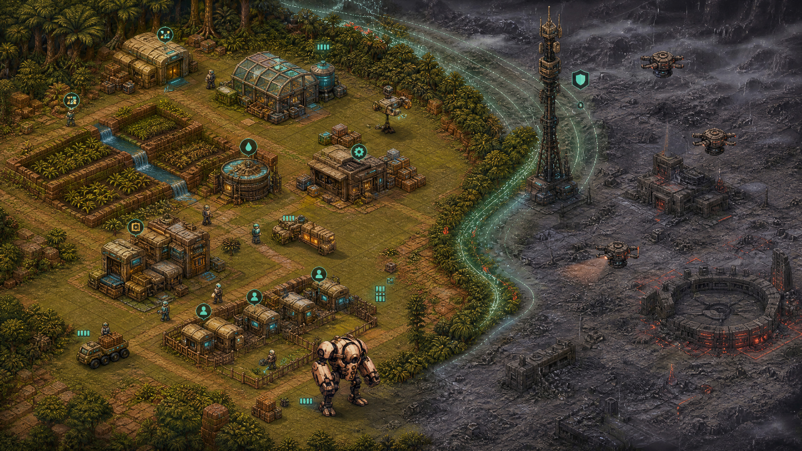
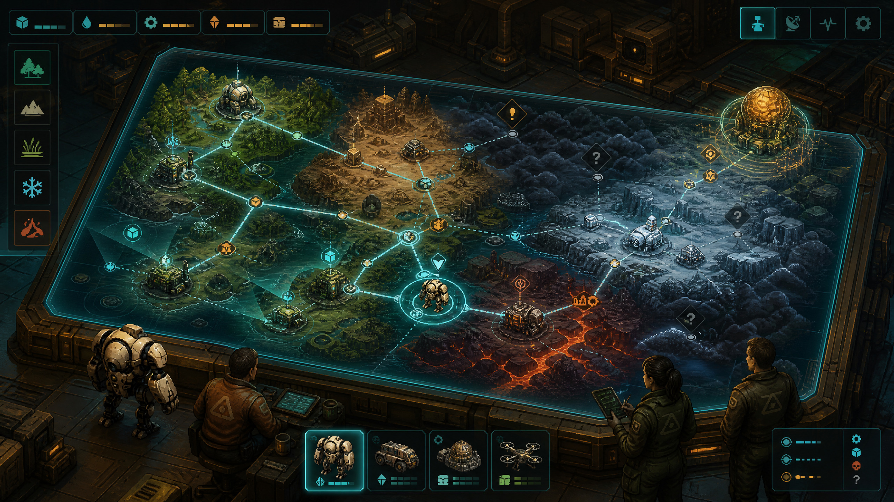
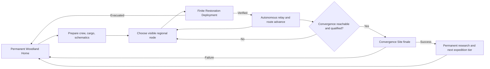
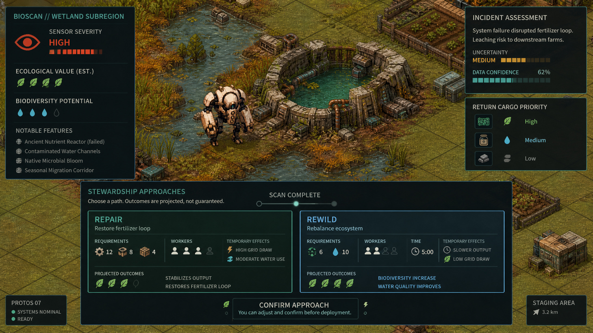
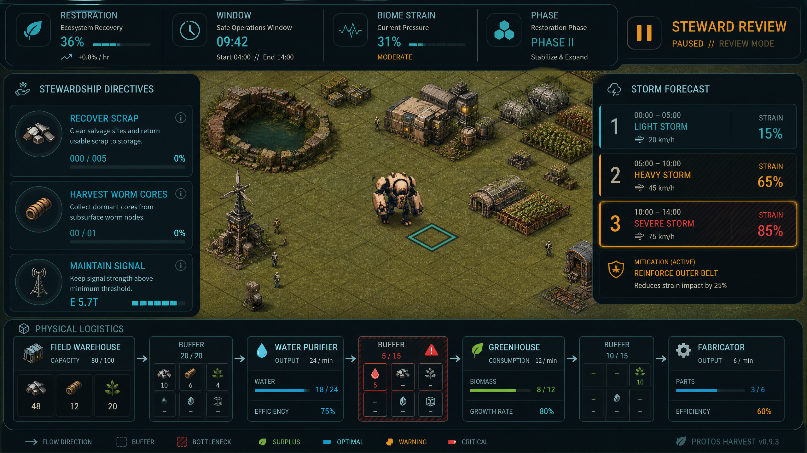

# Protos Harvest: The Long Restoration
## A Systemic Overhaul Proposal Inspired by *Against the Storm*

**Author:** Manus AI
**Canonical repository:** [junyboi/proto-isometric](https://github.com/junnyboi/proto-isometric)
**Analyzed source baseline:** `888ca2ff192e26100627211dc2dafea9ff84895b`
**Engine contract:** Godot 4.7.2 stable
**Proposal status:** Recommended direction; implementation not yet authorized

## Executive recommendation

**Protos Harvest should adopt the systemic structure that makes *Against the Storm* compelling without copying its fiction, map grammar, terminology, interface, or exact mechanics.** The most valuable lesson is not “add storms” or “make settlements temporary.” It is to build a closed network in which finite missions, production flexibility, population welfare, environmental pressure, bounded uncertainty, and campaign routing continually constrain one another.

The recommended product is a **persistent stewardship roguelite**. The woodland homestead remains the permanent emotional and economic center. Protos remains the directly controlled robot. From that home, the player launches finite **Restoration Deployments** into deterministic regional routes. Each deployment asks the player to establish a viable human outpost, restore local ecology, adapt a physical production web, resolve sensor-obscured incidents, and complete enough verification before the restoration window closes. Successful sites remain in the world as autonomous telemetry and logistics relays. A regional expedition culminates at an ancient **Convergence Site**, where the player must combine the systems learned along the route through alternative proof objectives.

The overhaul should therefore preserve the implementation already completed through Stewardship Settlement Phase 9—construction, deposits, applicants, workforce, staffed extraction, logistics, production policy, and humane wellbeing—and place those authorities inside a stronger mission and campaign structure. This is an evolution, not a rewrite. The robot has suffered enough undocumented migrations.

## 1. Why *Against the Storm* works as a system

Eremite Games described its original campaign-layer problem as a lack of structure, risk, goals, exploration, and meaningful failure. Its cycle redesign addressed that by turning individual settlements into a route toward a visible finale, making the last successful settlement the next launch point, and tying difficult optional locations to campaign resources and routing choices.[1] The official world-map documentation reinforces the same structure: completed settlements reveal and unlock nearby space, distance increases minimum difficulty, modifiers are previewable, and the campaign has an explicit end objective.[2]

At the local level, *Against the Storm* links success and failure through coupled pressure. Reputation immediately wins a settlement, Impatience loses it, and gaining Reputation also lowers Impatience.[3] Growth creates Hostility through time, exploration, population, and extraction; Hostility then crosses readable thresholds that worsen storm effects, while the player retains reversible mitigations such as reducing active woodcutters or building additional hearths.[8] This produces an unusually effective pattern: **the actions required to win also create the conditions that can make the player lose**.

The economy survives random blueprint access because buildings expose multiple recipes, resources have overlapping uses, alternative buildings can produce the same good at different efficiencies, and gatherers remain useful across biome resource sets.[5] This is a **production web**, not a brittle single chain. The game then provides a recipe control surface with product and ingredient views, global and local targets, ingredient selection, and recipe enablement so that complexity remains operable rather than merely impressive in a spreadsheet.[10]

Incidents and seasonal pressure complete the loop. Glade events present alternative approaches with different requirements, temporary working effects, and rewards; they are staged commitments rather than instant loot rolls.[6] Drizzle, Clearance, and Storm provide a predictable opportunity–production–stress cadence that schedules farming, hazards, resource collection, and trader availability.[7] The finale deliberately recombines prior systems: the Sealed Forest replaces normal victory with four staged objective levels, each offering alternative proof paths.[4]

| Transferable principle | Why it matters | Protos Harvest adaptation |
|---|---|---|
| **Finite local mission** | Creates a reason to prioritize, adapt, and finish | A Restoration Deployment has a bounded operational-day window and explicit evacuation state |
| **Progress relieves pressure** | Prevents the pressure clock from becoming passive punishment | Restoration Verification grants bounded window recovery at thresholds |
| **Growth creates delayed cost** | Makes expansion a decision instead of an automatic good | Buildings, extraction, subregion entry, and emissions add Biome Strain |
| **Predictable stress cadence** | Lets players prepare rather than merely react | Recon, Yield, and Exposure phases rotate on authoritative day advancement |
| **Production redundancy** | Makes constrained drafting strategic instead of unfair | Property-tagged ingredient alternatives and overlapping outputs form a recovery-capable production web |
| **Bounded uncertainty** | Preserves replayability without invalidating planning | Feasibility-filtered directives, incidents, schematics, weather, and routes use stable seeded offers |
| **Staged incidents** | Turns exploration into a cost–risk–value decision | Sensor-obscured bioregion incidents reveal full approaches after scan |
| **Population as strategy** | Converts production into social tradeoffs | Authored settlers have target/current cohesion, needs, safety, recovery, preferences, and agency |
| **Route-shaped campaign** | Makes individual missions strategically meaningful | Successful restoration sites become permanent relays on a deterministic node route |
| **System-recombining finale** | Tests mastery rather than only higher numbers | A Convergence Site uses alternative four-stage proof objectives |

> **Design thesis:** The game should not imitate *Against the Storm*’s nouns. It should reproduce the quality of its decisions: every meaningful gain changes the next constraint, and every constraint has at least two legible responses.

## 2. Current-game audit

The repository is much closer to this destination than the present expedition loop suggests. The existing homestead already has exact-once cross-domain transactions, persistent construction, finite deposits, authored applicants, protected housing, workforce slots, staffed extraction, local storage, deterministic hauling, recipe policy, reserve floors, nonfatal injury, remedy windows, and voluntary departure. These are the expensive foundations of a systemic settlement game.

The gap is primarily **macro structure and cross-system coupling**. The current expedition generates three relay objectives at authored radial distances, succeeds when all three are complete, banks scrap and cores, and then offers a run modifier before launching another independent expedition. The current recipe catalog contains only two production recipes. Settler needs and job preferences exist, but the mission does not yet turn settlement welfare, ecological restoration, production adaptation, exploration choices, and time pressure into alternative paths toward one shared conclusion.

| System | Current authority | What should be retained | Overhaul gap |
|---|---|---|---|
| **Embodied player** | `isometric_map.gd`, `surface_drive.gd`, interaction phases, Quick action | WASD movement, direct farming, gathering, combat, inspection, contextual E/A/touch language | Strategic overlays must never replace physical traversal or direct intervention |
| **Construction** | `construction_state_service.gd`, blueprint catalog, placement and modal authorities | Seven persistent buildings, footprints, bills, upgrades, exact-once placement | Buildings need deployment-specific roles, strain profiles, and schematic availability |
| **Finite resources** | resource deposit catalog/deltas and gathering authorities | Stable IDs, finite/renewable sources, manual and staffed extraction | Sources need biome distributions, tags, incident links, and restoration consequences |
| **Population** | `settler_catalog.gd`, housing, workforce, wellbeing services | Eight authored settlers, protected beds, two shifts, safety stops, nonfatal recovery, voluntary departure | Add transparent target/current group cohesion and deployment transfer decisions without turning people into score tokens |
| **Logistics** | `logistics_service.gd`, local storage, warehouse jobs | Physical outputs, haulers, self-haul fallback, reserve floors, deterministic priority and receipts | Add network visualization, route pressure, supply/export manifests, and bottleneck explanations |
| **Production** | `recipe_catalog.gd`, `production_policy_service.gd` | Ingredient groups, byproducts, targets, priorities, worker requirement | Expand from two recipes to a tagged production web with local/global overrides and feasibility-filtered schematics |
| **Home farming** | farm state, crops, weather, machines, economy | Permanent clearing, manual agriculture, seasonal data, exact day commits | Home should provision expeditions and receive autonomous relay yields without becoming an idle-game faucet |
| **Exploration** | inspectable-world and interaction providers | One authoritative inspect/approach/commit language | Add pre-entry severity, scan confidence, two-approach incident decisions, timed working effects, and projected ecological outcomes |
| **Combat** | fauna, melee pressure, biome bosses, hazards, direct Smash/Impact Charge | Protos remains responsible for direct combat and apex threats | Combat should defend or unlock restoration plans rather than remain a separate relay hunt |
| **Mission outcome** | `run_settlement.gd`, run state, terminal flow | Explicit settlement, failure, atomic banking, retry/deploy terminal | Replace three-relay binary with multi-channel Restoration Verification and a finite window |
| **Campaign** | profile state, modifier offers | Permanent profile, rewards, run summary, deterministic offers | Add regional route, completed-site graph, expedition supply, convergence target, and cycle result |
| **Information architecture** | field HUD, settlement terminal, biome intel, inspectable read results | Responsive landscape/portrait panels, localization, causal reasons | Add a compact Steward Console; do not resurrect removed tutorial cards |

## 3. Target experience

### 3.1 The permanent home

The woodland homestead remains permanent. It is the place where the player farms manually, maintains relationships with Lyra, Rook, and Mira, admits settlers, repairs facilities, prepares manifests, and chooses the next deployment. Its whole biome is mechanically safe; therefore, the `SAFE ZONE` label and luminous sanctuary ring are removed from woodland rendering while remote sanctuary markers remain visible where they communicate a genuinely local protection boundary.

Home production should matter to the campaign through **bounded preparation**, not passive infinite accumulation. Before launch, the player allocates a cargo mass limit among food, parts, seed stock, tools, medical supplies, and one specialist module. Successful regional sites may contribute one small, capped relay benefit to future manifests, such as one water cache or one forecast reveal. Home never generates deployment victory while the player is absent.

### 3.2 The Restoration Deployment

A deployment starts with Protos, a chosen settler crew, a cargo manifest, a limited schematic roster, biome conditions, and three initial Stewardship Directives. The player physically explores, builds, assigns work, repairs infrastructure, manages local logistics, protects settlers, and fights when necessary. The deployment ends in one of three states:

| Outcome | Trigger | Consequence |
|---|---|---|
| **Verified** | Fill the Restoration Verification track through any valid mix of four proof channels | Site becomes an autonomous regional relay; campaign position advances; bounded cargo and data return home |
| **Evacuated** | Restoration Window reaches zero, all active settlers are unable to work, or the player chooses evacuation | People survive; unreturned field cargo is lost; campaign time is spent; route remains at the last successful relay |
| **Abandoned site** | The player leaves after a major incident or failed convergence attempt | Same as evacuation, plus the node gains a deterministic scar/modifier if revisited in the same expedition |

Verification and pressure must be coupled. Reaching each 25% verification threshold returns a small, capped number of operational days, so progress creates breathing room. However, the facilities, population, subregion access, and extraction used to gain verification also create Biome Strain. There is no optimal plan that ignores either side.

### 3.3 The regional expedition

A regional expedition is a deterministic **node network**, not a copied hex map. It begins at the woodland home, contains five to seven ordinary deployment choices, two optional event branches, and one visible Convergence Site. A successful site becomes the origin for the next launch and reveals connected nodes. Routes differ through biome, sensor uncertainty, payload opportunity, minimum strain tier, resident availability, and convergence requirements.

Completed sites remain represented as autonomous farms, weather stations, habitats, or logistics relays. This preserves the fiction of care: settlements are not disposable score generators. Their strategic value persists, but their ongoing output is strictly capped and abstracted so the player does not manage several simulations at once.

## 4. Core local systems

### 4.1 Restoration Verification

Ordinary deployments use one 100-point track composed from four proof channels. The player does not need to maximize every channel, but no single channel may supply more than 45 points. This preserves alternative strategy while preventing degenerate one-system wins.

| Proof channel | Examples | Design purpose |
|---|---|---|
| **Ecological recovery** | Rewild an incident, restore water quality, establish biodiversity, close a pollution source, maintain healthy fields | Rewards stewardship rather than extraction volume |
| **Infrastructure resilience** | Complete a protected logistics loop, sustain power reserves, repair an ancient system, withstand Exposure without a critical failure | Makes construction and logistics part of victory |
| **Community continuity** | Maintain safe housing and food, resolve concerns, sustain target cohesion, complete resident-led work without injuries | Makes humane welfare strategically relevant without commodifying settlers |
| **Regional contribution** | Complete directives, transmit a survey, defeat an apex threat, return critical data, fulfill an outbound supply contract | Connects direct play, exploration, combat, and campaign goals |

Verification rewards must be event-based and exact-once. Continuous production should not passively grind victory. A stable logistics loop grants proof when it first satisfies a documented duration and load threshold; repeatedly toggling the same policy grants nothing further. Each proof receipt includes mission ID, proof ID, source revision, and canonical payload digest.

### 4.2 Restoration Window

The mission clock is measured in **operational days committed through the existing sleep transaction**, not wall-clock seconds. This preserves deterministic replay, accessibility, and the current architecture. A baseline ordinary deployment begins with 18 days. Every sleep decrements the window by one after the closing-day transaction. Verification thresholds at 25, 50, and 75 restore two days each, capped at the mission’s starting window.

Difficulty changes the starting window, supply costs, strain thresholds, and incident severity—not simulation speed. The UI must always show the projected next-day change before the player commits sleep.

### 4.3 Operational phases

Days rotate through a six-day forecast loop:

| Days | Phase | Opportunity | Risk |
|---|---|---|---|
| 1–2 | **Recon** | Faster scanning, clearer node intelligence, efficient manual salvage | Lower staffed yield; entering new subregions adds less immediate strain |
| 3–4 | **Yield** | Crop, water, renewable biomass, and staffed production bonuses | Storage and hauling bottlenecks become more likely |
| 5–6 | **Exposure** | Rare energy collection and specific incident opportunities | Biome Strain thresholds activate; remote sites need shelter, reserves, and mitigation |

The phase schedule is known at mission start. Biome modifiers change what each phase does, but not when it occurs. The design should generate planning, not calendar ambushes wearing a trench coat.

### 4.4 Biome Strain

Biome Strain is the local ecosystem’s response to disturbance. It is not moral condemnation and should not imply that settlement itself is illegitimate. The system exposes both a **Target Strain** and a **Current Strain**. Target is the additive total of known sources and mitigations. Current moves toward Target only at day commits, giving players time to react and making future Exposure effects forecastable. This adapts the readability rationale behind *Against the Storm*’s current/target Resolve model.[9]

| Strain source | Typical contribution | Player response |
|---|---:|---|
| Operational day elapsed | +2 per day | Advance verification efficiently; use threshold day refunds |
| Active extraction site | +3 to +8 by source tier | Unstaff, rotate, use managed sources, or complete restoration at the source |
| Powered industrial building | +2 to +6 | Shut down, upgrade efficiency, or buffer through clean power |
| Settler population | +1 per active settler above the first four | Expand shelter, food, and restoration capacity deliberately |
| Opened subregion | +5 normal / +12 severe | Scan before entry and choose route timing |
| Unresolved incident | +4 to +20 | Commit workers/resources to an approach or deliberately avoid the area |
| Ecological buffer | −4 to −12 | Rewild, restore water, plant shelter belts, and maintain biodiversity |
| Autonomous relay link | −3 once stabilized | Reward previous successful regional planning |

Exposure uses discrete threshold bands. The exact effects are biome-authored and visible from mission start. Examples include reduced outside work, water loss, unstable terrain, stronger fauna behavior, grid overload, and slower recovery. Thresholds must never directly delete buildings or settlers without a telegraphed, preventable state.

### 4.5 Stewardship Directives

Each deployment offers three directives from a context-filtered pool. Completing one grants Verification plus a bounded reward: supplies, one schematic choice, a campaign datum, or temporary mitigation. A completed directive is replaced until a mission cap of six completions.

Offers are seeded by expedition, node, directive sequence, available buildings, biome resources, current population, and already-completed proofs. The filter must guarantee that at least one offered directive can be completed using current or guaranteed mission capabilities. One **Diagnostic Reroute** per mission redraws an unaccepted set; it is not an infinite reroll casino.

Directive archetypes should include delivery, sustained infrastructure, ecological repair, safe operations, exploration, and resident-led projects. No directive may require a unique random schematic that is not already owned or guaranteed in its reward chain.

### 4.6 Production web and schematics

The existing alternative-ingredient machinery is the correct foundation, but two recipes cannot carry a strategy game. The first overhaul slice should expand to approximately 18 recipes across the existing building roster before adding new structures. Inputs should carry gameplay tags—`metal_bearing`, `organic_carbon`, `binding_fiber`, `clean_water`, `nutrient`, and `energy_cell`—so one required function can be satisfied through multiple biome-specific materials.

A schematic is a **production method plus building compatibility**, not a whole fantasy blueprint deck. Protos begins with survival methods and drafts a small number of specialized schematics during a deployment. Every offered schematic is feasibility-filtered against known biome tags and current roster. Each important function must have a low-efficiency baseline method and at least one specialized method.

| Function | Baseline method | Specialized alternatives |
|---|---|---|
| Clean water | Manual purifier using biomass filters | Wetland membrane, thermal distillation, cryogenic separation |
| Field food | Raw produce and ration assembly | Greenhouse meal loop, fungal protein, geothermal kitchen |
| Repair parts | Scrap reconditioning | Ore casting, ceramic composites, recovered precision modules |
| Shelter protection | Basic insulated panels | Fiber laminate, frost shell, heat-reflective plating |
| Ecological restoration | Seed and water treatment | Microbial slurry, mineral remediation, native habitat modules |
| Grid stability | Salvaged cells | Wind storage, thermal capacitor, ancient regulator coupling |

The control plane should extend the current production policy with global targets, site overrides, selected ingredient preference, enablement, priority, and explicit idle reasons. The Steward Console should answer: **What is blocked? Where? By which missing input, worker, reserve floor, capacity, hazard, or target?** The official recipe-control design is valuable precisely because it makes a complex production web diagnosable.[10]

### 4.7 Physical logistics

Goods remain physical. Extraction enters source output storage, haulers move it to a field warehouse, production consumes local input, and finished goods must be hauled or exported. No global magical stockpile is added.

The overhaul should add three capabilities to the existing logistics service:

1. **Route cost:** distance, terrain, and Exposure conditions affect daily hauling capacity.
2. **Export manifests:** a player may reserve and dispatch a bounded set of goods to the regional relay or home, with a visible arrival day.
3. **Network graph:** the UI presents source, destination, buffer, target, priority, throughput, and idle reason without creating a parallel mutation path.

### 4.8 Settler cohesion and agency

The authored individual model remains. Each settler keeps needs, preferences, injury, recovery, concern, remedy, notice, and voluntary departure. The overhaul adds two transparent derived values:

- **Target Cohesion** is the additive result of protected housing, rations, rest, job preference, safety, community facilities, unresolved concerns, injuries, and Exposure.
- **Current Cohesion** moves toward Target at day commits, with reaction speed modified only by authored resilience traits.

Cohesion affects departure pressure, work consistency, recovery, and the Community Continuity proof channel. It does not directly convert happy humans into abstract victory points. Proof is granted for explicit humane outcomes such as sustaining safe operations through Exposure, resolving a concern before deadline, or completing a resident-led infrastructure project.

### 4.9 Sensor-obscured subregions and incidents

The current inspectable-world architecture should become the sole interaction language for exploration. A closed subregion shows perimeter severity, scan confidence, likely resource classes, and ecological value. Entering it is explicit and adds known Strain. Full scan then reveals incidents, sources, hazards, and exact approach options.

Every major incident has two or three approaches. Each approach binds material requirements, worker slots, duration in day commits, temporary working effects, failure conditions, projected outcomes, and proof/reward consequences. The options must express the game’s identity: repair, rewild, isolate, relocate, salvage for emergency use, or synchronize with ancient systems. They should not collapse into “good reward versus evil reward.”

A first vertical slice needs three incidents:

| Incident | Approach A | Approach B |
|---|---|---|
| **Failed nutrient reactor** | Repair the fertilizer loop using parts and high temporary grid draw | Rewild with microbes and water, accepting slower immediate crop output |
| **Collapsed flood regulator** | Reconstruct gates for predictable irrigation | Open a seasonal wetland corridor for biodiversity and variable water abundance |
| **Dormant security habitat** | Restore containment and survey safely | Decommission the system, fight the released apex organism, and reclaim the site |

### 4.10 Combat inside the settlement game

Direct combat remains a differentiator. Protos—not the settlers—handles mobile fauna and apex threats. Combat should be connected to settlement decisions in four ways: subregion access, worker safety, infrastructure defense, and optional high-value proof. The player can often mitigate pressure through habitat repair, route choice, or Exposure preparation instead of fighting continuously.

Settlers retreat to protected shelter during declared critical states. There is no squad micromanagement and no permanent settler death. Combat failure damages mission time, field equipment, or cargo and may force evacuation, preserving high stakes without discarding the humane rules already implemented.

## 5. Campaign systems

### 5.1 Regional route generation

A regional map is generated from a stable expedition seed. It contains authored node archetypes arranged as a directed acyclic graph with one or two cross-links. The map generator guarantees biome diversity, at least two viable routes to Convergence, one recovery node after the first branch, and no mandatory dependency on an unavailable permanent unlock.

Node information is progressively revealed. Visible information includes biome, minimum Strain tier, expected resource tags, broad incident severity, relay benefit, and convergence value. Hidden information remains bounded to exact sources, directive offers, incident identities, and weather modifiers.

### 5.2 Expedition resources

The campaign layer uses three bounded resources:

| Resource | Earned from | Spent on | End-of-expedition behavior |
|---|---|---|---|
| **Operational window** | Starting expedition budget, verified sites, specific events | Each attempted deployment | Unused value has no permanent conversion; it exists to create route pressure |
| **Relay capacity** | Verified infrastructure and regional contribution | Longer jumps, extra cargo, one emergency evacuation | Resets after the expedition |
| **Convergence data** | Ecology, infrastructure, community, and regional proof | Qualifying for finale approaches | Surplus converts to a small capped research bonus |

Failure should cost route opportunity and field cargo, not permanent residents or the homestead. A failed ordinary deployment consumes its operational cost and returns the campaign to the last successful relay. A failed Convergence attempt ends the current expedition; the player keeps permanent research earned before the attempt but not uncommitted expedition supplies.

### 5.3 Autonomous sites

Successful sites persist as compact records, not live simulations. Each stores node ID, site archetype, selected legacy, protected population summary, ecological outcome, one relay benefit, and a small visual snapshot. Their effects are applied only when a future deployment starts or a campaign route is evaluated.

This choice protects the central fiction. The player is not abandoning disposable cities every twenty minutes; Protos is creating a network of places capable of continuing without constant direct intervention.

### 5.4 The Convergence Site

The finale is a bespoke biome whose ancient regulator destabilizes the whole region. Normal 100-point verification does not finish it. Instead, the player completes four stages. At each stage, one of three alternative proofs must be satisfied, and each alternative uses a different subsystem.

| Stage | Infrastructure path | Ecological path | Community path |
|---|---|---|---|
| **I: Establish contact** | Build and power a long-range synchronizer | Restore three sensor habitats | Maintain safe survey teams through one Exposure phase |
| **II: Recover control** | Deliver advanced components and stabilize the grid | Resolve two severe incidents through restoration approaches | Complete two resident-led directives and maintain target cohesion |
| **III: Sustain the region** | Operate a closed production/logistics loop for two cycles | Achieve water, soil, and biodiversity thresholds simultaneously | Fulfill protected food, shelter, care, and rest for the full crew |
| **IV: Converge** | Repair the core under maximum load | Rebalance the surrounding biome while the core remains unstable | Coordinate a timed multi-site effort with no critical safety stop |

Success unlocks a higher expedition tier, one permanent sidegrade, and a visible improvement to the woodland home. It should not merely increase numbers. Examples include better pre-entry scanning, one extra manifest slot, a new baseline recipe family, or a new diplomatic/resident project.

## 6. Steward Console and information architecture

The UI should remain subordinate to the field. A compact top strip shows Restoration, Window, Current/Target Biome Strain, and Operational Phase. The left edge can hold three directive cards. The right edge forecasts the next Exposure threshold and active mitigations. The full **Steward Console** opens only on demand or while paused and contains four tabs: Objectives, Production, Population, and Region.

Information follows four rules:

1. Every threshold shows current value, target value, next consequence, and top contributors.
2. Every blocked job has one stable reason and one suggested inspection target.
3. Every deterministic future event shows the day or phase when it will resolve.
4. Color is redundant with icon, shape, pattern, and text.

The removed tutorial system should remain removed. Discovery uses inspectable tooltips, glossary links, first-use highlights attached to existing panels, and a pauseable diagnostics view—not timed cards that occupy the battlefield like a bureaucratic ambush.

## 7. Distinctive identity and anti-copy boundary

The proposal borrows system principles, not protected expression. Protos Harvest should not reproduce *Against the Storm*’s hex-map layout, Smoldering City, Viceroy framing, Queen’s Impatience, Reputation bar, Hostility iconography, glades, hearths, species portraits, cornerstone rarity presentation, blueprint card layout, Seals, rainpunk fiction, or ornate fantasy UI.

| *Against the Storm* expression | Protos Harvest identity |
|---|---|
| Disposable frontier settlements | Persistent autonomous restoration sites connected to a permanent home |
| Viceroy/Queen hierarchy | Caretaker robot and human community stewardship |
| Reputation and Impatience | Four-channel Restoration Verification and a finite operational-day window |
| Forest Hostility | Measurable ecological Biome Strain with target/current telemetry |
| Glades | Sensor-obscured bioregion subregions |
| Orders | Stewardship Directives filtered by actual capability |
| Cornerstones | Engineering protocols and caretaker doctrines |
| Building blueprint deck | Feasibility-filtered production schematics applied to a stable building roster |
| Ancient Seal | Biosphere Convergence Site |
| Fantasy species needs | Authored human needs, safety, agency, recovery, and community continuity |
| Passive overseer camera | Directly controlled Protos remains essential for traversal, farming, repair, and combat |

## 8. Technical architecture

### 8.1 New bounded authorities

The implementation should add small pure authorities rather than expanding existing monoliths:

| Authority | Responsibility |
|---|---|
| `regional_expedition_schema.gd` | Strict campaign graph, node outcomes, resources, caps, and canonical ordering |
| `regional_route_generator.gd` | Seeded feasibility-guaranteed node graph generation |
| `restoration_mission_schema.gd` | Local window, phase, verification, strain, directives, incidents, and result |
| `restoration_verification_service.gd` | Exact-once proof grants, channel caps, threshold refunds, victory readiness |
| `operational_phase_service.gd` | Day-to-phase mapping and forecasted effects |
| `biome_strain_service.gd` | Additive target calculation, bounded current convergence, thresholds, contributors |
| `stewardship_directive_catalog.gd` | Data-driven directive definitions and feasibility predicates |
| `directive_offer_service.gd` | Stable seeded filtered offers and one diagnostic reroute |
| `bioregion_incident_catalog.gd` | Incident stages, approaches, costs, working effects, outcomes |
| `incident_resolution_service.gd` | Exact-once approach start, daily progress, interruption, and completion |
| `convergence_service.gd` | Four-stage alternative proof evaluation and expedition settlement |
| `steward_console.gd` | Read-only projections and intents into existing transaction boundaries |

Definitions belong in `.tres` resources or bounded catalogs. Service code owns validation and deterministic mutation. Presentation never writes domain dictionaries directly.

### 8.2 Reuse map

The overhaul should reuse `CrossDomainTransaction`, `SaveRepository`, exact-once receipts, canonical hashes, farm schema validation, construction, gathering, local storage, logistics, production policy, housing, workforce, settler day resolution, the interaction resolver, the inspectable-world read model, and the responsive modal framework. `run_settlement.gd` becomes a legacy adapter until old expedition saves finish; it should not be overloaded with campaign graph logic.

### 8.3 Persistence horizons

The new system requires three explicit horizons:

| Horizon | State | Commit boundary |
|---|---|---|
| **Local mission** | Window, phase, proof receipts, current/target strain, directives, incidents, field cargo | Every authoritative action and sleep transaction |
| **Regional expedition** | Node graph, current relay, completed sites, expedition resources, Convergence state | Mission settlement or explicit regional event |
| **Permanent home/profile** | Homestead, residents, permanent research, campaign history, accessibility/settings | Home action, expedition conclusion, or explicit upgrade |

A new envelope **schema 6** is recommended because the campaign graph is a new top-level persistence horizon. Migration from schema 5 should first verify the original raw hash, add neutral campaign and mission sections, then rebase the normalized hash. An active legacy relay expedition remains in `legacy_expedition_mode` until its terminal resolves; new campaigns begin only from a clean title/home choice. This avoids rewriting a shared in-progress run into a different game.

### 8.4 Determinism and caps

No mission authority depends on frame delta, wall-clock time, Dictionary iteration order, or visibility. Operational days advance only through the existing commit pipeline. Offers sort by stable IDs before seeded selection. Every collection has a documented maximum: seven route nodes, eight completed site records, six directive completions, three active directives, six incidents, 64 mission receipts per namespace, 24 settlers, 18 schematic records, and four convergence stages.

The simultaneous validator-valid save target should remain below 1.5 MiB, with ordinary play below 256 KiB. A 100-expedition soak must prove that campaign history compacts and that no receipt or event list grows from elapsed play alone.

## 9. Phased implementation plan

The overhaul should be delivered as eight independently shippable phases. After every phase: integrate upstream, run focused regressions plus all historical suites, run direct import and bounded boot, execute landscape/portrait Xvfb checks with representative input, run `verify.sh --release`, boot the exact exported PCK, serve over HTTP, inspect browser/network/runtime logs, update evidence, commit, and fast-forward push to `main`.

| Phase | Scope | Exit gate | Relative effort |
|---|---|---|---:|
| **R0 — Contracts and simulation harness** | Freeze terminology, schemas, caps, proof/strain equations, route invariants, migration fixture, and headless 100-mission simulator | Deterministic golden seeds; schema-5 migration; no runtime UI changes | 4–7 engineer-days |
| **R1 — One deployment vertical slice** | Restoration Window, four-channel Verification, phase loop, Biome Strain, three directives, new HUD strip, legacy-run adapter | One woodland-edge mission wins, evacuates, saves, reloads, and remains readable in both aspect ratios | 12–18 days |
| **R2 — Production web and diagnostics** | Resource tags, ~18 recipes, schematic offers, global/site targets, ingredient preference, network graph, route cost | At least three viable production solutions per critical function; no unreachable draft set across seed corpus | 14–20 days |
| **R3 — Community continuity** | Target/current cohesion, deployment crew selection, concern integration, shelter states, resident-led projects | Humane outcomes affect proof and operations; no death/instant eviction path; deterministic 10-year soak | 9–14 days |
| **R4 — Subregions and incidents** | Pre-entry scan, six subregions, three incidents with two approaches, timed effects, ecology outcomes, combat integration | Every incident exposes costs/effects/outcomes; replay and interruption are exact-once | 12–18 days |
| **R5 — Regional expedition map** | Seeded node graph, route selection, relay sites, payloads, expedition resources, site summaries | Two viable routes per seed; success/failure advances only intended horizons; old saves finish unchanged | 14–20 days |
| **R6 — Convergence finale and research** | Four-stage alternative proof finale, permanent sidegrades, campaign summary, home visual consequences | All three strategy families can complete finale; failure closes expedition cleanly | 16–24 days |
| **R7 — Balance, accessibility, performance, release** | Telemetry review, pacing passes, localization, save/load torture, input parity, final art/audio, Web tuning | Stable completion distribution, no dominant proof channel, complete release matrix and production publish | 12–18 days |

The order-of-magnitude implementation range is **93–139 engineer-days**, excluding major new music, voice, and animation production. R1 is the decisive greenlight gate: if the local proof/pressure loop is not intrinsically fun with existing assets and one biome, the regional layer should not be built. Strategy games are quite capable of multiplying a weak loop by seven.

## 10. Validation and balancing plan

### 10.1 Automated contracts

The test matrix should include deterministic route generation across extreme seeds, feasibility of every offered directive and schematic set, proof channel caps, threshold refunds, exact mission-window accounting, strain target contributors, delayed current convergence, phase transitions, incident replay/conflict, evacuation cleanup, site-summary compaction, schema-5 migration, schema-6 cold reload, and finale alternative-path equivalence.

Simulation tests should run at least 10,000 generated missions with simple policy agents: infrastructure-first, ecology-first, community-first, combat-heavy, production-minimal, and random-valid. No agent should encounter an unwinnable offer caused solely by generated content. A deliberately weak agent should still fail often enough to prove the pressure system has teeth rather than decorative molars.

### 10.2 Player-facing success metrics

| Metric | Healthy signal | Failure signal |
|---|---|---|
| Ordinary deployment completion | Broad distribution with recoverable early losses | Near-automatic wins or abrupt unavoidable failure |
| Proof-channel contribution | Multiple viable mixtures; no channel consistently above 45% | One dominant channel or a mandatory checklist |
| Schematic pick diversity | Biome and manifest change selection | Same first pick across most seeds |
| Idle reason frequency | Shortages and capacity produce understandable intervention | `unknown`, stale state, or perpetual blocked jobs |
| Exposure preparedness | Most critical losses were forecast and had at least two mitigations | Consequences appear without sufficient lead time |
| Settler outcomes | Concerns create decisions; departure is rare and explainable | Welfare becomes either irrelevant or punitive micromanagement |
| Route diversity | Players trade reward, risk, and convergence qualification | One mathematically dominant route |
| Field-to-console ratio | Most actions remain embodied; console supports diagnosis | Player spends the mission operating spreadsheets |

### 10.3 Release acceptance

The first public overhaul release should contain one complete regional expedition, four biome node archetypes using existing biome assets, one Convergence finale, approximately 18 recipes, six directive archetypes, three major incidents, four permanent sidegrades, and full keyboard/controller/touch parity. It must preserve the borderless fullscreen Web host, current permanent homestead, legacy save completion, and all existing combat and biome regressions.

## 11. Recommended first decision

Approve **R0 and R1 only**. They will answer the core product question with the smallest coherent build: does Protos Harvest become meaningfully better when its existing settlement systems are connected by finite verification, forecast phases, and Biome Strain?

If the answer is yes, R2–R6 expand a proven loop. If the answer is no, the repository retains a useful mission framework and improved HUD without carrying an unfinished campaign megastructure. That is the correct shape of risk for an overhaul this large.

## References

[1]: https://eremitegames.com/cycles-reforged-update/ "Eremite Games — Cycles Reforged Update"
[2]: https://wiki.hoodedhorse.com/Against_the_Storm/World_Map "Against the Storm Official Wiki — World Map"
[3]: https://wiki.hoodedhorse.com/Against_the_Storm/Beginner%27s_Guide "Against the Storm Official Wiki — Beginner's Guide"
[4]: https://wiki.hoodedhorse.com/Against_the_Storm/Sealed_Forest "Against the Storm Official Wiki — Sealed Forest"
[5]: https://eremitegames.com/devlog-7-blueprint-drafting-system-and-more/ "Eremite Games — Blueprint Drafting System and More"
[6]: https://eremitegames.com/explorers-choice-update/ "Eremite Games — Explorer's Choice Update"
[7]: https://wiki.hoodedhorse.com/Against_the_Storm/Seasons "Against the Storm Official Wiki — Seasons"
[8]: https://wiki.hoodedhorse.com/Against_the_Storm/Hostility "Against the Storm Official Wiki — Hostility"
[9]: https://eremitegames.com/resolve-revamp-update/ "Eremite Games — Resolve Revamp Update"
[10]: https://eremitegames.com/recipes-cookbook-update/ "Eremite Games — Recipes Cookbook Update"
