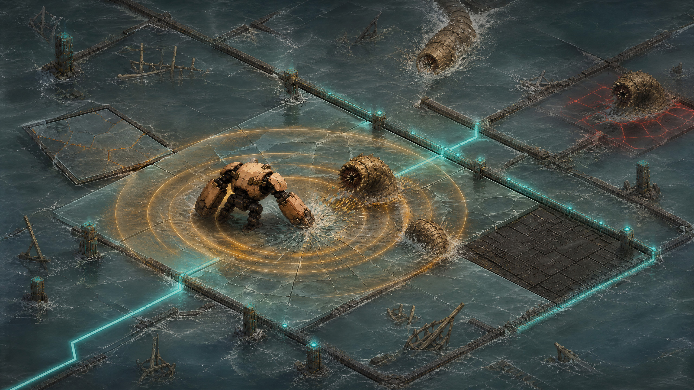
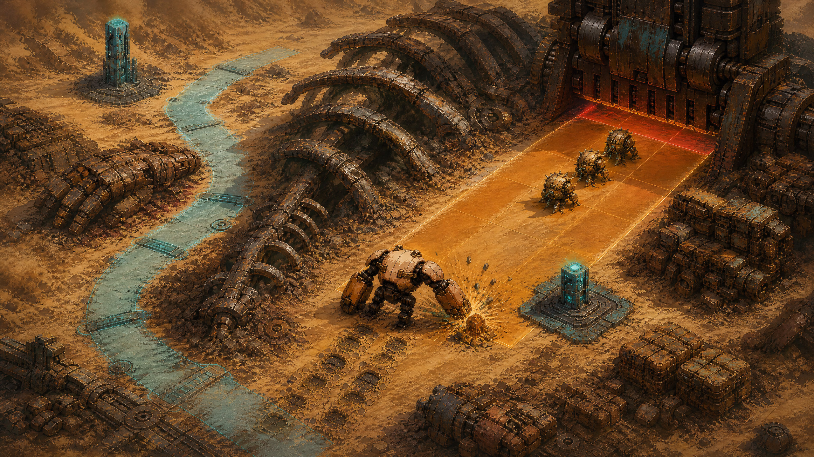
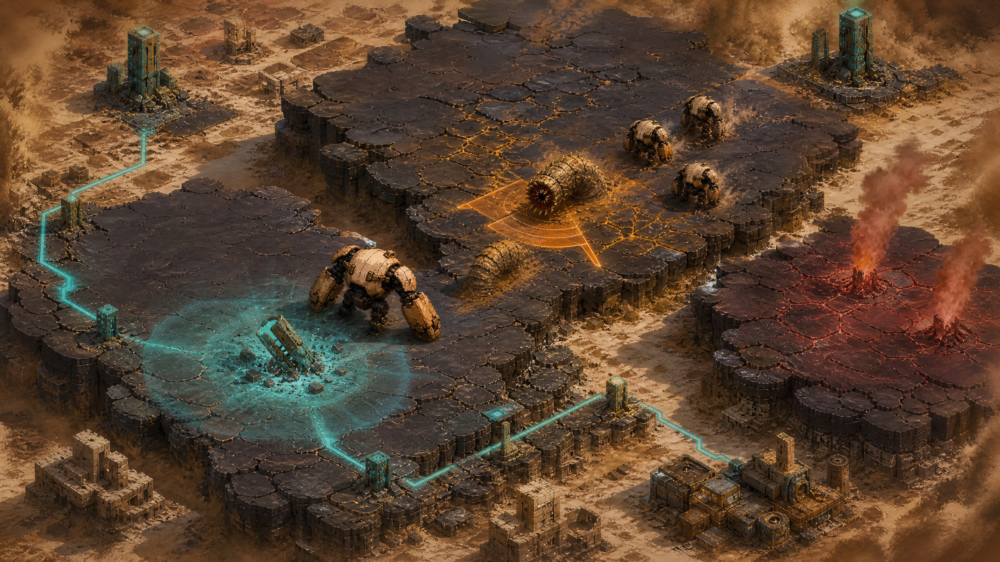
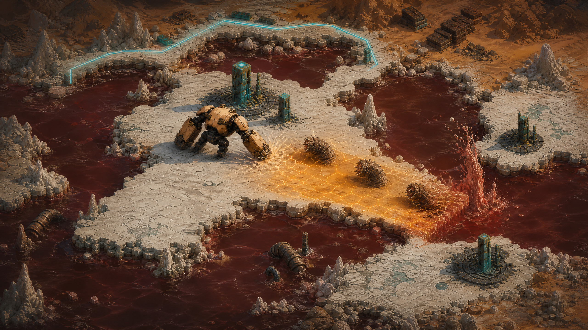
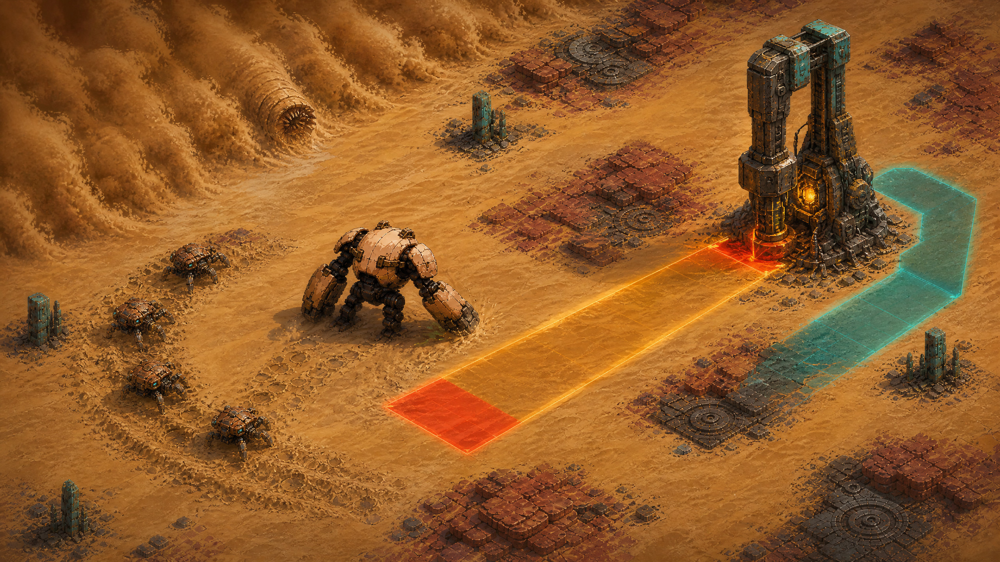

# WALKER'S WAKE — Biome and Encounter Variety Proposal

**Author:** Manus AI
**Status:** Recommended expansion direction
**Scope:** Four terrain-led biome families, two shared enemy families, and a biome-aware encounter deck for the shipped Walker's Wake 1.0 loop

## Executive recommendation

Walker's Wake should expand through **terrain-led decisions**, not through a catalogue of enemies with differently shaped health bars. Every new biome should change how Cardinal chooses a route, where the player is willing to Smash, and how an existing sandworm or weather threat can be turned into an advantage. The current desert remains the neutral **Sunscour Basin** and migration-safe fallback; four new deterministic macro-regions add materially different traversal and encounter rules without changing the expedition's three-relay structure, direct eight-direction control, or one-button combat.[1] [2]

The recommended production order is **Bellglass Shoals**, **Iron Graveyard**, **Resonance Shelves**, then **Salt Sink**. This sequence grows technical risk deliberately: a one-shot reactive floor, a timed moving hazard, temporary stress-driven lane denial, and finally encounter-long route collapse. The first playable increment should be one Bellglass route fork plus one Breakwater Ring encounter using only Cardinal, a sandworm, and the new resonant pane. If that small slice does not make route choice and Smash timing more interesting, we will have learned cheaply. A desert bureaucracy has again been denied funding.

## Player promise

> Enter a wasteland whose terrain fights everyone, read the safe line, take the dangerous shortcut, and use Cardinal's momentum and Smash to make the biome destroy its own ambush.

The expansion preserves the shipped run arc: launch, link three relays, survive Alert I–III, collect Cores and scrap, Refit once, and extract or fail within an 8–12 minute target. A run receives one primary biome forecast, with Relay 1 teaching its traversal rule, Relay 2 combining that rule with weather, and Relay 3 combining it with the most demanding sandworm or new-enemy composition. Outposts remain sanctuaries and exact-cell extraction points.[1] [2]

## Design doctrine

| Rule | Required interpretation |
|---|---|
| **One biome, one route decision** | Each biome owns one immediately readable choice between a longer guaranteed route and a shorter hazardous route. Decoration may vary; the rule does not. |
| **Terrain is impartial** | Reactive ground, presses, and collapses affect enemies as well as Cardinal. The player can bait pressure into the environment rather than merely tolerate it. |
| **No new field verbs** | Drive, run, Smash, automatic collection, automatic linking, and automatic extraction remain sufficient. New terrain listens to existing movement and Heavy Impact events. |
| **Alert remains the dramatic clock** | Relay completions still derive Alert 0–III. Biome recipes change combinations and geometry rather than inflating worm health. |
| **Safe routes are guaranteed** | Teal identifies the continuous nonhazard route, refuge, or recovery device. Amber shows the complete warned footprint. Red appears only while a volume is lethal. Shape, motion, and audio repeat the same meaning. |
| **Infinite does not mean unbounded** | Biomes are deterministic macro-regions over the existing bounded chunk streamer. Distant biome state cannot pin chunks, retain particles, or add unbounded encounter records. |
| **Art never owns gameplay truth** | GPT Image 2 assets define material, silhouette, and mood. Runtime polygons, timers, collisions, route validation, and rewards remain deterministic data. |

## World structure: biome route contracts

The infinite world should be partitioned into deterministic macro-regions derived from the existing world seed and generation version. The initial target is a region at least four visible diameters across—approximately a 16×16 group of the current eight-cell chunks—so a biome reads as a place rather than a decorative patch. A one-chunk **transition belt** blends materials but disables signature lethal behavior, preventing the biome boundary from becoming an ambush disguised as landscaping.

Each new expedition receives a stable `biome_id` in `RunState`. Relay objective search remains bounded but prefers valid cells within the selected region. Migrated and already-active saves keep the neutral Sunscour Basin contract; no objective moves after a run has begun. Outposts and relays may appear only on permanent ground, and every required anchor must retain a validated teal path after props are placed.

A shared `BiomeDefinition` Resource should own stable identity, terrain palette, chunk-template weights, encounter recipes, hazard policy, atmosphere profile, and reward weighting. A shared reactive-ground contract should accept existing semantic events such as Heavy Impact, occupancy, worm breach, and encounter reset. It should not become a general physics simulator. The ground has enough personality without a doctoral thesis.

## Biome I — Bellglass Shoals

**Bellglass Shoals** is the recommended first biome. Fossilized pressure glass lies between drowned industrial ribs. Teal-lit breakwaters provide a long guaranteed route, while broad dormant panes form shorter salvage-rich crossings. A Heavy Impact from Cardinal, an enemy, or a sandworm rings a pane. Two fixed amber pulses follow; the pane then ruptures once, affects everything inside its marked footprint, and cools into inert dark glass for the remainder of the encounter.

| Design element | Bellglass implementation |
|---|---|
| Traversal rule | Choose the stable teal rib or cross a dormant pane before it is rung. A spent pane becomes safe, changing the return line without permanently mutating the world. |
| Signature hazard | **Resonant Pane:** Dormant → Pulse One → Pulse Two → Rupture → Spent. It cannot chain to adjacent panes and is capped at three active panes per encounter. |
| Signature encounter | **Breakwater Ring:** two or three separated panes surround a relay or salvage pocket while one continuous teal perimeter remains open. Cardinal rotates around the ring and spends panes against pursuers. |
| Existing-system recombination | A sandworm intercept can ring a pane. Cardinal may dodge onto the rib, turn, and Smash the exposed worm while the pane staggers lesser pressure. |
| Reward hook | A discharged pane reveals normal scrap or a Refit-weight bonus. No Bellglass currency is introduced. |
| Main risk | Smash must feel empowered, not punished. Early panes require generous escape time, useful enemy stagger, and a refuge beside the trigger point. |

The teaching encounter is **Crossing Bell**: one dormant shortcut, one wide teal detour, light salvage on the far side, and a slow worm tell that demonstrates impartial triggering. Alert II adds **Split Chime**, with two panes flanking a relay zone while dust-devil formation pressure occupies the stable rib. Alert III uses **Worm at the Breakwater**, reserving the worm's intercept and pane rupture so their lethal footprints cannot seal the same route.

## Biome II — Iron Graveyard

The **Iron Graveyard** is a continent-scale scrapyard of fallen walkers and still-powered foundry machinery. Giant ribs form clear route walls. Teal maintenance paths are longer but stable; amber compression lanes are shorter, richer, and periodically closed by monumental Scrap Presses. Each press has a readable refuge and a Smashable maintenance latch. Waiting for the cycle, sprinting after closure, and jamming the latch are all valid uses of existing controls.

| Design element | Iron Graveyard implementation |
|---|---|
| Traversal rule | Take the teal bypass or commit to a timed compression lane for faster progress and denser salvage. |
| Signature hazard | **Scrap Press:** Idle → Amber Warning → Shove Sweep → Red Closure → Reopen, with an encounter-long Jammed state after a valid latch Smash. |
| Signature encounter | **Press Court:** three parallel lanes alternate closures while Alert pressure enters from reserved gates. Cardinal can bait threats into a press or secure one lane by jamming it. |
| Existing-system recombination | Dust-devil formation pushes movement toward a press lane; a sandworm emergence is serialized so it never overlaps a red closure across the only refuge. |
| Reward hook | Compression lanes contain more normal scrap and may improve the existing Refit offer. The safe bypass remains fully viable. |
| Main risk | Forced motion can feel unfair on touch. The amber shove must preserve steering, and only the stationary red closure may deal severe damage. |

The teaching encounter is **Cold Yard**, with one deliberately slow press and a visible latch. **Press Court** becomes the standard relay composition. **Hammer and Anvil** later combines one press lane with a sandworm, but the director must reserve the major telegraphs so at least one refuge is always open.

## Biome III — Resonance Shelves

The **Resonance Shelves** are black-violet obsidian plates built over dormant industrial heat sinks. Normal driving does not stress the ground. Heavy Impact events from Smash, charged attacks, enemy slams, and worm breaches raise local stress. A fully stressed shelf warns in amber, vents red for a bounded period, then cools. Smashing a squat teal heat-sink pylon safely discharges its connected shelf.

| Design element | Resonance Shelves implementation |
|---|---|
| Traversal rule | Use the long teal-buttressed perimeter or take a short salvage-rich shelf whose combat stress may temporarily deny the lane. |
| Signature hazard | **Resonance Shelf:** Quiet → Stressed → Warning → Venting → Cooling. Stress is local, quantized, and capped; it does not propagate across chunks. |
| Signature encounter | **Faultline Hold:** three broad shelves, two heat sinks, one stable perimeter, and existing pressure that makes the location of each Smash consequential. |
| Existing-system recombination | A worm breach may advance shelf stress. Cardinal can move the intercept away from the intended exit or discharge a heat sink before committing the punish Smash. |
| Reward hook | The risky shelf route carries denser normal salvage or an existing Refit cache. |
| Main risk | The game must not punish every Smash. Quiet shelves need generous capacity, and a heat sink must sit where combat naturally moves. |

**Relay Split** teaches the stable perimeter and the risky direct shelf. **Faultline Hold** introduces a serialized worm pass. **Cracked Outpost** places two heat sinks around a safe service floor, turning the approach into the encounter while preserving the outpost itself as sanctuary.

## Biome IV — Salt Sink

The **Salt Sink** is the most technically ambitious biome and should ship last. Permanent teal survey ridges connect stable islands above caustic brine. Brittle salt spokes accumulate stress from occupancy, running, enemies, and Heavy Impact. A fully stressed spoke warns in amber, then collapses into a red brine gap for the rest of the encounter. Unlike Bellglass, the route is removed rather than converted into safe floor.

| Design element | Salt Sink implementation |
|---|---|
| Traversal rule | Use permanent teal ridges or spend brittle spokes as shortcuts, traps, and one-way pursuit cuts. |
| Signature hazard | **Resonant Crust:** Intact → Stressed → Warning → Collapsed. Collapse is local, cannot cascade, and resets on a fair encounter reconstruction after reload. |
| Signature encounter | **Crustbreak Relay:** the relay occupies a stable central island with three brittle spokes and two permanent exits. Cardinal decides which pursuit lanes to preserve. |
| Existing-system recombination | A worm or moving pressure group can stress a spoke; Cardinal crosses, Smashes, and severs the route behind it. |
| Reward hook | Risky islands provide more existing scrap. Preserving at least one optional spoke can grant a normal salvage bonus. |
| Main risk | Route mutation can soft-lock objectives. Every objective requires two permanent exits, and spawn sockets must be filtered against collapsed spokes. |

**Survey Crossing** teaches stress with no combat. **Crustbreak Relay** turns route preservation into the contest. **Worm Sounding** introduces the worm only after the player has demonstrated that white salt is neutral and teal—not whiteness—means guaranteed safety.

## Encounter variety: two shared enemy families

The biome MVP should initially recombine the shipped sandworm, dust devil, and sandstorm systems. Once the terrain rules pass comprehension and fairness tests, the full expansion may add **no more than two shared enemy families**. They must work across every biome and fill roles the current roster does not.

| Enemy | Combat role | Behavior contract | Biome interaction |
|---|---|---|---|
| **Scrap Mites** | Light herder pack | Four to six low six-legged salvage machines form a crescent, pressure Cardinal away from the safest line, and die to one valid Smash. They deal low contact pressure rather than becoming a damage race. | Mites cross panes, enter press lanes, raise shelf or crust occupancy, and are excellent targets for impartial terrain traps. |
| **Pile Driver Sentinel** | Heavy lane controller and terrain trigger | A stationary industrial ruin projects one broad amber seismic lane, resolves one red impact strip, then exposes an amber maintenance core during recovery. Three valid Smash contacts disable it. | Its slam is a tagged Heavy Impact that can ring Bellglass, trigger a press reservation, stress Obsidian, or break Salt crust. |

The enemy limit is intentional. Biomes already add decision density. More than two new families would create onboarding and tuning cost faster than encounter variety. If the existing worm, weather, and terrain recipes meet the playtest targets, either enemy may be deferred. Fewer robots are easier to balance, and they complain less during code review.

## Biome-aware EncounterDirector

The EncounterDirector should select from **recipes**, not independently roll enemies and hazards. A recipe declares required terrain sockets, safe exits, major telegraph reservations, reward sockets, and an Alert budget. The director rejects any recipe whose prerequisites are absent. Major amber or red telegraphs are capped at two simultaneous readable threats in the normal camera.

| Alert | Biome-aware composition rule |
|---|---|
| Alert I | Teach the biome rule with one primary pressure source. The player must always have time to identify the safe route before damage begins. |
| Alert II | Combine the biome rule with either dust-devil formation or Scrap Mites. One major telegraph remains active at a time. |
| Alert III | Combine the biome rule with a worm, broad storm, or Pile Driver. The director reserves a continuous escape and forbids lethal overlap that seals it. |

Encounter seeds, reward event IDs, and the chosen recipe remain durable. Partial pane timers, press motion, particles, and crack animation remain transient. On reload, the director reconstructs a conservative fair checkpoint with stable routes and no immediate contact damage. This avoids unnecessary schema growth while preserving exactly-once rewards.

## Progression and replay hooks

Biome variety should reuse the shipped economy. Scrap remains common, Worm Cores remain the combat-gated resource, Refit remains one purchase per expedition, and next-run modifiers remain the replay decision. Biomes weight existing offers rather than create four currencies, four vendors, and a small filing cabinet.

The initial modifier integrations should be simple. **Hot Front** can increase aggressive recipe weight and biome salvage, **Brood Ground** can favor worm and Scrap Mite recipes, and **Dead Grid** can favor longer safe paths with cheaper repairs. A later profile unlock may add biome forecasts or contract choice at the title, but the first release should choose the biome deterministically from the run seed and display the forecast without adding another pre-run modal.

## GPT Image 2 asset production plan

The concept plates establish composition and material language; they are not runtime geometry. Runtime asset production should use GPT Image 2 liberally for replaceable visual layers while deterministic code owns all interaction.

| Asset family | Per-biome output | Runtime use |
|---|---|---|
| Seamless terrain materials | Base surface, secondary material, damaged/spent state, and transition-belt texture | Applied to existing 2:1 tile geometry with procedural tint and UV variation |
| Landmark sheets | Four to six large props in the exact isometric camera | Drowned ribs, walker carcasses, heat sinks, condensers, and salt fins |
| Hazard state sheets | Dormant, warning, lethal, recovery, and spent/collapsed visual states | Presentation over deterministic hazard polygons |
| Encounter accents | One relay arena plate and one extraction plate per biome | Art direction for authored chunk sockets and director recipes |
| Enemy sheets | Eight-direction movement/attack silhouettes for Scrap Mites; idle/warning/impact/recovery states for Pile Driver | Replaceable sprites over deterministic AI and hit geometry |
| Marketing plates | One key art image per completed biome and one four-biome expedition panorama | Store page, update posts, and title backgrounds; never runtime authority |

Each generated asset should preserve Cardinal's established material palette and 2:1 projection. Generated texture candidates should be checked for procedural salvage before rejection, following the project's existing texture workflow. Source control retains accepted runtime derivatives and a concise provenance note, not bulky rejected masters.[3]

## Smallest playable increment: Bellglass v0

The smallest release should place one deterministic Bellglass pocket beyond the starter outpost without changing existing objectives or saves. It needs one pane state machine, one guaranteed teal rib, one short dormant shortcut, one worm-trigger interaction, and one Breakwater Ring relay recipe. No new enemy family is required.

| Area | Goal | Done condition |
|---|---|---|
| Biome contract | Add stable `sunscour` and `bellglass` definitions with neutral migration fallback | Existing saves remain Sunscour; a seeded new run reaches the Bellglass pocket deterministically |
| Route validation | Author one Bellglass chunk with required anchors and a connected teal path | Props and pane placement cannot block outpost, relay, or extraction connectivity |
| Reactive pane | Implement the five-state one-shot pane with fixed warnings and impartial effect | Cardinal and the worm receive the same marked resolution; no chain reactions occur |
| Encounter recipe | Add Crossing Bell and Breakwater Ring to the director | Alert composition never seals the stable rib and cannot duplicate reward events |
| Presentation | Produce seamless glass, rib, pane-state, and rupture assets with GPT Image 2 | Runtime footprints remain readable with art hidden, and art aligns without owning collision |
| Verification | Extend focused tests, clean Web export, desktop/mobile live smoke, checkpoint, and push | Existing checks remain green; the public exact bundle boots; Bellglass adds no unbounded state |

## Implementation sequence

| Wave | Scope | Playable exit condition |
|---:|---|---|
| 1 | Shared biome definitions, macro-region forecast, transition belt, route validator, and Bellglass v0 | One complete run can enter Bellglass, understand the route choice, use a pane against a worm, and extract normally |
| 2 | Bellglass content pass and Iron Graveyard Scrap Press | Two visually and mechanically distinct biomes reuse the same director and route contracts |
| 3 | Resonance Shelves stress and heat-sink reset | Heavy Impact placement matters without making ordinary movement or every Smash punitive |
| 4 | Salt Sink route collapse and two-exit validation | Encounter-long topology changes cannot soft-lock objectives, spawns, reload, or extraction |
| 5 | Scrap Mites, then Pile Driver Sentinel if playtests justify them | Each enemy improves route-choice metrics by at least ten percentage points without extending run duration |
| 6 | Full GPT Image 2 asset pass, audio, accessibility, balance, soak, and exact Web release | Four biomes remain readable on desktop/mobile, preserve the 8–12 minute run, and introduce no save or streaming regressions |

## Success criteria

| Measure | Target |
|---|---|
| Traversal comprehension | At least 85% of blind testers identify the guaranteed teal route and risky shortcut within three seconds of entering a teaching chunk |
| Smash identity | At least 70% intentionally use Smash or a worm/heavy attack to manipulate terrain by the second eligible encounter |
| Fairness | At least 90% of biome damage events present the complete amber footprint for the configured warning period and leave a visible escape |
| Route agency | Safe and risky route use both remain between 30% and 70% after players understand the reward difference |
| Encounter recombination | At least 60% of successful signature encounters contain one intended cross-system action: bait, jam, discharge, rupture, or collapse |
| Mobile parity | Touch and keyboard/controller cohorts remain within ten percentage points for completion and unintended hazard-hit rate |
| Run pacing | Median successful expeditions remain within the shipped 8–12 minute target; biome timing gates add no more than fifteen seconds of forced waiting |
| Determinism | Seeded generation and input replay produce matching biome, recipe, and hazard-state outcomes; stress and propagation never cross chunk boundaries |
| Streaming | Macro-regions, landmarks, and encounters preserve current active-cell, visible-cell, and chunk-ring bounds |
| Roster discipline | Bellglass, Iron, Resonance, and Salt each pass their terrain metrics before either new enemy family becomes mandatory |

## Risks and scope cuts

The largest design risk is making the ground hostile to Cardinal's signature Smash. The solution is not to soften every consequence; it is to make the consequence useful, delayed, and escapable. Every teaching arena pairs the trigger with a refuge, every hazard affects enemies, and no signature shortcut is mandatory.

The largest technical risk is permanent topology. Bellglass and Resonance reset to a safe transient state on fair reload. Iron presses reconstruct at Idle or Jammed according to stable encounter events. Salt collapse should remain encounter-local until route validation and reload tests prove that persistence adds more value than failure modes. No cross-chunk stress, fracture cascade, fluid simulation, or physics debris belongs in the first expansion.

The largest production risk is visual overgrowth. Generated art must preserve broad lanes, strong contact shadows, and non-color cues. Decorative cracks, reflections, particles, and props fade or simplify around combat. The runtime must remain understandable with textures disabled; if a concept needs the painting to explain collision, the concept has quietly become a bug report.

## Final recommendation

Begin with **Bellglass v0** and treat it as the architecture test for the entire expansion. It creates the strongest visual departure from Sunscour with the least dangerous state model, lets the existing worm trigger the environment, and proves whether terrain can make one-button combat deeper without making it fiddly. Build Iron Graveyard only after the pane, route, director, and mobile-readability contracts are green. Build Resonance after timed hazards are stable. Build Salt last, when the project has earned the right to remove a route beneath a six-meter robot.

If Bellglass succeeds, Walker's Wake gains something more valuable than four backgrounds: it gains a reusable language for expeditions in which the world itself becomes Cardinal's second fist.

## References

[1]: ../gameplay-v2/GAMEPLAY_ENHANCEMENT_PROPOSAL.md "Walker's Wake Gameplay Enhancement Proposal"
[2]: ../../plans/WALKERS_WAKE_IMPLEMENTATION_PLAN.md "Walker's Wake Implementation Plan"
[3]: ../../../assets/cardinal/SOURCES.md "Cardinal Asset Contract and Provenance"
