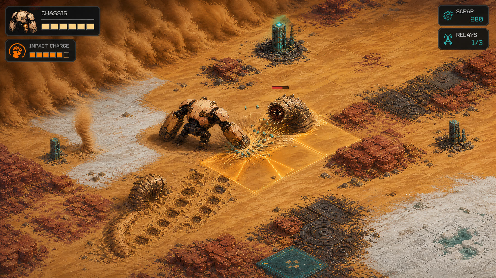
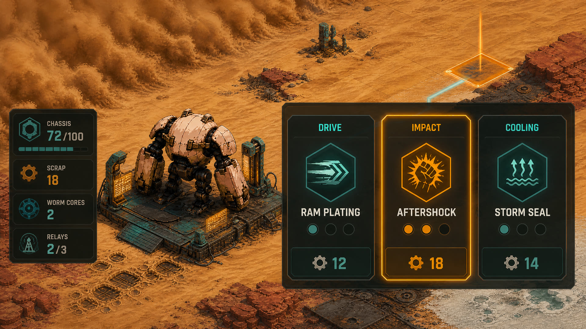

# WALKER'S WAKE — Gameplay Enhancement Proposal

**Author:** Manus AI
**Purpose:** Turn the current systems prototype into a replayable action-exploration loop without discarding its strongest asset: the feel of driving Walker.

## Executive Recommendation

The next version should become an **8–12 minute expedition game** built around a simple objective: activate three buried relays, survive the resulting escalation, and return to a harvested outpost to bank the run. Movement, smashing, scrap, sandworms, storms, outposts, damage, and persistence already exist. The missing ingredient is not more content; it is a structure that makes those systems collide in useful ways.

The proposed loop adds four connected mechanics. Movement builds **Impact Charge**, activated relays increase **Alert**, sandworms drop **Worm Cores**, and outposts turn scrap plus cores into one-run upgrades. This gives Walker a reason to move aggressively, a reason to fight selectively, a reason to explore, and a reason to retreat. In other words, the desert stops being a screensaver with opinions.

## Player Promise

> Drive a massive salvage robot through an increasingly hostile desert, build momentum into devastating strikes, choose which dangers are worth fighting, and reach safety with enough recovered machinery to change the next expedition.

The design should preserve direct eight-direction control and one-button melee. Fun must come from positioning, timing, escalating combinations, and route decisions rather than adding a large ability bar. Desktop and mobile should use the same verbs: drive, smash, collect, link, upgrade.

## Proposed Run Structure

| Phase | Player activity | Tension created |
|---|---|---|
| Launch | Leave an outpost with one starter module and a visible three-relay objective | The player chooses an initial play style rather than wandering without direction |
| Hunt | Follow signal pulses toward a relay while collecting scrap and building Impact Charge | Faster movement is rewarding, but hazards and worms punish careless lines |
| Contest | Enter the relay zone, clear or evade local pressure, and remain linked long enough to activate it | Standing near an objective conflicts with the instinct to keep moving |
| Escalate | Each relay raises Alert and changes enemy combinations | Progress makes the run harder instead of merely longer |
| Extract | Reach any outpost after the third relay and bank rewards | Low chassis, unspent scrap, and the shortest route compete for priority |
| Refit | Spend run resources on one module upgrade and choose the next expedition modifier | The run ends with a meaningful build decision and a clear reason to replay |

A successful run should contain roughly three relay encounters, two to four worm engagements, one major sandstorm crossing, and one emergency decision about whether to retreat or push onward. Procedural generation can remain infinite, but the run objective creates a finite dramatic arc.

## Core Mechanic: Impact Charge

Impact Charge converts good driving into better combat. Walker gains charge while moving above a speed threshold, gains it faster while running, and loses it slowly while idle. The existing smash remains available at zero charge, but charge adds range and utility rather than merely inflating damage.

| Charge state | Smash behavior | Intended use |
|---|---|---|
| 0–39% | Current single-cell contact strike | Rocks, opportunistic hits, and basic defense |
| 40–79% | Two-cell forward shock line and stronger knockback cue | Catching a pursuing worm after a dodge |
| 80–100% | Three-tile fan-shaped aftershock, extra debris, and brief worm stagger | A deliberate payoff for maintaining momentum under pressure |

The charge should be highly readable through one compact meter, Walker's forearm glow, and an audio pitch layer. It should not become a combo counter. The point is to reward motion planning, not to issue performance reviews after every punch.

## Relay Encounters and Alert

Relays turn terrain traversal into local arenas without requiring walls. A relay starts dormant and emits a directional signal pulse from several screens away. Entering its zone begins a short link sequence. Walker can move within the zone but loses link progress if it leaves. Linking does not make Walker invulnerable; it creates a defend-or-dodge problem around an understandable location.

Each completed relay raises **Alert** from I to III. Alert changes combinations rather than only increasing health. Alert I introduces a single hunting worm. Alert II allows a worm plus telegraphing dust devils. Alert III allows a worm encounter during a broad sandstorm crossing. Environmental enemies remain indestructible, so the player must solve mixed encounters through movement while deciding when to commit a smash to the worm.

Outposts remain sanctuaries. Linking to an outpost disperses worms, pauses Alert spawns in a local radius, and opens refit. This makes the journey between safe nodes legible and gives the player control over pacing.

## Sandworm Combat Improvements

Current worms pursue, bite for ten damage, expose health, die in four hits, and disperse at outposts. Their next improvement should be **attack readability**, not more statistics.

A worm alternates between three states. During **Burrow**, a moving ridge marks its path. During **Intercept**, an amber ground arc predicts where it will surface relative to Walker's current velocity. During **Expose**, the worm attacks, remains vulnerable for a short window, and then dives again. Walker can avoid the intercept, turn, and punish the exposed flank. A high-charge smash briefly staggers the worm and extends the vulnerability window.

Defeated worms drop one Worm Core plus scrap. Cores are intentionally rarer than scrap and gate stronger outpost modules. This makes combat optional but economically tempting; running away remains valid when chassis integrity matters more than greed.

## Outpost Upgrade Interface

The outpost screen should unlock the existing Crafting and Upgrades controls as a single, compact **Refit** interface. It should offer three large paths with no inventory grid and no crafting recipe spreadsheet.

| Path | First upgrade | Gameplay effect | Cost target |
|---|---|---|---|
| Drive | **Ram Plating** | Running through small rocks destroys them but drains Impact Charge | Scrap only |
| Impact | **Aftershock** | High-charge smash emits the three-tile fan shown in the concept | Scrap + one Worm Core |
| Cooling | **Storm Seal** | Reduces environmental damage while running and shortens damage-flash obstruction | Scrap + one Worm Core |

For the first implementation, upgrades should last for the current run. This allows rapid balance changes and creates meaningful build variety without introducing permanent-progression debt. Persistent unlocks can later expand which modules may appear, while individual run power still resets.

The interface should be navigable with pointer, keyboard, and touch. Three cards are enough for a first version: one highlighted selection, one-line effect text, level pips, and cost. The concept art is intentionally more decorative than the runtime target; usability wins any argument with holographic garnish.

## Rewards, Failure, and Replayability

A run banks relay data only after extraction. Shutdown in the field preserves discovered world mutations but loses unbanked Worm Cores and a portion of run scrap. This makes failure meaningful without deleting exploration progress. Reaching an outpost at low health should feel like a rescue, not like opening a settings panel.

After extraction, the next run receives one procedural modifier selected from two choices. Examples include **Hot Front**, where storms are more frequent but relays yield more scrap; **Brood Ground**, where worms spawn more often but cores have a chance to duplicate; and **Dead Grid**, where relays are farther apart but outpost repairs cost less. These modifiers reuse existing systems and provide variety more efficiently than producing a zoo of unrelated enemies.

## HUD and Feedback

The field HUD should be reduced to information that changes decisions: chassis, Impact Charge, scrap, Worm Cores, relay count, and current Alert. Coordinates and developer telemetry should move behind a debug toggle. Relay pulses should use teal; danger telegraphs and charged impact should use amber; lethal shutdown remains red. This preserves the project's established color grammar.

Mobile keeps the floating joystick and Smash button. The charge meter should sit above Smash so the player's thumb naturally associates movement with attack readiness. Relay interaction should be automatic inside the zone; adding a second mobile action button would be a small interface crime committed in broad daylight.

## Smallest Playable Implementation

The smallest high-confidence increment is **Impact Run v0**. Add Impact Charge, place one deterministic relay near the starting outpost, give the relay a short link timer, and spawn one test worm when linking begins. Completing the relay and returning to the outpost opens three upgrade cards, but only Aftershock is functional. A complete slice therefore proves the entire loop: move, charge, contest, fight, collect, extract, upgrade.

| Increment | Scope | Done condition |
|---|---|---|
| 1. Impact Charge | Meter, movement gain/idle decay, three charge bands, charged strike feedback | The player can intentionally build charge and observe a materially different smash |
| 2. Relay Contest | Signal guidance, one relay zone, link progress, one encounter trigger | The player understands where to go and can complete an objective under pressure |
| 3. Worm Counterplay | Burrow trail, intercept telegraph, expose window, charged stagger, core drop | Worm combat rewards dodge-turn-smash rather than trading chassis |
| 4. Outpost Refit | Three-card interface, costs, Aftershock functional, two locked or preview paths | Completing the relay produces a build choice that changes the next encounter |
| 5. Full Run | Three relays, Alert I–III, extraction, run summary, one modifier choice | A session has a beginning, escalation, climax, and replay hook within twelve minutes |

## Acceptance Criteria

The concept is working when a new player can answer three questions without explanation: where am I going, why should I keep moving, and when should I smash? The first relay should be reached within 45 seconds. Impact Charge should produce its first upgraded strike within 60 seconds. A worm fight should last under 25 seconds when played well. The outpost refit choice should take under 15 seconds. Most importantly, a failed run should create an immediate desire to try a different route or module rather than a desire to inspect the task manager.

## Recommendation

Implement **Impact Charge + one relay contest + Aftershock** before adding more enemies, crafting materials, or narrative systems. Those three pieces connect nearly every runtime capability already present and will reveal whether the game has a satisfying heartbeat. If that slice is fun, Alert escalation, Worm Cores, and the full three-path outpost interface become obvious extensions. If it is not fun, the prototype will have provided an honest answer before we built a desert bureaucracy around it.
