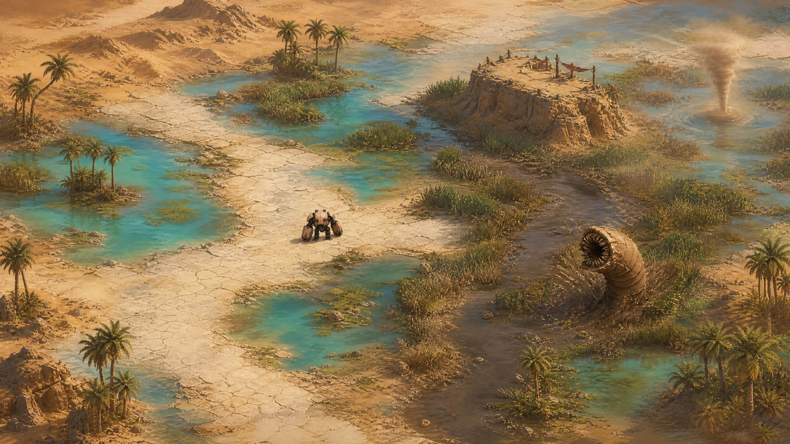
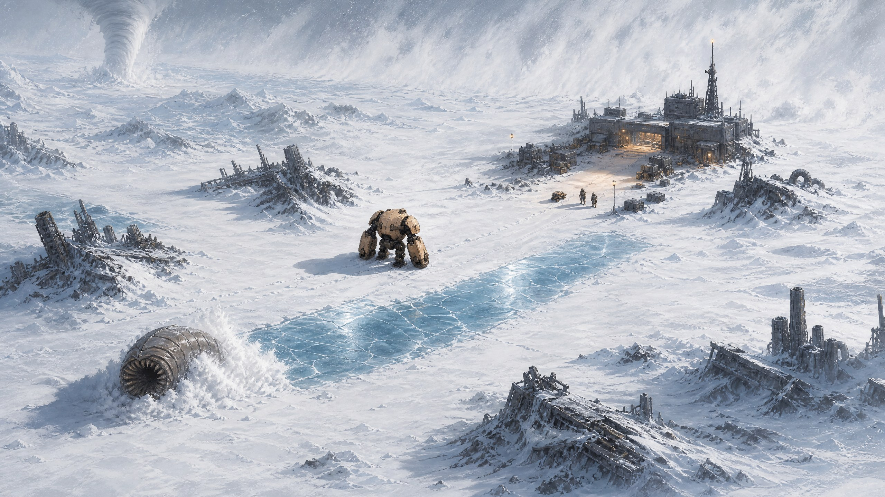
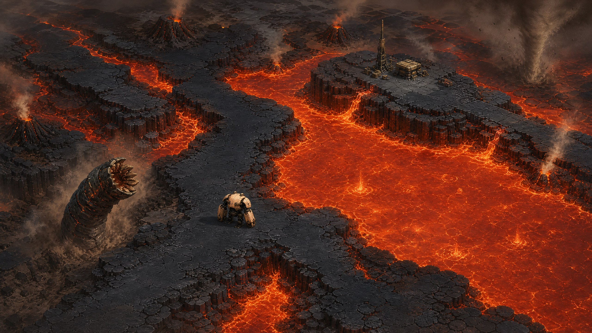

# Walker's Wake — Simple Biome Concept

**Author:** Manus AI  
**Status:** Replacement proposal  
**Scope:** Three visually distinct biomes, each with one immediately understandable terrain rule

## Direction

Walker's Wake should use biomes as **clear changes of place**, not as new rulebooks. Cardinal keeps the same eight-direction movement, running, Smash attack, enemies, resources, outposts, relays, and expedition structure everywhere. Each biome changes only the ground beneath those familiar systems.

> **Player promise:** Enter a place that looks different, understand its single terrain rule at a glance, and keep playing with the controls already learned.

The previous biome-expansion plan is rejected. Its lore-heavy names, reactive terrain state machines, new enemy families, currencies, encounter recipes, and cross-system mechanics are removed from the direction.

## Simplicity contract

| Rule | Requirement |
|---|---|
| **One biome, one rule** | Oasis mud slows. Tundra ice slides. Lava hurts. No second biome mechanic is introduced. |
| **No new controls** | Drive, run, and Smash remain the complete field vocabulary. |
| **No new progression systems** | Scrap, Worm Cores, Refit, relays, and outposts remain unchanged. |
| **Reuse the current roster** | Sandworms, tornadoes, and broad storms receive visual treatments and placement changes, not new behavior trees. |
| **Read the ground without UI** | Safe and hazardous surfaces must differ through color, material, silhouette, and motion. |
| **Keep outposts safe** | Every outpost sits on clearly safe terrain with its existing sanctuary boundary visible. |

## Oasis / Wetlands

**Oasis / Wetlands** is a bright pocket of shallow turquoise water, palms, reeds, pale sand, flat stone, and dark mud. Pale sand and stone are the normal lanes. Dark glossy mud is the only special surface.

> **Single rule:** Mud slows Cardinal while Cardinal is standing on it.

The player can follow broad firm paths at normal speed or cut through mud and accept slower movement. Sandworms emerge from muddy reed banks, tornadoes read as reed-and-mist waterspouts, and distant dry sandstorms remain recognizable at the desert edge; their underlying behavior does not change. Outposts sit on raised dry stone beneath palms, with no mud inside the sanctuary.

The smallest playable increment is one compact area containing a raised outpost, two firm lanes around a central pool, one muddy shortcut, edge reeds, and one existing sandworm encounter. This is the recommended first biome because a surface-based speed reduction is simple to build, easy to tune, and immediately tests whether the new terrain language is readable.

## Frozen Tundra

**Frozen Tundra** uses white packed snow, glossy blue ice, dark frozen wreckage, and windblown powder. White snow supports normal movement. Blue ice is the only special surface.

> **Single rule:** Cardinal slides in the chosen direction on blue ice and regains normal control on snow.

Snow lanes remain wide enough for ordinary combat. Short ice crossings reward lining up an exit before committing without adding a new button or meter. Sandworms breach through snow, tornadoes become white funnels, and broad storms become whiteout walls while retaining their existing timing and damage. Outposts use warm lights and packed snow, with no blue ice inside the sanctuary.

The smallest playable increment is one route from an outpost to a frozen wreck, using one wide snow lane, one short ice crossing with snow at both ends, one existing enemy encounter, and one whiteout pass. This biome should ship last because sliding changes movement response and therefore needs the most keyboard and touch tuning.

## Lava Fields

**Lava Fields** uses matte black basalt, bright red-orange lava, pale ash, and simple volcanic vents. Basalt is the safe traversable surface. Lava is the only special surface.

> **Single rule:** Touching lava damages Cardinal.

The map becomes a network of broad basalt lanes around highly visible lava pools and channels. Sandworms use an obsidian-dusted treatment, tornadoes carry ash and embers, and broad storms become ash fronts without changing their logic. Outposts occupy cool raised basalt islands with a clean lava-free sanctuary perimeter.

The smallest playable increment is one short loop around a single lava pool, with one outpost, one familiar sandworm encounter, and an obvious return path. This biome should follow Oasis because its damage can reuse the current chassis-damage system while introducing stricter—but still readable—route choices.

## Comparison

| Biome | Safe ground | Special ground | One rule | Existing-threat treatment | Implementation risk |
|---|---|---|---|---|---|
| **Oasis / Wetlands** | Pale sand and flat stone | Dark glossy mud | Mud slows | Mud-bank worms and misty waterspouts | Low |
| **Lava Fields** | Matte black basalt | Bright lava | Lava damages | Obsidian worms and ash storms | Medium |
| **Frozen Tundra** | White packed snow | Glossy blue ice | Ice slides | Snow worms, white funnels, whiteouts | Medium-high |

## Recommended implementation order

The recommended sequence is **Oasis / Wetlands**, **Lava Fields**, then **Frozen Tundra**. Oasis proves biome generation and surface effects with the lowest-risk rule. Lava Fields reuses established damage handling and tests strong lane layouts. Frozen Tundra comes last because movement inertia must feel correct on keyboard and touch.

No fourth biome, new enemy family, biome currency, status stack, survival meter, crafting branch, moving platform, reactive terrain state machine, or lore-heavy naming system is part of this proposal. The biome should be explainable in one sentence before it earns implementation time. A surprisingly effective anti-bureaucracy device.

## Done condition for the first biome

Oasis / Wetlands is ready when one complete expedition can enter a wetland region, identify mud without UI, feel the slowdown immediately, fight existing threats without new controls, use a visibly safe outpost, and continue the existing relay and extraction loop without save, streaming, mobile-control, or performance regressions.

## References

[1]: ../WALKERS_WAKE_PROPOSAL.md "Walker's Wake Core Proposal"
[2]: ../gameplay-v2/GAMEPLAY_ENHANCEMENT_PROPOSAL.md "Walker's Wake Gameplay Enhancement Proposal"
