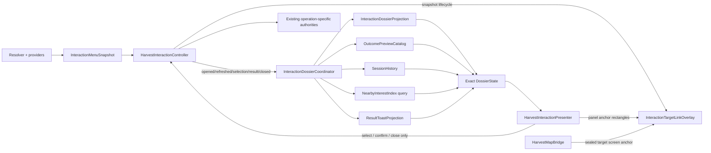

# Protos Harvest Concept Recreation Implementation Plan

**Canonical repository:** `/home/ubuntu/workspace/proto-isometric`
**Baseline revision:** `8e0d04f19dd60558d7b4d6d65bc7e227d5d30f46`
**Engine:** Godot 4.7.2 stable, GL Compatibility
**Deployment target:** Native development build and existing thread-free Web export
**Companion audit:** [Concept Recreation Discrepancy Report](PROTOS_HARVEST_CONCEPT_RECREATION_DISCREPANCY_REPORT.md)
**Delivery model:** Incremental fast-forward commits to `main`; focused checks, aggregate regression, completion-ledger update, and push after every phase

> **Product principle:** Recreate the concepts’ composition, palette, hierarchy, spatial linkage, and responsive posture. Do not recreate facts or operations that the game does not own. Presentation may omit unsupported data; it may never invent it.

## 1. Mission and definition of done

This plan evolves the existing pooled interaction terminal into one responsive dossier system with three compositions: a wide landscape terrain dossier, a wide landscape object dossier, and a portrait world-preserving bottom sheet. The work remains downstream of canonical menu snapshots and operation descriptors, adds pure bounded projections rather than presenter-owned rules, adds one cached target-link overlay, and adds an index-backed nearby-interest read path. All action execution continues through `HarvestInteractionController.confirm_menu()`.

The concept recreation is complete when the following outcomes are simultaneously true:

1. Wide landscape terrain targets use an identity-first dossier with canonical coordinates, provider-backed Surface and condition rows, canonical chips, action cards, a detached truthful outcome preview, target linkage, and a bounded nearby-interest card.
2. Wide landscape object targets use a left dossier and right inspection/result hierarchy when safe bounds preserve the world aperture; the first certified object is a real canonical facility, not an invented irrigation machine.
3. Portrait uses a safe-area-aware bottom sheet with **Summary**, **Actions**, and **History** navigation; History is a bounded, explicitly session-only log of validated results, not fabricated world history.
4. Current terrain, water, object, cost, lock, result, and mutation truth remains authoritative. Unsupported sections are absent or truthfully unavailable.
5. Target ring/connectors remain bound to the sealed target and do not re-resolve a replacement while the dossier is open.
6. Preview, toast, history, and nearby-interest records are exact-schema, deterministic or explicitly session-ordinal, bounded, localized by key, and mutation-free.
7. Keyboard, pointer, controller, and touch preserve current focus, stale rejection, exact-once, modal suppression, outside-close, and operation close semantics.
8. Native and Web layouts respect platform safe areas, UI scale, handedness, CJK wrapping, 44 px minimum targets, and bounded scrolling.
9. Idle/open dossier frames perform no projection rebuild, nearby query, layout, or overlay redraw when inputs are unchanged.
10. Every new raster game/UI asset is a documented **GPT Image 2** derivative; references are never shipped as flattened runtime skins.
11. Focused tests, the full aggregate verifier, release export, exported-pack boot, and served-browser matrix pass; the completion ledger records evidence and pushed revisions.

## 2. Immutable correctness and scope constraints

| Concern | Constraint |
|---|---|
| Signed contracts | Do not add decorative keys to `InteractionMenuSnapshot`, `InteractionOption`, or `InteractionExecutionResult`. Add separate exact presentation contracts. |
| Game-state truth | The presenter and presentation catalogs may whitelist and format authoritative values; they may not read arbitrary nodes, infer rules, convert Boolean state into percentages, or use concept prose as data. |
| Explicit rejections | **Terrain health, ecology stability, water depth/quality/habitat, fault diagnoses, staged or percentage repair, invented repair materials, maintenance age, network/output values, and blueprint facts are forbidden unless named authoritative sources and complete contracts are added first.** Existing Boolean facility repair and provider-owned exact costs remain valid. |
| Action closure | A card exists only for a canonical option. New reads/UI transitions/mutations require an operation descriptor, allowed provider, stale policy, route, adapter, result, localization, and tests. |
| Execution gateway | No presentation, toast, history, overlay, or nearby-index module may call a gameplay mutation. Every activation ends at `HarvestInteractionController.confirm_menu()` exactly once. |
| Staleness | Preview/hold/projection identity is subordinate to current `snapshot_id` and option fingerprint. A changed snapshot clears transient UI and rejects that confirmation press. |
| Persistence | Core recreation is save-neutral. Session History and an optional session waypoint are nonpersistent. Persisted waypoints or new facility condition are separate schema projects with migration/rollback gates. |
| Presenter ownership | Keep one `HarvestInteractionPresenter` `CanvasLayer`, one modal veil, one target-link overlay, bounded pools, and one modal input owner. |
| Visible world | The central landscape aperture and portrait world window are visual context only. World movement, tools, attacks, camera gestures, and conflicting touch controls remain suppressed. |
| Responsive design | Concepts are not scaled screenshots. Use qualified layout modes with containment fallbacks. |
| Web | Preserve GL Compatibility, `variant/thread_support=false`, explicit resource export, no live blur/viewport copy, no per-target nodes, no unbounded query, and no dynamic filesystem dependency. |
| Version control | Complete, test, ledger-update, commit, and push each phase independently. Never rewrite history or combine a failing phase with later work. |

## 3. Target architecture

### 3.1 Ownership and data flow

The controller remains the sole menu-selection and execution authority. A new read-only coordinator creates dossier presentation state from validated inputs and sends it to the existing presenter. The world bridge owns the nearby-interest index and target-anchor callable because those depend on world/farm registries. The presenter owns visual layout only. The overlay owns primitive target linkage only.



The coordinator never calls the resolver itself. It consumes controller-emitted validated snapshots and results. The nearby query receives the sealed `target_cell`, target identity, and the index revision from the bridge. The overlay converts only that sealed cell/stable target identity into a screen anchor and never asks which target is currently live at that cell.

### 3.2 Module and file map

| File | Status | Responsibility and boundary |
|---|---|---|
| `scripts/harvest_interaction_controller.gd` | Modify narrowly | Preserve all confirmation behavior. Add no dossier rules. Optionally expose a read-only `get_selected_option()` canonical copy to avoid duplicate lookup; never expose mutable internals. |
| `scripts/harvest_interaction_presenter.gd` | Major refactor | Retain one pooled `CanvasLayer`; render `wide_terrain`, `wide_object`, `compact_side`, and `portrait_sheet` modes; own focus, input forwarding, animations, safe bounds, and pool visibility. |
| `scripts/harvest_map_bridge.gd` | Modify | Instantiate/configure the coordinator, nearby index, and overlay; provide a sealed-target screen-anchor callable; forward modal HUD occlusion and dirty camera/viewport signals. |
| `scripts/interaction_dossier_state.gd` | New | Define exact keys, caps, validation, canonical copy, and digest for the complete presentation state. No localization lookup and no runtime reads. |
| `scripts/interaction_dossier_projection.gd` | New | Pure whitelist adapter from validated menu/result to target identity, summary sections, chips, portrait ID, and suggested stable action IDs. Omit unsupported fields. |
| `scripts/interaction_dossier_coordinator.gd` | New | Subscribe to controller lifecycle; compose projection, selected-option preview, session history, nearby rows, and toast; use dirty fingerprints to skip unchanged work. Never execute. |
| `scripts/interaction_action_presentation_catalog.gd` | New | Closed presentation-only map from exact/prefix action ID to icon ID, description key, semantic tone, and optional confirmation presentation. It cannot alter option fields. |
| `scripts/interaction_outcome_preview_catalog.gd` | New | Build an exact pure preview from current snapshot, current option, operation descriptor, and closed deterministic effect templates. Never call a candidate builder or reserve resources. |
| `scripts/interaction_result_toast_projection.gd` | New | Convert one validated execution result into one localized-keyed, bounded toast shell. Do not add outcomes absent from the result. |
| `scripts/interaction_session_history.gd` | New | Maintain a fixed-capacity, session-only sequence of validated execution-result references. No timestamps or invented prose; no save data. |
| `scripts/world_nearby_interest_index.gd` | New | Maintain bounded chunk buckets of stable, already-authoritative interest records from existing world/farm registries; expose revisioned, capped tile-distance queries. No node scan at query time. |
| `scripts/interaction_target_anchor_catalog.gd` | New | Presentation-only lower-center anchor offsets for known target subkinds/portraits. Defaults to cell center. It cannot choose a target. |
| `scripts/interaction_target_link_overlay.gd` | New | One input-transparent custom `Control` for ring, brackets, connector polylines, edge marker, and optional spotlight; redraw only on dirty input changes. |
| `scripts/platform_safe_area.gd` | New | Normalize native `DisplayServer` safe area and Web visual/CSS safe insets into viewport-local logical coordinates; cache until viewport/orientation changes. |
| `scripts/interaction_dossier_action_row.gd` | New | Reusable pooled action-card Control with icon, title, description, cost/lock column, selection state, hold progress, accessible name, and no execution logic. |
| `scripts/interaction_dossier_fact_row.gd` | New | Reusable pooled icon/label/value row with wrapping and accessible text; consumes typed projected values only. |
| `scripts/field_hud.gd` | Modify narrowly | Accept dossier occlusion/yield events; hide or reflow only overlapping HUD surfaces without changing `_state_snapshot` or defeating state/layout skip counters. |
| `scripts/mobile_controls.gd` | Preserve/extend tests | Continue modal suppression and popup touch exclusion. Accept multiple exclusion rectangles only if needed; do not create a separate suppression flag. |
| `scripts/responsive_camera.gd` | Preserve/extend tests | Continue hiding/suppressing zoom and camera gestures under modal ownership. Expose no dossier-specific camera mode in the first release. |
| `data/locales/en.json` and `data/locales/zh-CN.json` | Modify together | Exact key and named-placeholder parity for all dossier copy, units, accessibility text, empty states, session History, previews, and toasts. |
| `assets/ui/interaction/SOURCES.md` | New if raster ships | GPT Image 2 source/provenance, prompt ID, raw/output dimensions, processing recipe, runtime SHA-256, and intended maximum scale. |
| `provenance/interaction-dossier/manifest.json` | New if raster ships | Non-runtime generation records and source hashes. Explicitly excluded from export. |
| `export_presets.cfg` | Modify | Explicitly include every new script/resource/asset and keep threads/extensions disabled. |
| `tools/prepare_web_shell.py` | Modify | Set `viewport-fit=cover`, surface CSS `env(safe-area-inset-*)` plus `visualViewport` values to a small read-only Web safe-area bridge, and preserve existing loaders. |
| `project.godot` | Modify | Register the dossier feature flag and any new input/action accessibility labels without changing current gameplay bindings. |

### 3.3 Existing authorities that must remain authoritative

| Authority | Dossier use | Forbidden shortcut |
|---|---|---|
| `interaction_menu_snapshot.gd` | Target identity, cell, target state, canonical sorted options, snapshot digest | Presenter-owned option additions or raw runtime references |
| `interaction_option.gd` | Enabled/disabled state, reason, label, costs, affected cells, operation, close behavior | Hard-coded concept costs, locks, availability, or close policy |
| `interaction_operation_catalog.gd` | Read/UI/mutation classification, route, persistence, receipt, stale policy | Inferring mutability from action name or semantic tone |
| `interaction_execution_result.gd` | Executed result facts/body/parameters, mutation flag, source identity | Free-form success copy or invented rewards/effects |
| `interaction_read_result_catalog.gd` | Current provider-backed inspection facts | Dumping arbitrary `target_state` or node properties |
| `placement_validator.gd` | Future buildability result for a defined placement request | A generic “Buildable: Conditional” chip |
| Existing facility/farm/world/construction/deposit services | Current state and productive mutations | Direct calls from action cards, previews, or toasts |

## 4. Exact presentation data contracts

The new contracts are separate from signed gameplay contracts so presentation richness cannot weaken the trust boundary. All arrays are capped, all dictionaries have exact sorted keys, all IDs are stable `StringName` values, and all visible prose is represented by localization keys plus canonical primitive parameters.

### 4.1 `InteractionDossierState`

`interaction_dossier_state.gd` validates this exact top-level shape:

```gdscript
{
    &"state_id": StringName,                 # digest of all other keys
    &"source_snapshot_id": StringName,
    &"target_id": StringName,
    &"target_cell": Vector2i,
    &"profile": StringName,                  # terrain | object | generic
    &"portrait_id": StringName,              # may be empty; presentation only
    &"title_key": StringName,
    &"subtitle_key": StringName,              # may be empty
    &"summary_sections": Array[Dictionary],   # max 4 sections, max 12 rows total
    &"chips": Array[Dictionary],              # max 4
    &"action_ids": Array[StringName],         # exact snapshot order, max 32
    &"selected_action_id": StringName,
    &"preview": Dictionary,                   # empty or exact Preview
    &"nearby": Array[Dictionary],             # max 4
    &"history": Array[Dictionary],            # max 8 for current target view
    &"toast": Dictionary,                     # empty or exact Toast
}
```

Each summary section has exact keys `section_id`, `title_key`, `icon_id`, and `rows`. Each row has exact keys `row_id`, `label_key`, `value_kind`, `value`, and `tone`. The accepted value kinds remain aligned with `InteractionExecutionResult`; new ad hoc rich values are not introduced. Section construction whitelists fields by provider/subkind and omits unknown state. Total summary rows cannot exceed the existing twelve-fact trust budget.

The initial whitelist is:

| Profile | Immediately permitted opening-summary values | Explicitly omitted until authority exists |
|---|---|---|
| Terrain | Target cell, `biome_id`, `surface_id`, `walkable`, `farmable`/tillable, `blocked`, and real optional plot/crop fields already projected | Health, ecology score, soil, moisture percentage, canopy maturity, resource yields, generic buildability, hazard absence, traversal class/cost |
| Water | Target cell, `water_class`, `walkable`, `irrigation_relevant` | Depth, quality, habitat abundance, irrigation radius, weather modifier, safe traversal |
| Facility/object | Target cell and provider-emitted target state; validated inspection facts; current canonical repaired/powered facts | Integrity percentage, half-repair, network, output/day, ownership, maintenance age, faults, blueprint compatibility, spatial power source |
| Generic | Target kind/subkind and validated result facts only | Raw target-state dump or humanized internal IDs |

### 4.2 Action presentation metadata

`interaction_action_presentation_catalog.gd` returns only:

```gdscript
{
    &"presentation_id": StringName,
    &"icon_id": StringName,
    &"description_key": StringName,
    &"tone": StringName,              # read | ui | productive | danger | neutral
    &"confirm_presentation": StringName, # standard | hold; UI policy only
}
```

The catalog never returns `enabled`, `reason_key`, cost, operation, provider, arguments, priority, affected cells, or close behavior. Unknown action IDs use a localized neutral fallback and procedural icon. `hold` is allowed only for an operation that is already provider-emitted and already requires a confirmation presentation approved by a closed allowlist; it grants no authority.

### 4.3 Truthful selected-option preview

`interaction_outcome_preview_catalog.gd` validates:

```gdscript
{
    &"preview_id": StringName,             # digest
    &"source_snapshot_id": StringName,
    &"option_fingerprint": StringName,
    &"action_id": StringName,
    &"operation": StringName,
    &"mutability": StringName,
    &"title_key": StringName,
    &"description_key": StringName,
    &"enabled": bool,
    &"reason_key": StringName,
    &"costs": Array[Dictionary],           # canonical option costs, max 16
    &"affected_cells": Array[Vector2i],    # canonical option cells, max 16
    &"effect_rows": Array[Dictionary],     # max 4, closed templates only
}
```

The option fingerprint is the canonical digest of the selected option. A preview is valid only while both `source_snapshot_id` and the current option fingerprint match. Cost rows are copied from `cost_preview`. Disabled explanations are copied from `reason_key`. Effect rows may state only descriptor facts such as **read-only/no world change**, **opens an existing UI**, or a deterministic effect already represented by validated option arguments and covered by a closed test fixture. The preview must not call a candidate service, inspect inventory beyond the option, roll RNG, claim yields, or reserve resources.

### 4.4 Validated result toast

`interaction_result_toast_projection.gd` accepts one valid `InteractionExecutionResult` and produces:

```gdscript
{
    &"toast_id": StringName,       # equals or derives from result_id
    &"source_result_id": StringName,
    &"tone": StringName,           # success | failure | information
    &"title_key": StringName,
    &"body_key": StringName,
    &"parameters": Dictionary,
    &"reason_key": StringName,
    &"duration_msec": int,         # 2500..5000; presentation only
}
```

The toast uses validated result title/body/parameters and the failure reason. It never claims “Clean Water,” irrigation radius growth, Field Guide updates, items, faults, or rewards that the execution result does not contain. There is one pooled toast. A newer result replaces an older information toast; failures are announced immediately. Closing the menu does not invalidate a successful result toast, but target-specific connector UI closes normally.

### 4.5 Bounded session History

`interaction_session_history.gd` records only coordinator-observed, validated execution results. Its exact internal record is:

```gdscript
{
    &"sequence": int,               # monotonic within this process only
    &"result_id": StringName,
    &"action_id": StringName,
    &"target_id": StringName,
    &"target_cell": Vector2i,
    &"ok": bool,
    &"mutated": bool,
    &"title_key": StringName,
    &"body_key": StringName,
    &"parameters": Dictionary,
    &"reason_key": StringName,
}
```

The ring buffer holds at most 16 records globally and projects at most 8 for the current target. It has no wall-clock timestamp, day number, or persistence because those are not part of the execution result. The portrait tab title and empty state explicitly say **This Session**. It clears on application restart and can be cleared on returning to title. A persisted or calendar-dated history is outside this release and requires its own authoritative event-log schema.

### 4.6 Nearby-interest record and query

`world_nearby_interest_index.gd` accepts records only from known registries/adapters:

```gdscript
{
    &"interest_id": StringName,
    &"kind": StringName,
    &"title_key": StringName,
    &"cell": Vector2i,
    &"source_revision": int,
    &"available": bool,
}
```

The query result adds exact `tile_distance` and `direction_id`. Distance is the **Manhattan grid distance** `abs(dx) + abs(dy)` and is labeled in tiles. The index uses fixed-size chunk buckets, stable record IDs, and revisioned invalidation. Query radius is capped at 24 tiles, candidates examined are capped at 128, and returned rows are capped at 4. Results sort by `(tile_distance, interest_id)`. The query excludes the selected target and does not expose unavailable/hidden discoveries unless the source registry authorizes them.

Initial index sources are existing stable presentation records and registries already maintained by the runtime: homestead facilities, construction records, deposits, outposts/ruins, and other explicitly inspectable stable targets. Dynamic hostiles, decorative nodes, unobserved secrets, and arbitrary scene-tree nodes are excluded from the first release. Index buckets rebuild only when the corresponding registry revision changes; opening a dossier never scans the scene tree.

## 5. Platform-aware safe area and responsive geometry

### 5.1 Safe-area authority

`platform_safe_area.gd` computes one viewport-local `Rect2` and a four-edge inset record. Native builds read `DisplayServer.get_display_safe_area()` when the returned rectangle is valid, transform physical display coordinates to viewport-local logical coordinates, and intersect that result with the visible viewport. Desktop/windowed full-screen values commonly resolve to the entire viewport; the utility still applies a conservative design margin.

For Web, `tools/prepare_web_shell.py` adds `viewport-fit=cover` and a read-only `window.protosGetSafeArea()` function that combines CSS `env(safe-area-inset-top/right/bottom/left)` with `window.visualViewport` offset and occlusion. `platform_safe_area.gd` feature-checks `JavaScriptBridge`, reads this function only on startup, resize, orientation, or visual-viewport change, and falls back to zero platform insets if unavailable. It never polls JavaScript per frame.

The final usable bounds are the intersection of the viewport and platform-safe rectangle, inset by the larger of the platform edge inset or the design margin: 18 design px on landscape/desktop and 12 design px on compact portrait. UI scale affects control sizing, not the physical meaning of platform insets. Tests inject safe-area records directly so native CI does not depend on a real notch.

### 5.2 Layout modes and breakpoints

| Mode | Qualification after safe-area calculation | Geometry contract |
|---|---|---|
| `wide_terrain` | Landscape; safe width ≥1180, safe height ≥650; two side regions plus a ≥280 px aperture fit at current UI scale | Left dossier 360–480 px; 16–24 px gutters; central aperture ≥280 px; right preview/nearby region 300–420 px. Target must not be covered by panel rectangles after anchor-aware side selection. |
| `wide_object` | Same base qualification; object profile and inspection/result content available | Left dossier 360–480 px; right inspection panel 340–460 px; central aperture ≥280 px. If the target anchor lies behind a candidate panel, mirror panels or fall back. |
| `compact_side` | Landscape where wide constraints fail, including 844×390, or a target cannot retain aperture | One side panel 320–438 px within safe bounds; Summary/Actions/result stack is bounded and scrollable. POIs move inside Summary; connectors hide if routing would cross the panel. |
| `portrait_sheet` | Portrait or mobile ownership | Bottom anchored with 12–20 px horizontal safe margins and sheet height clamped to 52–62% of safe height. Retain 38–48% world context where height permits. All footer actions remain above the home indicator/browser occlusion. |
| `portrait_compact` | Very small safe area, including 320×568 at UI scale 1.25 | Sheet may use up to 68% safe height to preserve two action rows and footer. Content scrolls; never shrink a touch target below 44 px. |

A pure `layout_for(viewport, safe_insets, handedness, ui_scale, mobile, profile, row_count)` returns exact panel, content, footer, toast, and world-aperture rectangles plus the selected mode. `validate_layout()` asserts safe containment, non-overlap of interactive controls, 44 px row/footer minimum, minimum aperture in dual-pane modes, positive scroll viewports, and a reachable Close/Back path.

## 6. Desktop information architecture

### 6.1 Terrain hierarchy

The wide terrain composition uses the following order:

| Region | Content | Source and omission policy |
|---|---|---|
| Left identity | Accent rails, localized target title/subkind, signed X/Y, optional truthful status | Snapshot title/subkind/cell. Status is omitted if no canonical value exists. |
| Summary strata | Surface first; optional Soil and Ecology section slots only when authoritative rows exist | Initial release renders Surface/terrain facts and any real plot/water facts. Empty Soil/Ecology sections do not display placeholder telemetry. |
| Condition chips | Walkable, Tillable, Blocked; later buildability/hazard only through explicit adapters | Values come from target projection. Woodland Grass must report Tillable: Yes when canonical `farmable=true`. |
| Actions | Pooled rich action cards from exact options | No Survey, Waypoint, Guide, or Clear Brush row unless the provider emits it under an approved descriptor. |
| Right upper | Selected-option preview or validated read result | Pure preview before execution; validated result after Inspect. Fingerprint drift clears/rebuilds preview. |
| Right lower | Nearby interest, max four rows, tile distances | Index-backed only. If index has no authorized rows, omit the card or show localized empty state. |
| World aperture | Sealed target ring, brackets, connector | One input-transparent cached overlay. |

Surface, Soil, and Ecology are visual slots rather than promises of data. The first release should not show generic resource meters or movement cost. If a future soil/condition/traversal authority is added, it extends the whitelist and tests before a section becomes visible.

### 6.2 Object hierarchy

The wide object composition uses the following order:

| Region | Content | First-release truthful exemplar |
|---|---|---|
| Left portrait/identity | Existing authorized object art or procedural fallback; localized facility title; cell; Boolean state subtitle | Canonical greenhouse/facility identity, not “Ancient Irrigation Machine.” |
| Summary rows | Up to six provider/result-backed rows with icons, dividers, and semantic text | Repaired, powered, and only explicitly projected prerequisite/services. No integrity, network, output, ownership, or service age. |
| Actions | Exact current Inspect, Repair, Power, and service options where emitted | Repair/power enablement, reasons, and costs come only from the sealed option. Canonical greenhouse repair is 4 wood + 2 stone and power is 1 irrigation coil when those options carry those costs. |
| Right inspection | Validated inspection result grouped by presentation section | Boolean system state and real prerequisite/next-action facts. No fault names, blueprint card, or nearby power node. |
| Right preview | Selected action description, canonical costs, reason, deterministic descriptor effects | Never a candidate execution. |
| World aperture | Object ring/brackets and two routed connectors at most | Bound to sealed target anchor; no retargeting or input capture. |

If product design later requires the exact irrigation-machine lore, it becomes a separate gameplay project: stable facility definition and footprint, versioned persisted state, fault and blueprint catalogs, deterministic power topology, diagnosis/repair/power services, operation descriptors, receipts/rollback, migration defaults, localization, and full negative/reload tests. None of that is inferred in this presenter project.

## 7. Portrait Summary / Actions / History bottom sheet

The portrait sheet contains a decorative grab handle, identity header, tab strip, bounded content area, and persistent footer. The sheet opens only after a valid menu snapshot has been sealed. Its opening animation does not enable action rows early.

| Tab | Narrow portrait (<600 logical safe width) | Wide portrait (≥600 logical safe width) |
|---|---|---|
| Summary | Identity, coordinates, truthful sections/chips, result card, and in-modal nearby rows | Approximately 40% Summary plus 60% Actions split when both remain readable; selection still belongs to Actions. |
| Actions | Full-width pooled action cards with icon, title, description, canonical cost or lock reason | Shares the Summary split; the Actions tab focuses the first/selected card. |
| History | Full-width, target-filtered **This Session** result list, max 8 | Full-width History replaces the split to avoid three-column density. |

The footer provides Back, Activate, and a full-width or emphasized Close affordance according to available width. Close calls `controller.close_menu()`. Back returns History or Summary to Actions before closing; Cancel follows the same deterministic stack. Activate calls `confirm_menu()` through the existing debounce. The initial release retains select-then-confirm for every productive action. One-tap read execution is deferred until cross-input tests prove it cannot cause accidental or duplicate dispatch.

History is not displayed as calendar history. It contains only validated events emitted during the current process, with session sequence and localized result text. If the history module is disabled or contains no records, the tab remains available with a localized “No interactions in this session” state; it never invents entries.

## 8. Target ring, connectors, and anchor policy

`interaction_target_link_overlay.gd` is one `Control` in the presenter layer with `MOUSE_FILTER_IGNORE`. Its draw state contains only the current visibility, sealed snapshot ID, target cell/stable target ID, target screen anchor, panel anchor rectangles, safe bounds, viewport size, and camera transform generation.

The ring and brackets are procedural. Up to two connector polylines route from the nearest panel edge to the target ring with bounded elbow points. Lines never route through an interactive panel and clip to safe bounds. When the anchor is offscreen, connectors hide and an optional directional edge marker appears. Compact/portrait layouts hide long connectors and retain the existing cyan target diamond/ring above the sheet.

`harvest_map_bridge.gd` computes a screen anchor from the **sealed** snapshot. It uses the selected snapshot cell, current grid-to-screen transform, and a presentation-only lower-center offset from `interaction_target_anchor_catalog.gd`. It does not call `_target_snapshot`, a provider, or the live resolver. If the underlying target becomes stale, the controller refresh closes or replaces the snapshot through existing policy; the overlay follows that event.

The bridge compares camera position/zoom and viewport generation with stored scalar values during its existing process pass. It notifies the overlay only when they change. The overlay coalesces dirty notifications and calls `queue_redraw()` at most once per frame. No world nodes are created per ring, connector, POI, or inspected target.

## 9. HUD coexistence and modal ownership

The dossier does not replace the current Field HUD. `harvest_map_bridge.gd` continues stopping drive input and calling `_set_modal_radar_yielded(true)` on menu open. It additionally sends the presenter’s current occlusion rectangles to `field_hud.gd` only when layout changes. The HUD then hides or repositions overlapping presentation surfaces without altering canonical field state or forcing a rebuild.

In wide landscape, the radar and character hover card yield; nonoverlapping objective/status information may remain if it does not compete with the dossier. In portrait, controls under the bottom sheet hide, while truthful top-world HUD may remain if it fits within safe bounds. `MobileControls` continues to cancel active touches, hide command/zoom controls, suppress movement/tool commands, and own exclusion rectangles. `ResponsiveCamera` continues suppressing camera drag and zoom. External modal arbitration remains global: opening construction, settlement, Field Guide, or another modal closes/yields the dossier through the existing external-modal owner rather than stacking interactive layers.

The central world aperture and portrait world window use one explicit pointer policy: a press outside dossier panels closes the dossier and is consumed. It does not select a new cell, move, attack, tool, pan, or zoom. The overlay never intercepts input.

## 10. Input, accessibility, and localization

### 10.1 Input contract

| Input | Behavior |
|---|---|
| Keyboard | Up/Down changes action selection; Left/Right changes compact tabs; Enter/Space/Context confirms; Escape/Cancel backs from Summary/History to Actions, then closes. Numeric hints may focus but not bypass confirmation. |
| Controller | D-pad/stick navigation mirrors keyboard; Confirm calls the same presenter activation; Cancel follows the same stack; focus remains trapped inside the modal. |
| Pointer | First action-card click selects; clicking the selected enabled card confirms; disabled cards select for explanation but never call confirm; outside press closes and consumes. |
| Touch | 48 px preferred, 44 px absolute minimum cards/footer; first tap selects, explicit Activate confirms; touch regions respect handedness and safe-area exclusions. |
| Optional hold | Starts only on an already authorized option with `confirm_presentation=hold`; cancels on release, pointer departure, focus loss, selection/snapshot/locale/layout change, close, or stale refresh; completion calls `confirm_menu()` once. |

The controller `_executing` guard and existing 150 ms presenter debounce remain in place. Tests fire button, key, touch, and hold completion in the same frame and require one controller call and at most one mutation receipt.

### 10.2 Accessibility contract

Every icon has adjacent text or an accessible name. Enabled/disabled, read/mutate, selection, warning, and success/failure states are distinguishable without color. Action accessible names include title, description, enabled state, cost or lock reason, and confirmation instruction. Fact rows read as localized label/value pairs. Connector animation, sheet motion, toast movement, and hold effects obey the existing visual-effects preference; zero intensity disables or shortens nonessential motion. Focus is restored to the previously owned world/control surface after close, and locale/layout changes restore by stable action ID rather than child index.

Controls remain at least 44×44 logical px at UI scales 0.85, 1.0, and 1.25. Long text wraps in bounded scroll containers. Ellipsis is permitted for a secondary identity line only when the full localized string remains in tooltip/accessibility text.

### 10.3 Localization contract

Every new key is added to `data/locales/en.json` and `data/locales/zh-CN.json` in the same commit with exact named-placeholder parity. Candidate namespaces are:

- `interaction.dossier.*` for layout, sections, tabs, empty states, and accessibility;
- `interaction.preview.*` for descriptor effects and cost/reason shells;
- `interaction.toast.*` for validated result presentation;
- `interaction.history.session.*` for explicit session-only history;
- `interaction.nearby.*` for tile-distance/direction formatting;
- `interaction.action.description.*` for presentation-only descriptions;
- `interaction.safe_area.*` only if a user-visible fallback notice is ever needed.

Providers continue emitting stable localization keys and primitives, never translated prose. Distance, coordinates, costs, percentages if ever authoritative, and units use full templates rather than concatenated fragments. Locale changes preserve snapshot ID, selected action ID, active tab, History sequence, and scroll positions where the active content identity is unchanged.

## 11. GPT Image 2 asset manifest and art pipeline

The first functional phases use native Controls, `StyleBoxFlat`, and custom drawing. Frames, rails, chips, meters, separators, selection brackets, lock badges, progress fills, ring, connectors, and grab handle remain procedural. Existing runtime art may be reused as authorized presentation. New raster art is optional polish and cannot block the truthful vertical slice.

### 11.1 Initial manifest

| Runtime asset | Status | Source rule | Runtime budget | Provenance action |
|---|---|---|---:|---|
| `assets/props/machine_irrigation_pump.png` | **Existing, reusable** | Existing GPT Image 2 derivative | 256×256 RGBA; 101,009 bytes; SHA-256 `1c863bbd6af47a95abf09d313cf36f941f4b415e56aad80c4470b430a0db2c89` | Keep existing `assets/props/SOURCES.md` record. Do not use it as evidence of a damaged machine or blueprint. |
| Existing terrain/facility textures selected through authorized catalogs | Reuse only | Existing repository provenance applies | No duplicate runtime copies | Record reuse mapping in the dossier source manifest; do not alter gameplay identity. |
| `assets/ui/interaction/dossier_action_icons.png` | **Approved by the user on 2026-08-27** | GPT Image 2 only; one coherent isometric/terminal icon atlas | ≤512×512, tightly packed; ≤192 KiB download; ≤1 MiB decoded | Record generation date/model/prompt ID, raw hash, crop/atlas script, runtime hash in `assets/ui/interaction/SOURCES.md` and `provenance/interaction-dossier/manifest.json`. |
| `assets/ui/interaction/dossier_surface_thumbnails.png` | Proposed optional | GPT Image 2 only; stable surface classes, no data labels baked into art | ≤512×512 atlas; ≤192 KiB download; ≤1 MiB decoded | Same manifest requirements; map only to existing canonical `surface_id` values. |
| `assets/ui/interaction/dossier_object_portraits.png` | Proposed optional | GPT Image 2 only; canonical object identities only | ≤512×512 atlas; ≤256 KiB download; ≤1 MiB decoded | Same manifest requirements; no fictional condition, fault, or repair state baked into identity mapping. |

All raw generations remain outside runtime asset directories. Offline processing must remove carrier backgrounds, crop transparent padding, normalize lower-center anchors, atlas related images, and calculate SHA-256 deterministically. Godot import settings are reviewed for intended maximum display scale and Web decoded memory. `tools/verify_runtime_asset_integrity.py` is extended so a newly tracked raster under `assets/ui/interaction/` fails validation without a GPT Image 2 manifest entry and matching runtime hash.

The terrain/object/portrait concept screenshots are design references only. They are never listed in `export_presets.cfg`, never copied into runtime asset folders, and never used as full-screen skins or world backgrounds.

## 12. Performance and resource budgets

Budgets are measured after one warm open on the baseline test scene. They are regression gates, not aspirational notes.

| Metric | Native budget | Web/mobile budget | Enforcement |
|---|---:|---:|---|
| Dossier first open, projection + pool/layout work | p95 ≤4 ms | p95 ≤8 ms | Performance sampler around coordinator/presenter open across 50 cycles |
| Steady open-frame incremental CPU | p95 ≤0.35 ms | p95 ≤0.75 ms | 300 stationary frames with modal open |
| Unchanged-state work | 0 projection rebuilds, 0 nearby queries, 0 layouts, 0 overlay redraw requests over 300 frames | Same | Exact work counters in coordinator/presenter/index/overlay |
| Overlay dirty response | ≤1 redraw request per frame and ≤1 draw per coalesced generation | Same | Unit/live dirty-gating tests |
| Nearby query | ≤0.25 ms, ≤128 candidates, ≤4 results, radius ≤24 | ≤0.75 ms, same caps | Query counters and synthetic dense index fixture |
| UI pools | ≤32 action rows; ≤12 fact rows; ≤4 sections; ≤4 nearby rows; ≤8 visible History rows; 1 toast; 1 overlay | Same | Node/pool-count assertions |
| Repeated lifecycle | After 200 open/inspect/locale/close cycles: node count returns to baseline; retained heap delta ≤1 MiB | Retained JS/WASM memory growth attributable to UI ≤2 MiB | Native memory/node snapshot and served-browser loop |
| New dossier raster download | ≤640 KiB total; no individual reference-sized image | Same | Asset integrity script and Web output size diff |
| New decoded raster memory | ≤4 MiB total | ≤4 MiB, because mobile VRAM compression is disabled | Import metadata audit and runtime texture accounting |
| Web package growth | ≤1 MiB before audio/unrelated changes | ≤1 MiB | Compare `.pck` and compressed deployment artifact against baseline |
| Frame target | Preserve 60 Hz budget; no modal-open p95 regression >1 ms in certified scene | Same on reference browser/device class | Native and served-Web performance sampler |

No per-frame arrays or dictionaries are allocated solely to compare camera signatures. Store scalar prior values. The coordinator caches source fingerprints and skips all composition work when snapshot, result, selection, nearby revision, locale, preference, and viewport generations are unchanged. Toast lifetime may update a scalar timer, but it must not rebuild the dossier or redraw the world overlay each frame.

## 13. Automated, native, and Web test plan

### 13.1 Exact test files

| File | Change |
|---|---|
| `test/test_interaction_dossier_projection.gd` | New pure contract, whitelist, omission, digest, cap, shuffled-order determinism, preview, toast, and session History tests. |
| `test/test_interaction_dossier_presenter.gd` | New live pooled UI, layout, focus, tab, CJK wrapping, safe area, action-row, footer, and toast tests. |
| `test/test_interaction_overlay_and_nearby.gd` | New sealed-anchor, offscreen marker, connector input policy, redraw gating, index revision, bounded query, stable sort, and tile-distance tests. |
| `test/interaction_dossier_runner.gd` | New focused headless runner aggregating the three suites. |
| `test/test_harvest_interaction_phase_c.gd` | Extend stale preview/hold cancellation, cross-input exact-once, modal aperture ownership, selected action/tab preservation, pool bounds, and HUD yielding. |
| `test/test_interaction_inspection.gd` | Extend negative truth fixtures and exact dossier source coverage for terrain, water, facility, construction, deposits, and unknown subkinds. |
| `test/test_localization.gd` | Extend exact key/placeholder parity and both-locale formatting for coordinates, tile distance, action descriptions, tabs, History, preview, toast, and accessibility text. |
| `test/test_performance.gd` | Add coordinator/presenter/index/overlay work counters, 300-frame unchanged assertions, dense nearby fixture, and repeated lifecycle bounds. |
| `test/test_responsive_viewport.gd` | Add injected native/Web safe-inset matrices and world-aperture/sheet containment assertions. |
| `test/smoke.gd` | Add truthful end-to-end terrain, water, object, stale, result-toast, History, close, and reload-neutral smoke paths. |
| `test/exported_pack_boot.gd` | Assert all new shipping scripts/assets/locales preload from exported PCK and the presentation contracts validate. |
| `test/web/interaction_dossier_smoke.mjs` | New served-browser Playwright test for canvas resize/orientation, Context/open/select/confirm/close, console errors, and repeated lifecycle. |
| `tools/run_web_interaction_dossier_smoke.sh` | New deterministic local server and browser-run wrapper used by release verification. |
| `verify.sh` | Add focused dossier runner to normal verification if runtime remains acceptable; add Web browser smoke under `--release`. Preserve existing import/lint/assets/smoke/P11/boot gates. |

### 13.2 Truth-discipline fixtures

The test suite explicitly proves absence, not only presence. Fixtures with no authority must produce no dossier row for health, ecology, soil, moisture percentage, water depth, water quality, habitat abundance, weather effect, safe traversal, integrity percentage, network state, output, ownership, service age, fault, blueprint, or nearby power node. A generic unknown target must show a bounded generic identity and cannot leak raw state keys or values.

The audited Woodland Grass fixture must show `Tillable: Yes`. The water fixture must show `Water class: Freshwater Pond`, `Walkable: No`, and `Irrigation relevant: Yes`; it must include canonical Cast Line and Cast with Luminous Bait rows when emitted while omitting unsupported Sample Water, Fill Tool, Place Pump, and Mark Waypoint actions. The truthful facility fixture must render only provider-emitted repaired/powered/prerequisite/service values and exact sealed-option costs. A concept repair-cost fixture is rejected.

### 13.3 Layout matrix

Pure layout validation runs the complete Cartesian matrix; live UI tests use the representative subset shown below.

| Viewport | Mode expectation | Safe-inset cases | UI scale | Locale | Handedness |
|---:|---|---|---|---|---|
| 320×568 | Portrait compact sheet | none; top 32/bottom 34 | 0.85, 1.25 | en, zh-CN | both |
| 390×844 | Portrait sheet | none; top 47/bottom 34; left/right 12 | 0.85, 1.0, 1.25 | en, zh-CN | both |
| 720×1280 | Wide portrait split where readable | none; top 48/bottom 40 | 1.0, 1.25 | en, zh-CN | both |
| 844×390 | Compact side | none; left/right 44 | 0.85, 1.0, 1.25 | en, zh-CN | both |
| 1024×576 | Compact side or qualified single panel | none | 1.0, 1.25 | en, zh-CN | both |
| 1280×720 | Wide if aperture validates; otherwise compact side | none; top/bottom 24 | 0.85, 1.0, 1.25 | en, zh-CN | both |
| 1920×1080 | Wide terrain/object | none | 1.0, 1.25 | en, zh-CN | both |
| 2560×1440 | Wide terrain/object | none | 1.0 | en, zh-CN | right-handed baseline plus left-handed check |

Every case asserts safe containment, reachable footer, ≥44 px controls, bounded scroll, no panel overlap, central aperture when dual-pane, target-marker policy, and no Chinese text escaping its container.

### 13.4 Functional and safety matrix

| Layer | Required automated evidence |
|---|---|
| Projection | Exact keys/caps, stable digest, whitelisted fields only, unsupported omission, no runtime access, no mutation, locale-key existence |
| Preview | Cost/reason/options copied exactly, descriptor classification exact, no candidate call, stale fingerprint invalidation, zero extra mutation |
| History | Valid results only, session ordinal, cap 16/projected cap 8, target filter, no timestamps/save writes, clear lifecycle |
| Toast | Valid result only, localized parameters, one pooled instance, failure/success tone, no invented effect, controlled replacement |
| Nearby | Authorized source only, chunk/revision invalidation, max radius/candidates/results, Manhattan tile distance, stable sort, hidden-source exclusion, no node scan |
| Overlay | Sealed identity, cell-center fallback, panel routing, offscreen behavior, input ignore, one node, dirty-only redraw |
| Controller | Stale press cancels, action ID restored, disabled non-mutating, cross-input duplicate commits once, hold
 cancellation, controller-only confirmation, existing close behavior |
| Modal/HUD | Aperture/outside press consumed, movement/tool/Smash/zoom blocked, active touches canceled, radar/hover yielded, teardown restores controls |
| Accessibility/localization | 44 px targets, color-independent states, deterministic focus, CJK wrapping, exact key/placeholder parity, active identity preserved on locale switch |
| Persistence | Presentation-only opening/reads/history/previews alter no save bytes, revisions, receipt ledger, RNG, dirty cells, or node registries |

### 13.5 Native and Web execution matrix

| Environment | Required execution | Pass evidence |
|---|---|---|
| Headless Linux native | `interaction_dossier_runner.gd`, interaction phase A/B/C, inspection, localization, responsive, performance, smoke, and `./verify.sh` | No error/parse markers; exact suite pass markers; aggregate smoke count does not regress; `[PASS] Protos Harvest` |
| Linux windowed native | Manual/captured 1280×720, 1920×1080, 390×844 emulation; keyboard/mouse/controller | Panels and connectors match acceptance captures; focus and modal behavior observed; performance overlay within budget |
| Touch/native emulation | 320×568, 390×844, 844×390, both handedness modes | No touch leakage; 44 px minimum; footer above bottom inset; locale switch and rotate stay contained |
| Web exported PCK | `./verify.sh --release` and exported-pack boot | Required resources load; no test/provenance artifacts packed; no parse errors; PCK boot marker passes |
| Served Chromium desktop | 1280×720 and 1920×1080; resize and device scale 1/2 | Context/open/inspect/select/close loop passes; no console errors; package and frame budgets pass |
| Served Chromium mobile emulation | 390×844, 844×390, 320×568; injected CSS safe insets; touch | Sheet respects notches/home indicator; orientation update works; no world or camera leakage |
| Cross-browser smoke | Current supported Chromium plus Firefox/WebKit where deployment CI makes them available | Open, inspect, locale, toast, History, close, and reload produce no fatal/console errors; layout remains usable |

Manual visual review supplements but never replaces contract tests. Golden screenshots may use tolerant region comparisons for panel containment and overlay routing; they must not encode concept-only text as expected gameplay truth.

## 14. Phased end-to-end work plan

Each phase is independently releasable or safely revertible. A phase is not complete until focused checks, affected regression suites, aggregate verification, documentation/ledger update, commit, and push have all succeeded. The phase may not claim later capabilities early.

### Phase 0 — Baseline, audit synthesis, and feature isolation

**Goal:** Freeze the verified starting point and establish reviewable truth and performance baselines without changing runtime behavior.

**Work packages**

1. Confirm `main`, clean working tree, revision `8e0d04f19dd60558d7b4d6d65bc7e227d5d30f46`, Godot 4.7.2, and Web preset constraints.
2. Land the discrepancy report and this plan.
3. Record baseline native screenshots for terrain, pond, facility/object, compact landscape, and portrait.
4. Record baseline PCK/download sizes, first-open/steady UI timings, node counts, HUD/performance counters, and resource hashes.
5. Introduce a project feature flag defaulting off, for example `features/interaction_dossier_v2=false`; no runtime code path changes yet.
6. Preserve the three concepts only as repository design references already present; confirm they are absent from runtime export resources.

**Regression gate:** `./verify.sh`; existing interaction inspection 19/19; interaction phase C 21/21; clean import/lint/runtime-asset/smoke/P11/boot.
**Push gate:** Documentation reviewed; no changed runtime behavior or export content; ledger has revision, commands, counts, and artifact locations.
**Rollback:** Revert only plan/report/feature-flag commit; no save or runtime migration exists.

### Phase 1 — Pure contracts, truth whitelist, preview, toast, and session History

**Goal:** Build all bounded data models before rendering a new visual shell.

**Work packages**

1. Add `interaction_dossier_state.gd`, `interaction_dossier_projection.gd`, and exact-schema validators/digests.
2. Add `interaction_action_presentation_catalog.gd` with procedural-icon fallbacks and no authority fields.
3. Add `interaction_outcome_preview_catalog.gd`; fingerprint selected options and prove no candidate/service call occurs.
4. Add `interaction_result_toast_projection.gd` and `interaction_session_history.gd` with session-only caps.
5. Add `interaction_dossier_coordinator.gd` in pure/test configuration; track fingerprints and work counters.
6. Add all visible keys to both locales and extend localization parity tests.
7. Add exhaustive negative fixtures explicitly rejecting health, ecology, depth, quality, habitat, fault, repair-stage/percentage, concept repair costs, network, maintenance, and blueprint claims.

**Focused gate:** New projection runner; interaction inspection; localization; 1,000 shuffled-input determinism runs; no mutation/save delta; GDScript budgets.
**Regression gate:** Interaction phase A/B/C, inspection 19/19 or higher, smoke, `./verify.sh`.
**Push gate:** Exact contract review; every projected row has a named canonical source; unsupported-field tests pass; no presenter/runtime wiring enabled.
**Rollback:** Remove new pure scripts/locale keys/tests; no save, scene, controller, or export behavior changes.

### Phase 2 — Safe-area framework and portrait bottom-sheet shell

**Goal:** Ship the most constrained composition first, using current truthful data and options.

**Work packages**

1. Add `platform_safe_area.gd`, injectable safe-inset tests, and Web bridge changes in `tools/prepare_web_shell.py`.
2. Refactor `harvest_interaction_presenter.gd` into shared build/render pieces and explicit layout modes without changing controller routing.
3. Add pooled `interaction_dossier_action_row.gd` and `interaction_dossier_fact_row.gd` controls.
4. Build portrait sheet identity, Summary/Actions/History tabs, bounded scroll views, decorative handle, Back/Activate/Close footer, and one pooled toast.
5. Bind the coordinator to the existing presenter/controller in `harvest_map_bridge.gd` behind the default-off feature flag.
6. Preserve select-then-confirm, disabled-row explanations, debounce, focus trap/restore, modal suppression, outside-close, locale refresh, and handedness.
7. Render coordinates and only the Phase 1 truth whitelist. Water includes only the current Inspect and provider-emitted fishing options; no synthetic water action is added.

**Focused gate:** 320×568, 390×844, 720×1280, and 844×390 with injected safe insets, both locales, both handedness modes, and scales 0.85/1.0/1.25; touch/keyboard/controller focus; session History cap; toast truth.
**Regression gate:** Phase C, inspection, localization, responsive, performance, smoke, `./verify.sh`.
**Push gate:** Feature flag remains off by default; no modal input leakage; all controls ≥44 px; no save bytes differ after open/read/history/close.
**Rollback:** Disable flag immediately; revert presenter shell and bridge wiring while retaining harmless pure contracts if useful.

### Phase 3 — Desktop terrain dossier and truthful hierarchy

**Goal:** Recreate the landscape terrain information architecture with provider-backed values only.

**Work packages**

1. Implement `wide_terrain` geometry with left dossier, central aperture, detached preview, and in-panel nearby placeholder region.
2. Render identity, canonical X/Y, Surface/biome, walkable, tillable, blocked, and real plot/water facts.
3. Use visual section slots for Surface, Soil, and Ecology, but omit Soil/Ecology when no authority emits rows.
4. Promote canonical booleans to chips. Do not show buildability/hazard chips until adapters exist.
5. Render selected-option previews from the pure catalog and clear/rebuild on snapshot/option fingerprint drift.
6. Preserve 1280×720 containment and compact-side fallback; certify Woodland Grass as Tillable: Yes.

**Focused gate:** Truth omissions, stale preview, unchanged-snapshot build skip, 1280×720/1920×1080/2560×1440, 844×390 fallback, Chinese wrap, UI scales.
**Regression gate:** Phase A/B/C, inspection, localization, responsive, performance, smoke, `./verify.sh`.
**Push gate:** Screenshot review confirms concept hierarchy without invented telemetry; zero per-frame dossier rebuild at idle; flag may remain off globally but be enabled in a developer test mode.
**Rollback:** Disable wide terrain profile or feature flag; canonical presenter path remains intact.

### Phase 4 — Desktop object dossier and truthful greenhouse slice

**Goal:** Add the dual-pane object composition using a canonical facility as the first exemplar.

**Work packages**

1. Implement `wide_object` left DossierPanel and right InspectionPanel with a minimum 280 px central aperture.
2. Add portrait/status presentation mapping for existing canonical objects; reuse authorized art or procedural fallback.
3. Build a truthful greenhouse/facility projection from fields already present in validated target/results. Add provider fields only when explicitly authoritative and within codec budgets.
4. Render repaired/powered, explicit prerequisite/services, and exact current Repair/Power costs/reasons from sealed options.
5. Group validated read-result facts and suggested current action IDs without changing the twelve-fact result contract.
6. Do not expose Ancient Irrigation Machine, Half-Repaired, integrity, network, output, ownership, service age, faults, blueprint, nearby power node, Mark for Construction, or facility dismantle.

**Focused gate:** Truthful facility fixtures; 4 wood + 2 stone and 1 irrigation coil are asserted from provider options, not presenter constants; absent invented sections; dual-pane modal ownership; locale/focus/stale selection.
**Regression gate:** Facility/farm/cross-domain suites, Phase A/B/C, inspection, localization, responsive, performance, smoke, `./verify.sh`.
**Push gate:** Domain-authority review signs every displayed field; no new save schema; no action availability drift; visual review passes at 1280×720 and larger.
**Rollback:** Disable object profile or global flag; no facility-state migration is needed.

### Phase 5 — Sealed-target ring and connector overlay

**Goal:** Visually bind dossier and target without changing target authority or input ownership.

**Work packages**

1. Add `interaction_target_anchor_catalog.gd` and presentation-only anchors.
2. Add one `interaction_target_link_overlay.gd` custom Control with ring, brackets, optional spotlight, routed connectors, and offscreen edge behavior.
3. Add the sealed-cell screen-anchor callable in `harvest_map_bridge.gd` and dirty camera/viewport generations.
4. Send panel anchor rectangles from presenter only on layout changes.
5. Explicitly set mouse ignore and retain outside-click ownership in the presenter.
6. Hide long connectors in compact/portrait; keep the selected-cell diamond/ring visible where safe.

**Focused gate:** Overlay binds to original snapshot identity, never live-retargets, handles target offscreen, redraws only on dirty changes, coalesces to one redraw/frame, owns one node, and cannot consume pointer/touch.
**Regression gate:** Modal input, camera, world rendering, performance, Phase C, smoke, `./verify.sh`.
**Push gate:** 300 unchanged frames produce zero redraw requests after stabilization; central aperture pointer closes/consumes without issuing a world command.
**Rollback:** Hide/remove the overlay while keeping dossier panels operational.

### Phase 6 — Nearby-interest index and bounded context card

**Goal:** Add truthful spatial context without scene scans or unsupported distances.

**Work packages**

1. Add `world_nearby_interest_index.gd` chunk buckets, exact records, revision counters, and capped query.
2. Register existing authorized stable records from world/farm presentation registries during their normal rebuild/update paths.
3. Exclude dynamic/hidden/decorative targets until a source explicitly authorizes discovery.
4. Query once per target/index revision, sort by Manhattan tile distance then stable ID, cap at four rows, and show tile units.
5. Feed landscape nearby cards and portrait in-modal rows through the coordinator.
6. Expose query/build counters and dense synthetic fixtures.

**Focused gate:** No scene-tree scan; radius ≤24; candidates ≤128; rows ≤4; stable ordering; source revision invalidation; hidden targets omitted; no per-frame calls; no meter labels.
**Regression gate:** World/farm/construction/deposit registries, performance, localization, inspection, Phase C, smoke, `./verify.sh`.
**Push gate:** Query timing budgets pass native/Web; only registered canonical points appear; unchanged target/index produces zero calls over 300 frames.
**Rollback:** Suppress nearby section and stop index construction. It is read-only and has no save migration.

### Phase 7 — HUD coexistence, input hardening, accessibility, and localization closure

**Goal:** Certify the unified dossier as a first-class modal across all supported inputs and presentations.

**Work packages**

1. Extend `field_hud.gd` to consume dossier occlusion/yield changes without defeating state/layout caching.
2. Certify `mobile_controls.gd` exclusions, active-touch cancellation, command/zoom hiding, and both handedness modes.
3. Certify `responsive_camera.gd` gesture/zoom suppression and restoration.
4. Complete focus order, accessible names, color-independent badges, reduced-motion behavior, and optional hold-confirm wrapper for already authorized actions only.
5. Complete all English/Simplified Chinese strings, wrapping rules, unit templates, and locale-switch preservation.
6. Decide whether the global feature flag can default on after accessibility and input review.

**Focused gate:** Cross-input duplicate storm produces one confirm/receipt; stale during hold cancels with zero mutation; aperture/world-window never plays; 44 px targets; screen-reader strings; CJK at maximum scale; HUD counters remain stable.
**Regression gate:** All interaction, settlement/construction modal coexistence, localization, responsive, performance, smoke, `./verify.sh`.
**Push gate:** Accessibility/product sign-off; flag defaults on only if all certified layouts and input types pass. Otherwise ship behind off-by-default flag for one more phase.
**Rollback:** Turn flag off. Existing terminal remains the fallback; no persisted user state is lost.

### Phase 8 — GPT Image 2 polish and provenance gate

**Goal:** Add only the raster assets that materially improve fidelity after the procedural implementation is accepted.

**Work packages**

1. Approve a minimal manifest for action icons, surface thumbnails, and canonical object portraits.
2. Generate every new raster with GPT Image 2; retain prompt/model/generation metadata and raw hashes.
3. Process deterministically into bounded atlases, crop transparent padding, set import settings, and record runtime hashes.
4. Add `assets/ui/interaction/SOURCES.md` and `provenance/interaction-dossier/manifest.json`; extend the asset-integrity verifier.
5. Add explicit runtime files to `export_presets.cfg`; confirm provenance and concept references remain excluded.
6. Compare download, decoded texture, first-open, and frame metrics against budgets.

**Focused gate:** Asset manifest/hash verification; GPT Image 2 attribution; atlas dimensions/download/decoded-memory budgets; no missing Web resources; visual mapping only to canonical identities.
**Regression gate:** Import, runtime asset integrity, PCK boot, performance, smoke, `./verify.sh --release`.
**Push gate:** Art-direction and provenance review; package growth within budget; no concept screenshot or unprocessed generation in runtime export.
**Rollback:** Revert asset/catalog mappings and use procedural fallbacks. No gameplay behavior depends on raster art.

### Phase 9 — Native/Web release candidate, rollout, and rollback certification

**Goal:** Ship a measured, reversible release with complete evidence.

**Work packages**

1. Freeze strings and presentation contracts; update release notes and the completion ledger.
2. Run the full native matrix, `./verify.sh`, `./verify.sh --release`, exported PCK boot, and served-browser matrix.
3. Compare PCK/download/decoded memory, open/steady timing, node/heap lifecycle, and visual captures to the Phase 0 baseline.
4. Perform save compatibility and reload-neutral checks even though the feature is presentation-only.
5. Deploy first with the existing old terminal retained behind the feature flag; enable for a controlled Web cohort/build if the deployment environment supports configuration, otherwise keep a one-commit rollback ready.
6. Monitor browser console errors, failure markers, modal close/confirm errors, frame-time counters, and support reports. Do not log raw target state.
7. After the soak window, make the dossier the default while retaining the flag for one release cycle.

**Release gate:** All automated/native/Web matrices green; no unsupported fact visible in acceptance captures; no new save section; PCK/resource manifest complete; performance budgets pass; rollback drill completed.
**Push/deploy gate:** Tag the release candidate and production revision; record Web artifact hashes and deployment identifier in the ledger; push `main` fast-forward only.
**Rollback:** Disable `features/interaction_dossier_v2` or redeploy the previous Web artifact. Because the recreation adds no persisted state, rollback requires no migration. If optional persisted waypoint/facility projects are ever added, they must have separate downgrade-compatible schema and rollback plans before merging.

## 15. Future authority projects, explicitly outside core recreation

The following work is not a UI phase and must not be pulled into a styling commit.

| Desired concept capability | Required new authority before presentation |
|---|---|
| Terrain health/ecology/moisture | Deterministic per-cell condition schema/service, bounded projection, persistence/versioning if mutable, migration defaults, localized states, and mutation/read tests |
| Soil/Canopy | Closed soil/canopy catalog and deterministic mapping or persisted state; explicit scope and revision |
| Generic buildability | Adapter to `PlacementValidator` for a defined blueprint/envelope, with canonical reason and revision |
| Hazard none/present | Spatial hazard query that can certify absence at a revision; stable identities and query cap |
| Traversal class/cost | Canonical path/traversal adapter defining cost units and blocked semantics |
| Water depth/quality/habitat/weather | Hydrography/ecology/weather services with authoritative values and units; no inference from `water_class` |
| Persisted waypoints | Versioned save schema, stable IDs, capacity semantics, mutation operation, stale policy, receipt/idempotency, migration, and reload tests |
| Exact irrigation machine/fault/repair/blueprint story | Persisted facility schema, staged repair/integrity, fault discovery catalog, blueprint/catalog compatibility, power topology, maintenance history, mutation candidates, receipts/rollback, migration, and full provider/result coverage |

Until those projects are complete, the corresponding visual sections remain omitted. **A missing row is correct behavior; an invented row is a defect.**

## 16. Release and rollback runbook

### 16.1 Pre-release checklist

1. Confirm clean `main`, expected revision, official Godot version, and no untracked runtime assets.
2. Run focused dossier runner and all affected interaction/inspection/localization/responsive/performance suites.
3. Run `GODOT=/home/ubuntu/.local/bin/godot ./verify.sh` or the canonical installed path.
4. Run `./verify.sh --release`; inspect export log for errors and forbidden `test`, `provenance`, `artifacts`, or concept files.
5. Run exported PCK boot and served-browser matrix.
6. Verify locale key and placeholder parity, CJK font inclusion, resource pack inclusion, GPT Image 2 provenance, and runtime asset hashes.
7. Review acceptance screenshots against the discrepancy report’s truth tables.
8. Record PCK/JS/WASM/HTML hashes, sizes, performance metrics, test counts, commit, and deployment identifier in the ledger.

### 16.2 Rollback triggers

Rollback is immediate for any of the following: invented or contradictory player-facing data; stale or duplicate mutation; modal input leakage; unreachable Close/Back at a certified viewport; missing Chinese keys or unreadable overflow; Web parse/resource failure; first-open/steady-frame/package growth above budget; connector retargeting; per-frame nearby scans; or an undocumented raster asset.

### 16.3 Rollback steps

1. Set `features/interaction_dossier_v2=false` in the release configuration or revert the enablement commit.
2. Redeploy the last known-good Web artifacts and verify their hashes.
3. Run the old terminal’s Phase C/inspection smoke path and confirm modal suppression/exact-once behavior.
4. Preserve the failing build artifacts and bounded diagnostic counters; do not preserve raw target state in telemetry.
5. Open a regression fixture reproducing the trigger before re-enabling.
6. No save migration is required for Phases 0–9 because the dossier, toast, preview, nearby index, and History are transient/read-only.

## 17. Phase-by-phase regression and push gate summary

| Phase | Focused evidence | Aggregate/native gate | Web/release gate | Push condition |
|---:|---|---|---|---|
| 0 | Audit/baseline captures and metrics | `verify.sh`, smoke 2142/2142 | Baseline export sizes recorded | Docs only; no runtime delta |
| 1 | Pure contracts, omissions, determinism | Interaction/inspection/localization + verify | Pack inclusion planned, flag off | Every field has authority mapping |
| 2 | Safe area and portrait shell | Phase C/responsive/performance + verify | Exported sheet resource boot | Flag off; no leakage/save delta |
| 3 | Terrain hierarchy/preview | Truth/stale/desktop-fallback tests + verify | Web layout/perf smoke | No invented terrain/water fields |
| 4 | Object dual pane/greenhouse | Facility costs/state and modal tests + verify | Web dual-pane fallback smoke | No invented machine/fault/blueprint fields |
| 5 | Overlay | Sealed anchor/redraw/input tests + verify | Web camera/resize smoke | Zero idle redraw after stabilization |
| 6 | Nearby index | Cap/sort/revision/no-scan tests + verify | Dense-query performance smoke | Tile units; zero idle query |
| 7 | HUD/input/a11y/i18n | Cross-input/hold/CJK/HUD tests + verify | Mobile safe-area browser matrix | Accessibility sign-off; optional default-on |
| 8 | GPT Image 2 polish | Provenance/hash/memory tests | `verify.sh --release`, PCK boot | Art and package budgets pass |
| 9 | Full RC | Complete native matrix | Complete served-browser/deployment matrix | Tag, ledger, rollback drill, fast-forward push |

A failed gate blocks the phase. Do not waive stale, exact-once, modal, localization, boundedness, provenance, or truth assertions to make a visual milestone pass.

## 18. Completion ledger

The implementer updates this ledger in the same commit that completes each phase. `Baseline` records the revision on which work began; `Completion revision` records the pushed phase commit. Evidence links should point to repository test logs, CI runs, or versioned artifact manifests rather than ephemeral local paths.

| Phase | Status | Baseline | Completion revision | Verification evidence | Push/release evidence | Notes |
|---:|---|---|---|---|---|---|
| 0 — Baseline and audit synthesis | **Complete** | `8e0d04f19dd60558d7b4d6d65bc7e227d5d30f46` | `bf19c17c81b6d432089add8292a751ee7a44c0d1` | **`verify.sh --release` 2142/2142 passed** after integrating the gathering/farming merge. Godot `4.7.2.stable.official.ed1daf0bf`; P11 1,000-day hash `162fc7dec14149a3ea7beb67007b8be8cc474a310ecd87cacee19061b4f37270`; `[PCK_BOOT_PASS]`; `[PASS] Protos Harvest --release`; interaction inspection **19/19**; interaction Phase C **21/21**; Xvfb terrain/pond/facility captures passed in both orientations. Durable evidence: [`PROTOS_HARVEST_CONCEPT_DOSSIER_PHASE0_BASELINE.md`](../release/PROTOS_HARVEST_CONCEPT_DOSSIER_PHASE0_BASELINE.md). | `bf19c17` contains the audited package and default-off flag; the immediate ledger closure records and pushes it without rewriting shared `main`. | The default-off feature flag has no runtime consumer. Concurrent wild-flora art changed field pixels but not the audited interaction discrepancy. |
| 1 — Pure contracts and truth discipline | **Complete** | `8ae45e1c4d6cd9724505d456410e5841bea9a289` | `09df142b8fe68862c33e529c419d0392b0840e65` | Dossier projection/state/history/toast/preview contracts passed **31/31**; omission, determinism, stale identity, bounded fields, and mutation separation remain enforced. | Fast-forward push to shared `main`; no history rewrite. | The feature flag is now consumed by a bounded façade with a tested legacy fallback. |
| 2 — Safe area and portrait sheet | **Complete** | `8ae45e1c4d6cd9724505d456410e5841bea9a289` | `09df142b8fe68862c33e529c419d0392b0840e65` | Responsive primitive matrix passed **63/63** across 320×568, 390×844, 720×1280, and 844×390 at 0.85–1.25 UI scale; every action/control remains at least 44 px. | Included in the same independently verified integration push. | Portrait uses a safe-area-aware Summary/Actions/History bottom sheet and suppresses the underlying mobile command surface. |
| 3 — Desktop terrain dossier | **Complete** | `8ae45e1c4d6cd9724505d456410e5841bea9a289` | `09df142b8fe68862c33e529c419d0392b0840e65` | Native 1280×720 Terrain and pond captures passed; canonical surface/water identity, truth chips, facts, actions, costs, and detached preview/result panel were visually inspected. | Included in the same independently verified integration push. | No unsupported soil, ecology, depth, quality, habitat, weather, or technology claims are shown. |
| 4 — Desktop object dossier | **Complete** | `8ae45e1c4d6cd9724505d456410e5841bea9a289` | `09df142b8fe68862c33e529c419d0392b0840e65` | Native facility captures passed in landscape and portrait; canonical repaired, powered, costs, and action availability are projected from current state. | Included in the same independently verified integration push. | Concept-only integrity, fault, ownership, network/output, service-age, blueprint, and power-source fields remain omitted. |
| 5 — Target overlay | **Complete** | `8ae45e1c4d6cd9724505d456410e5841bea9a289` | `09df142b8fe68862c33e529c419d0392b0840e65` | Overlay/index suite passed **14/14** including sealed identity, off-screen marker, redraw coalescing, and zero stabilized idle redraw. | Included in the same independently verified integration push. | Exactly one pooled, input-transparent overlay renders the diamond, connector, and spotlight. |
| 6 — Nearby-interest index | **Complete** | `8ae45e1c4d6cd9724505d456410e5841bea9a289` | `09df142b8fe68862c33e529c419d0392b0840e65` | Overlay/index suite passed **14/14** with four-result cap, 24-tile radius, 128-candidate cap, distance-then-ID ordering, revision caching, and zero unchanged-query work. | Included in the same independently verified integration push. | Wide layouts render canonical homestead/facility records in tile units; compact layouts omit the detached card. |
| 7 — HUD/input/accessibility/localization | **Complete** | `8ae45e1c4d6cd9724505d456410e5841bea9a289` | `09df142b8fe68862c33e529c419d0392b0840e65` | Phase C passed **21/21**; English/Simplified Chinese parity, shipped-font coverage (**1,093 codepoints**), exact-once activation, Back/Close semantics, accessible names, color-independent text, and legacy fallback passed. | Default-on flag shipped in the integration push; rollback remains a one-line setting change. | The HUD remains visible in the world aperture while conflicting mobile controls are suppressed during the modal. |
| 8 — GPT Image 2 polish | **Complete** | `8ae45e1c4d6cd9724505d456410e5841bea9a289` | `09df142b8fe68862c33e529c419d0392b0840e65` | Generated atlas suite passed **4/4**; runtime integrity passed **220 assets**; all three RGBA atlases were visually reviewed after deterministic cleanup. | Runtime atlases and importer metadata are included in the integration push. | Provenance, prompts, semantic cells, dimensions, byte sizes, and hashes are recorded in [`ASSET_MANIFEST.md`](../concept/inspectable-world/ASSET_MANIFEST.md). |
| 9 — Release candidate and rollout | Not started | Phase 8 completion revision | — | — | — | Record artifact hashes, deployment, and rollback drill. |

## 19. Final acceptance statement

Completion means the concepts are recognizable in the product’s information hierarchy and interaction polish while the game remains more truthful than the mock-ups. A shipped build must never display invented health, ecology, depth, water quality, habitat, fault, repair-stage/percentage, concept repair cost, maintenance, network/output, or blueprint information simply because the concept contains it. If an authoritative source is absent, the correct implementation is to omit the claim, keep the action unavailable, or defer the section.

The safest and intended outcome is one pooled responsive dossier, one controller execution gateway, one sealed-target overlay, one bounded nearby index, one validated toast, and one session-only History projection—fully localized, accessible, Web-conscious, tested, measurable, and reversible.
