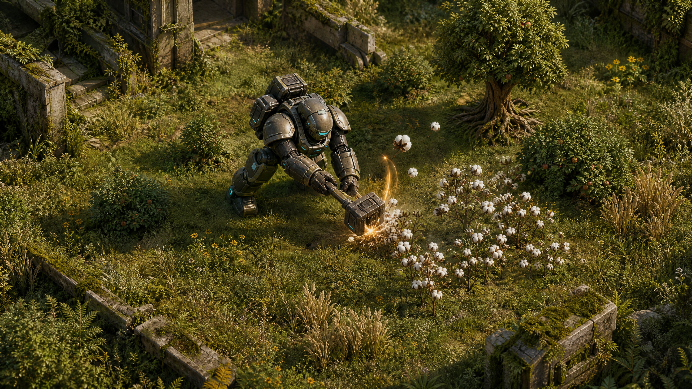
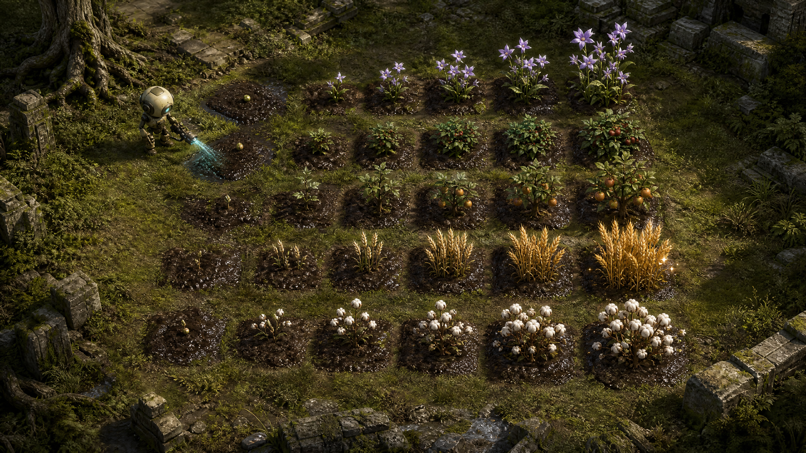
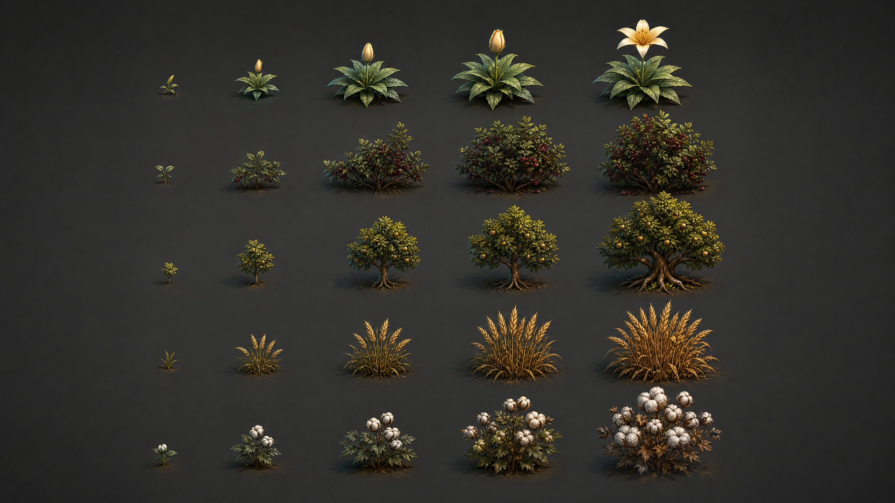

# Protos Harvest
## Gathering, Harvest, and Farming System Concept Proposal

**Author:** Manus AI, Agent 3
**Date:** 27 August 2026
**Canonical repository:** [`junnyboi/proto-isometric`](https://github.com/junnyboi/proto-isometric)
**Planning baseline:** `2ab6d6c785db32a233919863019291556c89bd89`
**Engine:** Godot 4.7.2 stable, GL Compatibility, no-threads Web export

## 1. Executive concept

The woodland clearing should become a readable **seed-discovery ecosystem**. Flowers, shrubs, compact fruit trees, wild wheat, and cotton appear deterministically on eligible grass cells. The player can Smash a wild specimen to gather **50% of its mature produce yield plus one seed**, converting exploration into an immediate farming opportunity. The seed enters the existing transactional inventory, can be planted only in tilled soil, requires watering to gain daily growth, and becomes a full-yield crop at maturity.

> **Player promise:** Every wild plant is both a useful resource and a possible beginning. Smash for an emergency half-yield now, or cultivate its seed into a dependable harvest later.

This system connects four existing strengths—deterministic world generation, deliberate adjacent-cell interaction, atomic persistence, and data-driven crops—without creating a second farming renderer or serializing untouched procedural terrain.

## 2. Design pillars

| Pillar | Commitment |
|---|---|
| **Exploration teaches cultivation** | The first encounter with a species grants enough produce to feel useful and a seed that demonstrates its farm potential. |
| **Wild is immediate; farming is efficient** | Smashing grants half the mature yield. A cultivated crop grants the full yield and may regrow, making care economically superior without making gathering pointless. |
| **Legible ecology** | Wild specimens occur only on compatible grass cells, never on paths, the farm apron, water, ruins, trees, deposits, structures, or occupied cells. |
| **One interaction grammar** | Smash gathers wild flora; Context inspects it; hoe, planting, watering, and harvesting retain the existing adjacent-cell farm flow. |
| **Exact-once rewards** | Produce, seed, stamina cost, and cleared-state mutation are committed atomically. A failed save gives nothing and leaves the plant intact. |
| **Sparse persistence** | Wild placement is coordinate-derived. Only cleared flora cells are stored in the existing world mutation ledger. |

## 3. Species lineup

| Wild species | Mature wild yield | Smash reward (50%) | Seed reward | Cultivated behavior | Role |
|---|---:|---:|---:|---|---|
| **Starflower** | 2 blossoms | 1 blossom | 1 seed | 3 watered days, yield 2 | Fast tutorial flower and compact visual accent |
| **Brambleberry** | 4 berries | 2 berries | 1 seed | 4 watered days, yield 4, regrows every 2 watered days | Renewable food and shipping crop |
| **Sunpear** | 4 fruit | 2 fruit | 1 seed | 6 watered days, yield 4, regrows every 3 watered days | Compact one-cell orchard fantasy |
| **Wildwheat** | 6 grain | 3 grain | 1 seed | 4 watered days, yield 6 | Staple crop and future mill input |
| **Cotton** | 4 fiber | 2 fiber | 1 seed | 5 watered days, yield 4 | Future textiles, construction, and trade |

All five species use the same four-stage farm contract as the existing crop catalog. Fruit trees are intentionally represented as compact one-cell orchard trees for this vertical slice; multi-cell orchards, pruning, seasons, and sapling relocation remain expansion seams.

## 4. World ecology

Wild flora is a pure function of `world_seed`, cell coordinate, gameplay mode, terrain, and exclusion predicates. It appears in the fresh-farm woodland reserve on ordinary `woodland_grass`, outside the protected farm apron and authored paths. A bounded density target of approximately 8–12% of eligible cells creates visible variety without turning the clearing into a produce warehouse wearing leaves.

The generator uses a stable coordinate hash with a dedicated flora salt. One roll determines presence and a second roll selects the species. Placement is invariant across chunk streaming order and reload. Cleared flora is hidden by the mutation ledger until a future explicit respawn policy is designed; the vertical slice does not silently regrow smashed wild plants.

### 4.1 Precedence

The authoritative order becomes:

1. Base terrain and biome
2. Woodland clearing override
3. Protected paths and farm apron
4. Trees, rocks, water, ruins, resource deposits, and placed occupancy
5. Wild flora projection
6. Cleared-object mutations
7. Structures and farm plots

Farm plots always win. A player cannot till underneath a wild plant; Smash it first, then till the now-empty grass cell if the cell is otherwise farmable.

## 5. Gathering interaction

### 5.1 Smash

When Smash targets an adjacent wild specimen, the flora interaction intercepts the combat attack before ordinary rock or hostile resolution. The existing attack animation still plays. At the contact frame, one cross-domain transaction:

1. Revalidates the exact flora species at the target coordinate.
2. Verifies it has not already been cleared.
3. Builds canonical half-yield and one-seed rewards from the flora catalog.
4. Verifies inventory capacity for both stacks.
5. Records `object.flora` in the world mutation ledger.
6. Credits produce and seed atomically.
7. Publishes one dirty cell, harvest feedback, and a world redraw.

The reward is never trusted from UI arguments. The transaction recomputes species and rewards from the world seed and coordinate.

### 5.2 Context

Context opens a concise flora menu with **Inspect** and **Smash for Seed**. The destructive option previews the produce, seed, and 50% wild-harvest rule. Smash remains the fast physical route; Context remains the legible route.

### 5.3 Feedback

A successful wild harvest uses the existing harvest-pluck world cue, an amber contact flash, a short item summary, and immediate disappearance of the plant. Inventory-full and stale-target failures consume no stamina and leave the plant untouched.

## 6. Farming lifecycle

The acquired seed uses the existing farm authority:

1. **Till:** Hoe converts an eligible grass cell into a sparse plot record.
2. **Plant:** The interaction menu lists only seeds currently owned by the robot inventory.
3. **Water:** Watering records the current absolute day.
4. **Advance day:** A crop gains one growth point only when watered or eligible rain applies.
5. **Harvest:** A ready crop credits its canonical produce yield exactly once.
6. **Regrow:** Brambleberry and Sunpear return to their declared regrowth threshold rather than disappearing.

Missing water pauses growth; it does not kill the crop. The existing atomic sleep transaction remains the only daily growth authority.

## 7. Art direction

The production art follows the current crop atlas grammar: four transparent 256 × 256 frames arranged in a 1024 × 256 sheet, one bottom-centered plant per frame, grounded photoreal materials, warm woodland light, and readable silhouettes at 90 × 45 isometric scale. Wild flora renders from each species' mature frame; cultivated flora renders the stage selected by farm state.

Concept designs:

## 8. Technical architecture

| Authority | Responsibility |
|---|---|
| `wild_flora_catalog.gd` | Stable species definitions, spawn density, crop mapping, mature yield, half-yield reward, seed reward, texture metadata |
| `wild_flora_generator.gd` | Pure coordinate-derived placement with terrain and exclusion predicates |
| `infinite_world.gd` | Authoritative flora query, cleared-state check, collision/exclusion integration, snapshot application |
| `world_mutation_ledger.gd` | Persist `object.flora` cleared records without serializing untouched flora |
| `harvest_interaction_world_provider.gd` | Project Inspect and Smash offers using canonical rewards |
| `harvest_world_operation_adapter.gd` | Atomically clear flora, spend the bounded 2-point Context stamina cost, and credit two canonical inventory rewards |
| `harvest_interaction_phase_b_service.gd` | Give flora priority over terrain and expose a trusted Smash execution path |
| `world_objects.gd` | Batch-draw mature wild flora with diagonal ordering and no per-flora nodes |
| Existing farm stack | Plant, water, grow, render stages, harvest, regrow, ship, save, and load cultivated species |

## 9. Economy and balance

The 50% rule is implemented as `max(1, floor(mature_yield / 2))`. Wild gathering is therefore a discovery and bootstrap channel, not the most efficient production method. Cultivation doubles or better the immediate produce return, and regrowing crops compound the advantage. Seeds are not sold by the baseline greenhouse at first; they enter the economy through discovery, preserving the exploration-to-farm relationship.

Sell prices are modest enough to prevent deterministic wild spawns from eclipsing construction and expedition rewards. Cotton and wheat intentionally foreshadow processing systems but remain shippable raw materials in this slice.

## 10. Accessibility, localization, and platform behavior

Every species, target title, action, result, and failure reason receives English and Simplified Chinese keys. Wild silhouettes differ by shape as well as color. Touch uses the existing Smash and Context buttons; controller and keyboard retain their current bindings. No hover-only information is required. The system must function identically in native and no-threads Web exports.

## 11. Acceptance criteria

The feature is complete when all of the following are true:

- Five species appear deterministically on eligible woodland grass and nowhere protected or occupied.
- The same world seed produces the same flora across stream order, reload, native, and Web.
- Smash grants exactly canonical half produce plus one seed and clears exactly one flora record.
- Duplicate, stale, full-inventory, or failed-persistence attempts grant nothing.
- The seed can be planted in tilled land, watered, grown through four visual stages, harvested, and regrown when declared.
- Wild and cultivated flora render without per-entity nodes or full-world scans.
- Existing crops, trees, rocks, combat, construction, settlement, saves, and legacy expedition semantics remain intact.
- Direct import, bounded headless boot, repository tests, dual-aspect Xvfb interaction, Web export, PCK boot, served HTTP runtime, and WebDev preview all pass.
