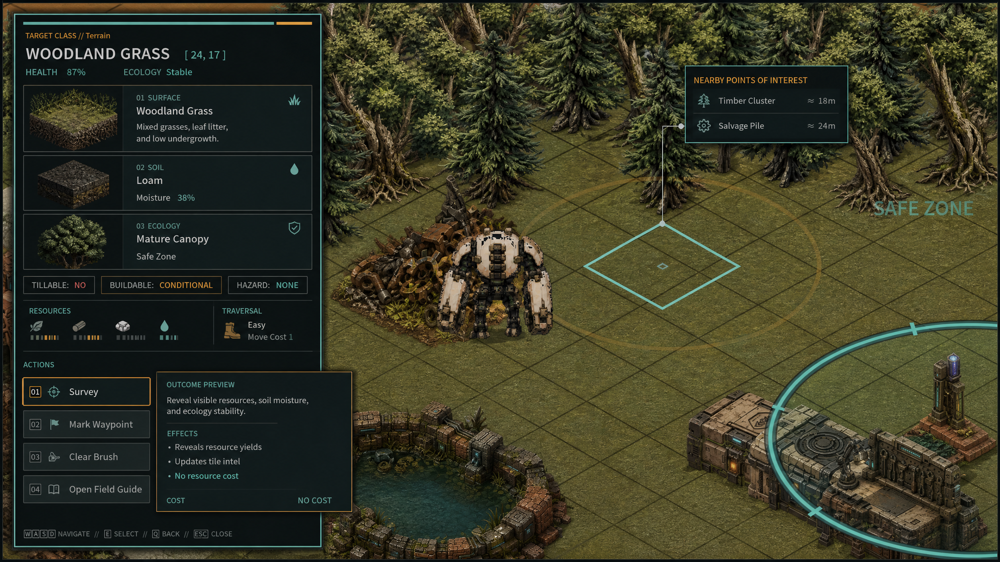
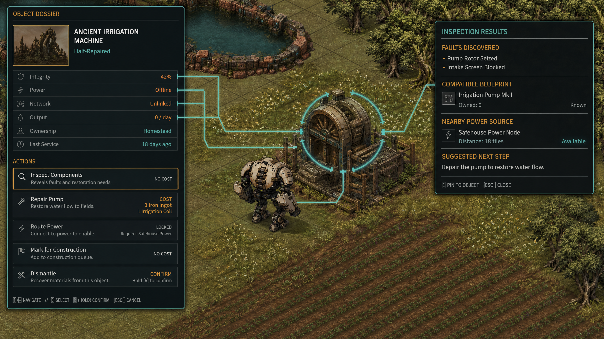
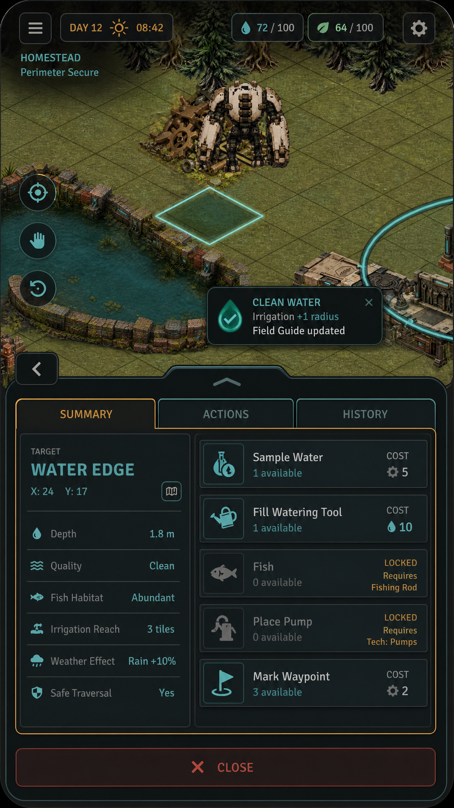

# Protos Harvest
## Fully Inspectable and Interactable World Proposal

**Author:** Manus AI  
**Engine:** Godot 4.7.2 stable, GL Compatibility  
**Canonical repository:** [junnnyboi/proto-isometric](https://github.com/junnyboi/proto-isometric)  
**Baseline revision:** `db833ad391193e7c94bd0063a712076f133fabb0`

## 1. Proposal summary

Protos Harvest already possesses the difficult foundations of a universal interaction system: deterministic adjacent targeting, sealed target and menu snapshots, pure providers, stale-state rejection, exact transaction boundaries, responsive native UI, bilingual localization, and a Web-safe runtime. The reported defect is concentrated in the read path. Confirming **Inspect** does not query or present the sealed state. Instead, the controller and Phase B service manufacture `preview_only`, and the presenter reduces execution results to one generic status line.

This proposal turns inspection into a **Decision Card**: a bounded, localized, read-only view generated from the freshly revalidated target snapshot. The card answers four questions:

1. **What is this?**
2. **What is its current state?**
3. **Why does that state matter?**
4. **What can I do next through actions that already exist?**

The solution preserves the current resolver, command IDs, target/option/menu contracts, Quick policy, transaction services, save schema, and fullscreen Web host. It introduces one closed operation catalog, one canonical transient result envelope, one pure read-result catalog, and a pooled detail area inside the existing interaction terminal.

> **Inspectable** means every stable target projected by the interaction system produces a useful current-state card. **Interactable** means every enabled action has one authoritative route and every unavailable action explains exactly why it cannot yet execute.

## 2. Design thesis

The highlighted adjacent cell remains the spatial authority. Pressing Context opens a sealed menu without mutation. Confirming an Inspect or review row produces a current, deterministic Decision Card. Confirming a productive row continues to use the existing farm, cross-domain, construction, deposit, or world authority.

Inspection is not an encyclopedia and does not expose internal state. A standard card contains:

- one localized identity;
- up to three decision-relevant state signals;
- one consequence or opportunity;
- up to two next steps drawn from the sealed action menu;
- no raw hashes, tokens, provider IDs, save keys, hidden probabilities, or unbounded lore.

The world becomes legible without becoming a spreadsheet wearing a robot costume.

## 3. Player experience

### 3.1 Terrain and farming

Inspecting woodland grass identifies its surface, biome, walkability, authoritative farmability, blocker class, and plot state. A tilled plot adds moisture and occupation. A planted crop adds crop identity, growth stage, water state, readiness, and the relevant next action. Walkability is never treated as tillability; farmability comes from the same farm rule used by the Till action.



### 3.2 Facilities, machines, and construction

Inspecting a machine or building shows integrity or lifecycle state, power, queued work, completion timing, output readiness, staffing or range, and the most relevant sealed action. Construction inspection uses the same read route as terrain rather than falling into a mutation handler.



### 3.3 Wilderness and resources

Trees, finite deposits, renewable biomass, herds, hostiles, hazards, ruins, and gates expose concise cards based on their current provider state. Reads explain depletion, renewal, tool requirements, danger, first-clear status, sanctuary consequence, or gate risk. Combat remains Smash authority; inspection never damages a target.

### 3.4 Portrait and touch

Wide landscape uses a details-and-actions composition within the existing left terminal. Compact landscape and portrait use **Details** and **Actions** tabs in the same modal. Touch receives explicit **Back** and **Activate** controls because the gameplay command dock is suppressed while a modal owns input.



## 4. Interaction grammar

| Intent | Responsibility | Read or mutation behavior |
|---|---|---|
| **Context** | Open menu, inspect, converse, collect, operate services | Opening is always read-only; selected row determines the routed authority |
| **Inspect / review row** | Present current target state and next-step guidance | Freshly revalidated read; no save, receipt, revision, reward, dirty cell, or tutorial commit |
| **Productive row** | Till, harvest, gather, repair, power, craft, care, construct | Existing authoritative transaction; common result reports `mutated = true` only after commit |
| **Quick** | Execute one uniquely safe zero-cost productive row | Remains mutation-only; Inspect is excluded |
| **Tool** | Use equipped farming or gathering tool | Existing contact-frame authority remains unchanged |
| **Smash** | Damage hostile actors | Existing combat authority remains unchanged |
| **Cancel / Back** | Return from Details to Actions or close the terminal | Never mutates gameplay |

## 5. Target coverage model

Coverage expands through target **subkinds**, not new resolver kinds. Resolver masks and priority remain compatible.

| Target family | Inspection content | Productive actions |
|---|---|---|
| Terrain, plot, crop | Surface, biome, walkability, farmability, moisture, crop stage/readiness | Till, plant, water, harvest |
| Home, storage, shipping | Services, capacity, staged value, sleep readiness | Sleep, inventory, shipping |
| Facility, machine | Repair/power, service availability, recipe/progress/output | Repair, power, craft, claim, upgrade |
| Construction | Blueprint, lifecycle, footprint, range, worker, upgrade state | Move, upgrade, demolish, range preview |
| Resident, livestock | Schedule/service, relationship/request, care/product state | Talk, gift, service, feed, pet, collect |
| Tree, legacy resource | Species/material, tool, remaining/cleared state | Chop, mine, break |
| Salvage, mineral, biomass deposit | Richness, charges, renewal, reservation, extraction compatibility | Gather, range preview |
| Herd, hostile | Habitat, disposition, drops, threat | Bond/yield where supported; Smash stays combat authority |
| Hazard | Forecast, mitigation, capability, reward | Stabilize only after atomic adapter certification |
| Ruin, gate, exit | Sanctuary/first-clear, biome risk, transition readiness | Activate/enter only through existing lifecycle authority |
| Water, functional prop | Depth/quality/reach or purpose/state | Existing actions when authoritative; otherwise useful inspect-only card |

Purely decorative draw calls without stable identity remain intentionally non-targetable.

## 6. Technical architecture

### 6.1 `InteractionOperationCatalog`

One static catalog replaces scattered read and route lists. Each operation descriptor defines:

| Field | Meaning |
|---|---|
| `operation` | Stable operation ID |
| `route` | `read`, `farm`, `cross_domain`, `construction_ui`, or `world_runtime` |
| `adapter_id` | Internal deterministic dispatch branch |
| `allowed_provider_ids` | Sorted provider allowlist |
| `mutability` | `read_only`, `ui_only`, or `mutating` |
| `receipt_policy` | `none`, `required`, or `postcondition_idempotent` |
| `persistence_domains` | Empty for reads; declared domains for mutations |
| `stale_policy` | Snapshot identity or snapshot plus revision |
| `allowed_close_behaviors` | Existing close constants only |

Tests enumerate every provider fixture. Every emitted `(provider_id, operation)` pair must match exactly one descriptor. Unknown or provider-disallowed operations fail closed instead of falling through to farm runtime. This closes the current `review_threat`/`read_threat`, `inspect_construction`, and `inspect_deposit` routing gaps.

### 6.2 `InteractionExecutionResult`

Every routed option returns one transient exact-key result:

| Key | Rule |
|---|---|
| `result_id` | Deterministic digest of the remaining fields |
| `ok` | Semantic success |
| `reason_key` | Empty on success; localized failure key otherwise |
| `mutated` | True only after an authoritative commit |
| `source_snapshot_id` | Fresh menu snapshot used to build or execute the result |
| `action_id` | Exact selected action |
| `target_id` | Fresh target identity |
| `target_cell` | Fresh adjacent cell |
| `observed_state` | Canonical detached state for proof and tests; never rendered directly |
| `view` | Bounded localization descriptor rendered by the presenter |

The existing contract-codec budgets remain unchanged. A Decision Card adds a stricter cap of twelve facts, although normal content uses no more than seven.

### 6.3 `InteractionReadResultCatalog`

The read catalog is a pure mapping:

```text
fresh menu + exact current option + operation descriptor
    → canonical InteractionExecutionResult with mutated=false
```

It performs no node query, save access, random access, time access, transaction, dirty notification, publication, or tutorial write. Dispatch is operation-first and subkind-specific. Unknown subkinds receive a safe generic card rather than a raw dictionary dump.

### 6.4 Controller and Phase B service

The controller becomes operation-agnostic. It keeps its current `_executing` guard, stale refresh, adjacency re-resolution, selection, cancel, and close behavior, but removes the literal Inspect bypass. It validates every returned result and emits mutation-commit semantics only when `mutated` is true.

The Phase B service reprojects the current target, rebuilds the sealed menu, exact-matches the current option, validates the operation descriptor, and then dispatches by route. Reads are built from the **fresh** snapshot. Existing mutations continue through their current authorities and are wrapped only after those authorities report commit.

### 6.5 Presenter

The existing `HarvestInteractionPresenter` remains the sole modal. It gains:

- a fixed pool of at most twelve fact rows;
- a bounded Details region;
- wide-landscape split layout;
- compact/portrait Details and Actions tabs;
- explicit touch Back and Activate controls;
- focus trap and restore;
- locale-reactive rerendering from the stored canonical result;
- non-color status semantics and accessible label/value descriptions.

No per-target nodes, parallel DOM overlay, persisted panel state, or world query is introduced.

## 7. Persistence and determinism

Inspection is rigorously read-only. It changes none of the following:

- save bytes or write sequence;
- farm/world/run/profile revisions;
- exact-once receipts;
- mutation ledgers;
- inventory, resources, stamina, or daily tokens;
- tutorial persistence;
- dirty render cells;
- published live nodes;
- RNG state.

Reads remain functional under persistent, volatile, and blocked browser storage. Productive actions retain the existing detached candidate, validation, persistence, and publication boundaries.

## 8. Localization and accessibility

English and Simplified Chinese catalogs retain exact key and placeholder parity. Result views carry keys and scalar values, never translated provider prose. Certified UI rejects missing-key markers, `preview_only`, humanized internal IDs, and raw state keys.

Keyboard, controller, mouse, and touch reach the same confirmation path. Every interactive region is at least 44 pixels. Reduced effects, disabled haptics/audio, left-handed controls, UI scaling, and color-independent status remain supported.

## 9. Productive seam policy

The project becomes fully inspectable before risky new world mutations are enabled. Pickup collection, hazard stabilization, and gate/exit transition actions remain disabled until each can prove:

- stable identity and current-state revalidation;
- detached candidate construction;
- declared persistence domains;
- an unambiguous commit point;
- exact-once or durable-postcondition retry behavior;
- rollback or recover-forward behavior;
- reload-safe publication;
- localized failure reasons.

Remote ruin activation remains an expedition-return consequence. A truthful disabled explanation is preferable to a button that succeeds only in spirit.

## 10. Success criteria

The proposal succeeds when every stable projected target produces a useful current-state card; every emitted provider-operation pair has one validated route; Terrain Inspect never displays Preview Only; reads are deterministic and storage-independent; productive behavior remains byte-compatible unless intentionally extended; the modal works across certified viewports and input modes; and the Godot 4.7.2 native, exported-PCK, HTTP browser, and WebDev gates remain clean.

## References

[1]: https://github.com/junnyboi/proto-isometric "Protos Harvest canonical repository"
